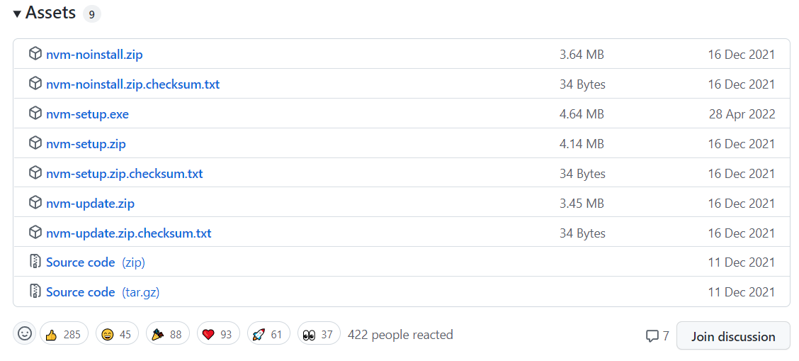
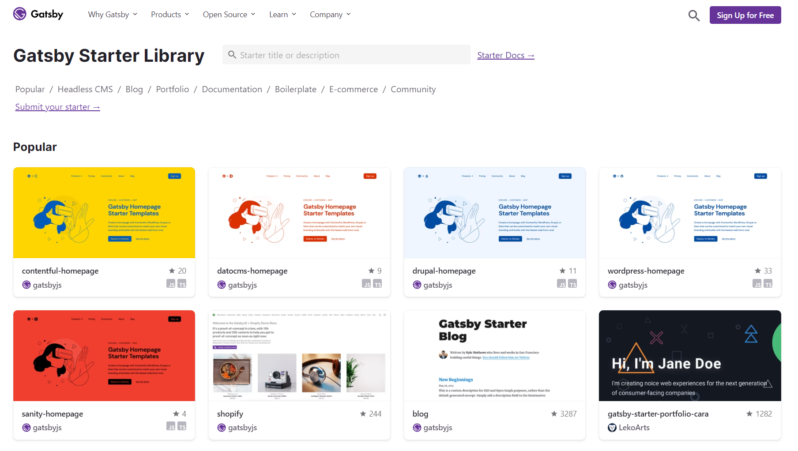
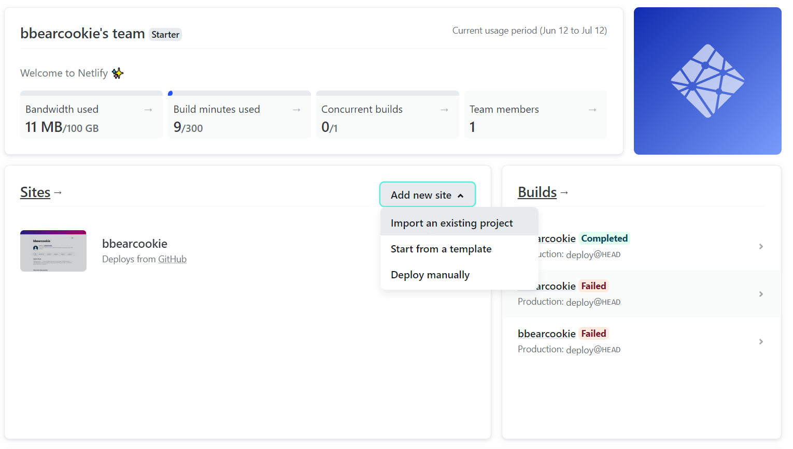
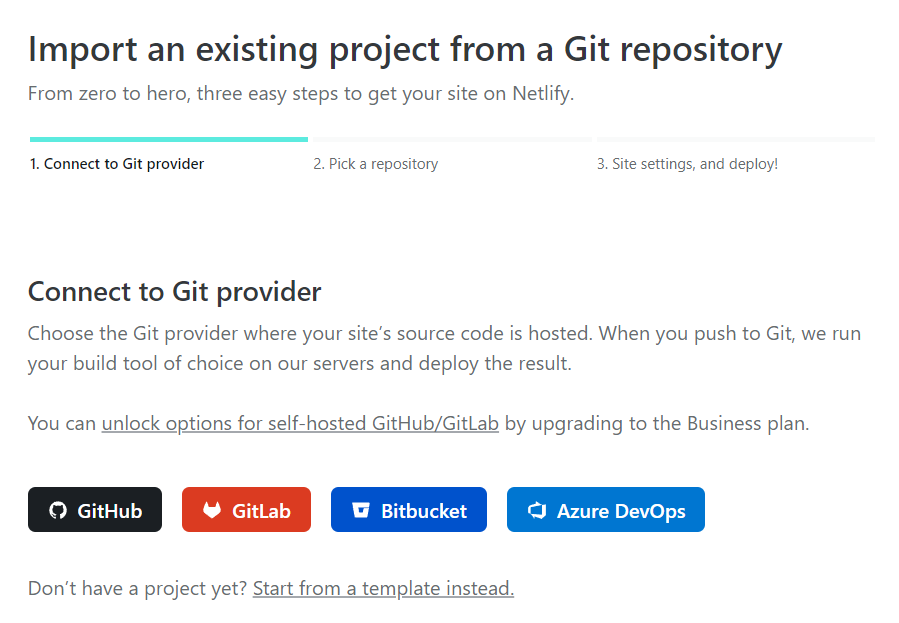
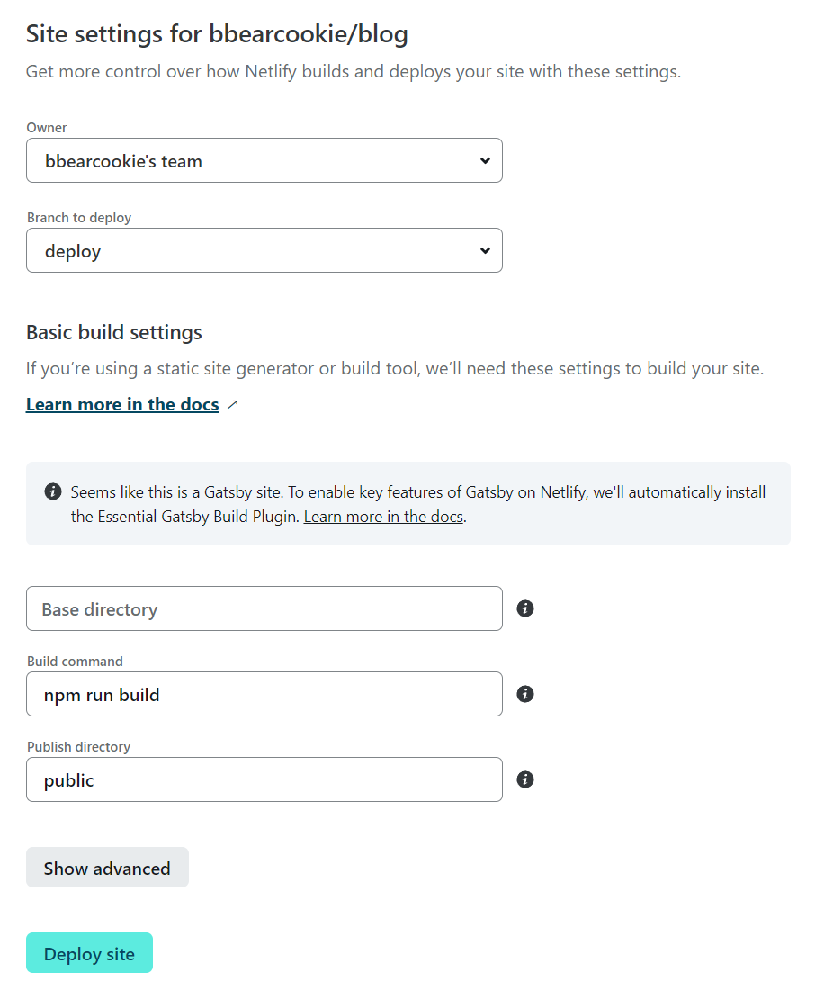
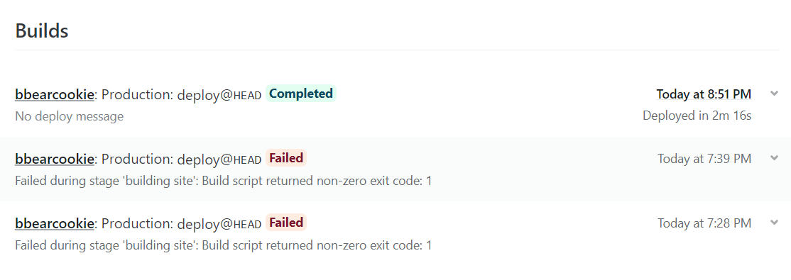
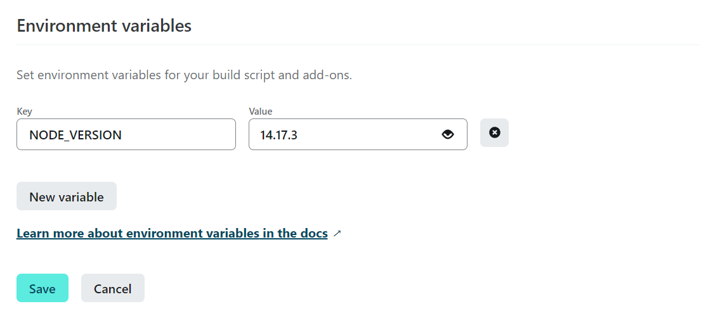

내가 공부하거나 개발하면서 생겼던 문제들이나 해결방법을 블로그에 정리하면 비슷한 문제가 생겼을 때
나중에 확인하기도 좋고 지식을 관리하기 편할 것 같아서 알아보기로 했다.

찾아보니 미디움이나 티스토리같은 블로그 서비스를 이용하는 것도 좋지만 Jekyll이나 Gatsby같은 정적 사이트 생성기를 이용해서 간단한 웹페이지를 만들고, Github Page나 Netlify에 배포하는 방법이 개인적으로 끌렸다.

Jekyll은 루비 기반으로 동작하는데 나는 루비를 한 번도 사용해 본 적이 없었고 React에 더 익숙하기 때문에 React 기반으로 동작하는 Gatsby를 선택하게 되었다. 그런데 설치하고 기본적인 환경을 설정하려고 하다가 몇 가지의 오류를 만났었다. 이 글에서는 그 문제들을 해결했던 방법을 기록하고자 한다.

## Gatsby 설치
우선 Gatsby를 설치해야 했다. Gatsby로 만들어진 웹사이트를 빌드하고 개발 서버를 실행해보기 위해서는 gatsby-cli 모듈을 설치해야 했는데 이건 npm 모듈이기 때문에 Node.js를 먼저 설치해야한다.
```sh
npm install -g gatsby-cli
```
아래에 서술할 것이지만 모듈 설치 이후에는 `gatsby new` 명령어로 웹사이트를 생성해야 하는데 이 과정에서 문제가 발생했었다!

```sh
npm ERR! A complete log of this run can be found in:

 ERROR

Command failed with exit code 1: npm install


  Error: Command failed with exit code 1: npm install

  - error.js:60 makeError
    [npm]/[gatsby-cli]/[execa]/lib/error.js:60:11

  - index.js:118 handlePromise
    [npm]/[gatsby-cli]/[execa]/index.js:118:26

  - task_queues:96 processTicksAndRejections
    node:internal/process/task_queues:96:5

  - init-starter.js:135 install
    [npm]/[gatsby-cli]/lib/init-starter.js:135:7

  - init-starter.js:202 clone
    [npm]/[gatsby-cli]/lib/init-starter.js:202:3

  - init-starter.js:343 initStarter
    [npm]/[gatsby-cli]/lib/init-starter.js:343:5

  - create-cli.js:463
    [npm]/[gatsby-cli]/lib/create-cli.js:463:9
```

이 문제를 해결하려고 이것저것 시도해봤는데, 노드의 버전이 원인으로 의심되었다.

## nvm 설치


nvm(Node Version Manager)은 한 개발환경에서 노드 버전을 여러개 설치하고 그때그때 원하는 노드 버전을 선택해서 사용할 수 있는 기능이다.  
나는 https://github.com/coreybutler/nvm-windows/releases 에서 nvm-setup.exe 를 다운받고 설치했고, 터미널 상에서 nvm 기능을 이용할 수 있었다.  
기존에는 16.15.1 버전을 사용하고 있었는데 이번에 추가로 14.17.3을 설치하고 gatsby 웹사이트를 생성해보았다. 결과는 성공이었다!

###명령어
> nvm ls: 설치된 모든 노드 버전 확인  
 nvm install &lt;version&gt;: 특정 버전의 노드 설치  
nvm use &lt;version&gt;: 특정 버전의 노드 사용

## Gatsby 프로젝트 생성


gatsby에는 기본적인 디자인이나 페이지 구성이 미리 되어있는 다양한 스타터 템플릿이 있었다. [Gatsby Starter Library](https://www.gatsbyjs.com/starters/) 에서 원하는 템플릿을 골라볼 수 있었는데 [gatsby-starter-bee](https://github.com/JaeYeopHan/gatsby-starter-bee) 나 [zoomkoding-gatsby-blog](https://github.com/zoomKoding/zoomkoding-gatsby-blog) 처럼 우리나라 개발자분들이 개인 블로그를 작성하시면서 기본적인 형태를 템플릿으로 만들어서 공유하시는 것도 있었다. 나는 그 중에서 gatsby-starter-bee가 개인적으로 마음에 들어서 적용하기로 한다.

```sh
gatsby new my-blog-starter https://github.com/JaeYeopHan/gatsby-starter-bee
```

프로젝트를 생성했으면, gatsby-starter-bee 같은 경우에는 gatsby-meta-config.js 파일에 기본적으로 자신의 정보를 기록할 수 있었다.

```
content
├── __about
└── blog
```
생성한 프로젝트의 content/blog 디렉토리 아래에 원하는 내용을 작성하면 된다. 

## Github 레포지토리에 올리기
내 블로그를 다른 사람이 읽을 수 있게 하기 위해서는 먼저 Netlify에 배포하기 위해서 Github 레포지토리에 올려야한다.

## Netlify 에 배포하기
Github 레포지토리에 프로젝트를 올렸으면 Netlify 에 배포할 수 있다.



먼저 Netlify 에서 자신의 계정의 대쉬보드에 들어가 Add new site -> Import an existing project 버튼을 클릭한다.



그 다음 프로젝트가 올라와있는 원격 저장소를 선택한다. 나는 Github를 사용했으니 Github를 선택한다. 
그러면 배포할 레포지토리를 선택할 수 있다.



여기서 Branch to deploy 에서 선택한 브랜치는
Github 원격 레포지토리에서 해당 브랜치의 컨텐츠 내용이나 소스코드가 바뀌면
변화된 내용이 Netlify 에도 자동으로 적용된다! 이게 굉장히 편리한 기능인 것 같다. 글을 작성하고 레포지토리에 푸쉬만 해도 새로운 글이 그대로 적용될테니..

## 빌드 문제 발생



여러 설치와 기본 설정을 끝내고 이제 블로그를 볼 생각에 싱글벙글 했지만 빌드에 문제가 발생했다! 문제의 원인을 찾다가 아까 Gatsby 프로젝트를 생성할 때 노드 버전때문에 문제가 생겼던게 생각났고, Netlify 의 노드 버전을 설정하는 방법은 없을지 알아봤다. [여기](https://docs.netlify.com/configure-builds/manage-dependencies/)를 확인해보니 두 가지 방법이 있었다.
> 1. Netlify 환경변수 설정에서 `NODE_VERSION` 정의하기
> 2. 프로젝트의 기본 디렉토리에 `.nvmrc` 파일을 만들어서 그 안에 노드 버전 정의하기

나는 여기서 첫 번째 방법으로 해결했다.

## Netlify 노드 버전 설정
[여기](https://docs.netlify.com/configure-builds/environment-variables/)에 Netlify 프로젝트의 환경변수를 설정하는 방법이 나와있다. 프로젝트의 대쉬보드에서 **Site settings > Build & deploy > Environment > Environment variables** 를 차례대로 내려가면 환경변수 설정을 할 수 있다.



나는 14.17.3 버전으로 했다. 결과는 성공이다!