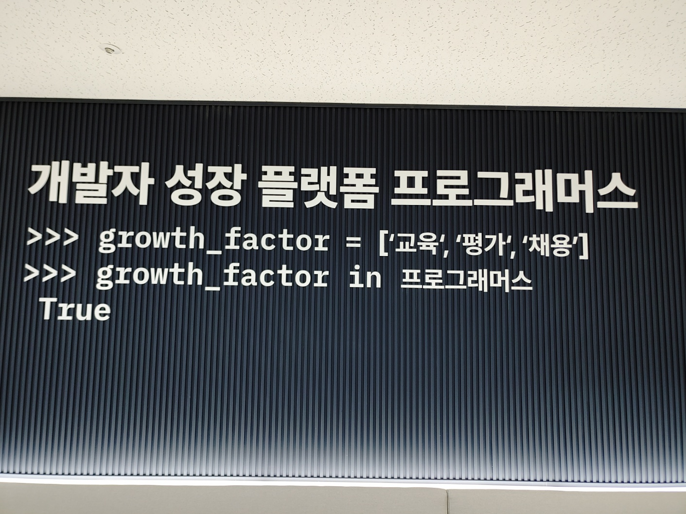

어느덧 프로그래머스 프론트엔드 데브코스 4기에 합류한지 한달이 되었다.  

나는 아직 더 공부하고 준비해야 할 것이 많다고 느껴지는데 벌써 6개월이라는 교육 과정 중에서 한달이 지났다고 생각하니 시간이 조금만 더 천천히 흘러가줬으면 하는 바램을 느낀다.  

## 데브코스 지원동기
사실 지원동기나 후기는 교육과정에 합격했을 당시에 썼어야 하지 않나 싶은 생각도 있지만, 내 생각을 글로 적는게 부끄럽기도 했었고 이미 선배 수료생님들이 작성해놓은 좋은 퀄리티의 후기글이 많아서 내가 작성한 글이 다른 사람들이 보기에 크게 도움되지는 않겠다는 생각에서 생략했었다.

그러나 이번에 한달차 회고를 작성하면서 데브코스를 지원할 때 내가 처음에 계획했던 부분은 무엇이었는지, 한달동안 어떻게 학습했는지, 앞으로는 어떻게 학습할 것인지를 점검하기 위해서 나 자신이 스스로를 돌아보는데 초점을 맞춰서 회고해보고자 한다.  

올해 2월에 대학교를 졸업을 하고 진로의 방향에 대해서 고민이 있었다. 아니, 정확하게는 개발자가 되고 싶지만 어떻게 준비해야 할지 방법을 잘 몰랐다.  

나는 학창 시절에 친구들이랑 마인크래프트를 즐기면서 서버에 여러 플러그인을 적용하고 운영해보거나, 워크래프트3의 유즈맵 시스템을 이용해서 나의 입맛대로 게임을 만들어보거나 하는 경험으로 프로그래밍에 대한 흥미를 느꼈었고, 이 때문에 컴퓨터공학과로 진학한 것이었기 때문에 개발에는 흥미가 있고 적성 또한 최소한 안맞지는 않는다고 생각한다.

대학시절에도 자료구조, 알고리즘, 데이터베이스 등 컴퓨터공학과에서 흔히 배울만한 과목들을 나름 흥미롭게 배웠었고 전액은 아니지만 매 학기 성적 장학금을 받을 수 있을 만큼은 학점을 챙겼기 때문이다. 사실 교양 과목보다 전공 과목이 학점 따는게 더 수월했으니 적성도 다른 분야에 비해서 컴퓨터와 관련이 있는 분야가 더 잘맞는다고 느낀다.  

다만 더 능동적으로 공모전이나 해커톤 혹은 대외활동이나 동아리를 알아보면서 학습했다면 어땠을지 아쉬움이 남는다. 대학시절에는 성적 장학금을 목표하면서 정말 단순하게 학교에서 배우는 공부에 집중했었고~~(사실 열심히 했었던 전공지식도 다시 찾아봤을 때 빠르게 복기하고 학습할 수 있는 정도여서 지금 누군가에게 설명하라고 하면 공부가 더 필요하다)~~ 개발자가 되기 위해서 필요하다고 하는 기술들은 주로 방학기간에 혼자 인터넷을 찾아보면서 공부했었다.  

그렇다보니 내가 올바른 방향으로 학습하고 있는 것인지 점검하는 것이 어려웠는데 특히 졸업 프로젝트로 했었던 **포카포카**의 아이디어만을 가지고, 아쉽다고 생각하는 부분들을 개선하고 `React-Query`, `TypeScript` 같은 새로운 기술도 적용해서 **포카**라는 프로젝트로 새로 만들었을 때 학습의 방향에 대한 문제를 가장 많이 느꼈었다.  

전체적으로 구현해야 할 요구사항들은 이미 나와있다고 생각해서 화면, 디렉토리 구조, 소스코드 작성방식 정도만 빠르게 생각해서 다시 작성하면 금방 하지 않을까? 하는 생각에 새로운 기술의 깊은 학습 없이 바로 구현에 들어갔던게 오히려 독이 되었던 것 같다. 깊은 이해 없이 구현 하다보니 잘못된 방식으로 사용하거나, 코드의 규모가 점점 커지면서 이전에 작성했던 방식이 좋지 못하다고 느껴지는 경우 점점 리팩토링 해야하는 영역도 늘어났다. 그렇다보니 완성까지 걸리는 시간이 예상보다 훨씬 오래 걸리기도 했다.  

또한 혼자서 아무리 고민해도 결국에는 정답을 찾기 어려웠던 부분들도 있었고, 개발은 함께 하는 것이기 때문에 협업에 대한 경험의 필요성 외에도 함께 학습하거나 궁금한 것이나 어려운 점들을 공유할 수 있는 환경을 절실하게 느끼게 했던 프로젝트였다.

이런 와중에 시간은 많이 흐르게 되었고.. 어느새 졸업까지 하게 되었다. 그런데 현 상황에 내가 신입 개발자로 취업하는데 있어서 과연 매력있는 구직자가 될 수 있는지 의문이 들었고 앞으로 준비해야 할 것들이 많게 느껴졌다. 나는 내가 개발을 좋아한다고 생각하지만 과연 좋아한다고 어필할 수 있는 부분들이 있는지 반성하게 되었다.

그래서 나한테 부족한 부분을 보완하고 취업을 준비하는 기간이 필요하다고 생각을 했고, 이 기간에 부트캠프를 활용해야 할지 아니면 인프런이나 오픈톡방 같은 곳에서 스터디를 알아봐야 할지 고민되었다. 특히 부트캠프도 교육과정마다 얻어갈 수 있는 것이 다르기 때문에 나에게 꼭 유익한 과정을 듣고 싶었다. 그래서 여러 부트캠프 추천 글과 영상, 데브코스의 선배 수료생님들의 후기, 그리고 상세한 커리큘럼을 봤을 때 나에게 부족한 부분들을 보완하기에 최적의 방법이라고 생각해서 지원했다.

그리고 감사하게도 가장 하고 싶었던 데브코스에 합격하게 되었다.

## 6월 회고
6월달은 새로운 학습 환경에 적응하는 시기였다. 유튜브나 강의로만 봐왔던 개발자님들을 실시간 라이브로 볼 수 있다니 굉장히 영광이었고 신기했다.

특히 첫 주차 토요일에 했었던 `Git` 특강에서는 함께 데브코스에 참여하게 된 프롱이들의 무수한 질문과, 하나라도 더 알려주시려는 개발자님의 열정에 내가 정말 데브코스에서 공부하게 된 것을 실감했다.  

### 1-2주차
이 기간에 학습했던 부분은 크게 세 가지로 나눌 수 있다: 

1. 스코프, 클로저, 변수, 메모리, 이벤트 루프, 프로토타입 등 자바스크립트의 핵심이 되는 동작들의 이해
2. 네트워크, 암호화, 컴퓨터 시간, 유니코드 등의 컴퓨터 과학에 대한 이해
3. 자료구조와 알고리즘의 이해를 바탕으로 코딩 테스트 문제 풀이

#### 자바스크립트 핵심
자바스크립트에 대한 부분은 FE 개발자로서 기술 면접에서 자주 다뤄지기도 하고 중요한 부분이기 때문에 데브코스를 시작하기 전에도 `모던 자바스크립트 Deep Dive`, `코어 자바스크립트 문서`, `MDN 문서` 를 읽으면서 블로그에 정리하고 있던 부분이었다.  

이번에 데브코스에서의 LMS 강의를 통해서 다시 학습하게 되었는데 새로 알게 된 부분들이나 잘못 이해했던 부분들을 정정해서 기존의 글을 수정하거나 새로운 글을 작성하는 등의 정리를 했다.  

그런데 아직 이벤트 루프나 브라우저의 동작 원리와 같은 부분은 정리하지 못한 상태여서 조만간 정리해야할 것 같다.

#### 컴퓨터 과학
학부에서 배웠던 부분들을 복기하는 차원에서 정리된 부분도 있었고, 혹은 새롭게 알게되는 내용도 있었다.  

특히 컴퓨터가 문자를 처리하는 방법, 인코딩, 유니코드 등의 내용은 새롭게 느껴졌었다. 각각 용어를 들어만 보았지 실제로 어떻게 동작하고 왜 등장했는지에 대한 이해가 없었던 것 같다. 아니면 1학년 당시에 컴퓨터공학개론에서 간단하게 배우고 넘어갔을지도..  

3일차 강의의 내용에 컴퓨터 과학에 대한 핵심 내용이 가득 담겨있었기 때문에 강의 러닝타임이 길진 않지만 찾아서 정리해야 할 부분이 많아서 시간이 꽤나 걸렸었다.

#### 코딩 테스트
자료구조는 학부에서 꽤 흥미롭게 학습했던 내용이라 오랜만에 실제로 구현하고 복기해보는 과정이었다. 그런데 트라이는 처음 알게된 자료구조여서 단어를 길이만큼의 시간에 빠르게 탐색할 수 있다는 점이 신기했다.  

코딩 테스트 문제같은 경우에는 데브코스를 하기 전에도 프로그래머스나 백준의 문제를 풀면서 공부했었기 때문에 자세하게 기억이 나지는 않지만 기록을 보면 거의 예전에 한 번씩은 풀어봤던 문제였다. 물론, 나름대로의 풀이를 했던 것이라서 효율적인 자료구조와 알고리즘을 적절하게 적용하는 건 이번에 데브코스에서 느꼈다.  

초반부의 문제들은 크게 어렵진 않았으나 후반부로 갈수록 어려워졌다. 특히 여행 경로, N-Queen, 단어 퍼즐 문제는 고민하다가 어려워서 해답을 먼저 봤는데도 이해가 잘 되지 않아서 같은 팀의 동료의 설명을 듣기도 하고 여러 설명들을 참고하면서 이해하느라 노력했었다.

### 3-4주차
나는 FE 개발을 공부할 때 바로 리액트 라이브러리부터 시작했었기 때문에 화면 렌더링의 처리를 해주는 라이브러리나 프레임워크의 도움 없이 기본 Vanilla JS 로만 컴포넌트 방식으로 개발하는 방법이 궁금했다. 웹 컴포넌트라는 기술을 사용해야 하는 것인지, 아니면 웹팩과 같은 모듈 번들러가 필수적인 것인지 등이 궁금했다.  

그런데 LMS 강의나 Todo App 과제, 그리고 팀원들과 함께하는 간단한 룰렛 프로젝트를 진행하면서 라이브러리 없이 컴포넌트 방식으로 개발한다는 느낌이 어떤 것인지가 와닿기 시작했다. 웹 컴포넌트를 사용하지 않아도 되고 모듈 번들러도 필수는 아니었다.

특히 과제에 대해서 코드리뷰 해주신 여러 멘토님들의 코멘트를 보거나, 다른 프롱이가 진행한 과제를 참고하면서 좋은 코드를 작성하기 위한 방법을 고민하는데 큰 도움이 되었다. 혼자였다면 알기 굉장히 어려웠던 부분들이라 가려운 부분이 해소되는 느낌이었다.  

가장 인상 깊었던 부분은 <b style="color: blue;">**컴포넌트는 단순히 받은 데이터를 가공해서 보여지는 View에만 집중**</b>하고, <b style="color: red;">**데이터에 대한 처리는 외부에 위임하거나 따로 Store를 만들어서 관리**</b>(Flux라는 패턴이 있는 듯)하는 부분이었다.

### 5주차
지금까지 학습했던 Vanilla JS로 컴포넌트 방식으로 개발하는 노션 클로닝 과제를 진행했다.  
마감까지 하루가 남은 상황인데, 거의 마무리는 되어가고 있지만 아직 보완하고 싶은 부분들이 있어서 이후에 한 번 회고글을 작성해보고자 한다.

## 앞으로의 계획
여러 특강이나 세션 그리고 커피챗을 통해서 내가 준비해야 할 부분을 점검하게 되었는데 중요하다고 생각하는 부분부터 우선순위를 정해서 계획을 세워보고자 한다.

### 1. 이펙티브 타입스크립트
포카 프로젝트 당시에 타입스크립트를 처음 사용해보지만 정확하게 이해하고 사용하지 않아서 생기는 시행착오를 경험 했었다. 그래서 이번에 도서지원 신청을 해서 학습해보고자 한다.  

책의 분량이 그렇게 길진 않아서 타입스크립트 핸드북 문서와 함께 학습하고 블로그에 정리해나간다면 금방 학습할 수 있을 것 같다.

### 2. Next.js
특강이나 커피챗에서 최근에는 거의 `Next.js` 프레임워크를 사용하는 경우가 많다는 말씀을 많이 들었다. 그래서 데브코스의 프로젝트 기간이 되기 전에는 전체적인 기능을 한 번 학습하고싶다.

### 3. Git
`Git` 특강 이후에 받았던 무료 쿠폰은 사용했는데 아직 강의는 듣지 못했었다. 개발을 하면서 버전을 관리하거나 협업에 있어서 `Git` 은 필수이니 단순하게 커밋하고 푸쉬하고 머지하는 기능 외에도 자유자재로 다룰 수 있게끔 공부하고 싶다.

### 4. 기술면접 준비
**좋은 개발자로 성장하기** 라는 주제의 특강에서 기록의 중요성과 지식의 깊이에 대한 말씀을 듣고 누구나 답할 수 있는 1depth 수준의 이해를 하는 것과, 그것을 넘어서 왜 등장한 기술이고 그 기술과 관련해서 현존하는 문제점들은 무엇이 있는지, 또한 앞으로 어떤 방향으로 해결해 나갈지를 이해하고 남에게 설명할 수 있는 2depth, 3depth 수준의 이해를 하는 것은 다르다는걸 느꼈다.  

데브코스에 참여하기 위해서 면접을 볼 때도 매니저님께서 굉장히 잘 풀어주셨지만 내 나름대로 기술 질문에 대한 내용을 답변 하고 있긴 한데 정리되지 않고 횡설수설 했었던 모습을 보인 것 같아서 말로 설명하는 연습도 많이 해봐야겠다는 생각을 했었다.  

그래서 노션 클로닝 과제 이후에 팀원들과 함께 스터디 방식을 고민해보기로 했다.