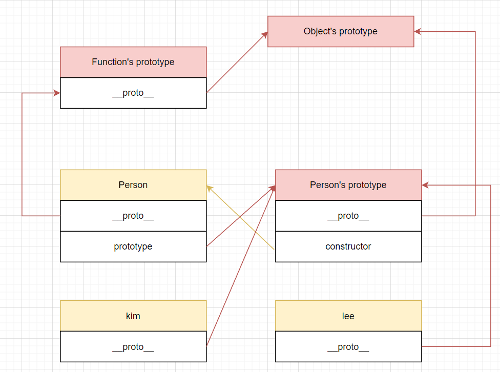

자바스크립트의 데이터 타입은 `Boolean`, `Number` 같은 <b>원시 값</b>을 제외하고는 모두 <b style="color: red">객체</b>로 분류된다.  
예를 들어서 `Function`이나 `Array`같은 타입도 모두 객체이다.  
또한 자바스크립트에서 거의 모든 객체는 상위 객체인 `Object`의 인스턴스이다.  
이번 글에서는 프로토타입 기반 언어인 자바스크립트에서 객체를 어떻게 생성하는지, 객체와 상속같은 개념을 어떻게 프로토타입을 활용해 사용할 수 있는지를 서술해보고자 한다.

## 객체 생성 방법
객체를 생성하는 방법은 크게 객체 리터럴 방식, `Object` 빌트인 함수를 사용하는 방법, 생성자 함수를 `new` 연산자로 실행하는 방법이 있다.

### 객체 리터럴
중괄호 {}를 사용해 그 안에 객체의 프로퍼티를 넣어주는 방식이다.  
이렇게 객체를 생성한 경우 그 객체의 프로토타입 객체는 `Object.prototype`이 된다.

```js
let kim = { 
  name: "김철수",
  showName: function() {
    console.log(`제 이름은 ${this.name} 입니다.`);
  }
  showNameMethod() {
    console.log(`제 이름은 ${this.name} 입니다.`);
  }
};
```

그런데 사실 객체 리터럴 방식으로 객체를 생성하면 내부적으로 `Object` 생성자 함수가 호출이 된다.

### Object 생성자 함수
`new` 연산자로 Object 생성자 함수를 실행하는 방법이다.

```js
let kim = new Object();

kim.name = "김철수";
kim.showName: function() { console.log(`제 이름은 ${this.name} 입니다.`); };
```

### Object.create()
객체를 생성할 때 지정한 프로토타입 객체를 갖도록 하는 함수를 사용하는 방법이다.  
글 하단의 상속 부분에서 서술하였다.

### 생성자 함수
만약 내부에 동일한 프로퍼티가 존재하지만 값만 다른 객체를 여러 가지 생성해야 한다면  
객체 리터럴 방식으로는 동일한 코드가 계속 반복되기 때문에 불편할 것이다.  
이런 경우에는 생성자 함수를 만들고 `new` 연산자로 실행하면 편리하다.  
이렇게 객체를 생성한 경우 그 객체의 프로토타입 객체는 `생성자함수.prototype`이 된다.

```js
function Person(name, age) {
  // this = {}; // 암시적으로 this 객체가 생성됨.

  this.name = name;
  this.age = age;
  this.showName = function() {
    console.log(`제 이름은 ${this.name} 입니다.`);
  };

  // return this; // 암시적으로 this 객체가 반환됨.
}

let kim = new Person("김철수", 20);
let lee = new Person("이미리", 25);

kim.showName(); // 제 이름은 김철수 입니다.
lee.showName(); // 제 이름은 이미리 입니다.
```

만약 생성자 함수 내부에 반환하는 객체를 특별히 명시한 것이 아니라면 암시적으로 새로운 객체가 `this`에 바인딩되어 반환된다.

## 프로토타입
객체 내부에 정의된 함수를 ***'메소드'*** 라고 하는데 이런 메소드는 <b style="color: red;">**객체마다 재정의 할 필요 없이 공통적으로 사용되는 경우**</b>가 많다.  
그렇기 때문에 객체가 생성될 때마다 메소드의 세세한 내용과 구현부까지 새로 복사되어 메모리를 낭비할 필요가 없는데 객체 내부에는 **프로토타입 객체를 가리키는 링크**만 놓고 공통된 실제 내용은 **프로토타입 객체의 내부**에 저장하는 방식을 사용하면 훨씬 효율적이다.  
또한 프로토타입이 존재하기 때문에 클래스라는 개념 없이도 자바스크립트에서 객체지향을 구현할 수 있다. **자신의 프로토타입 링크가 부모를 가리키게 한다면** 부모의 프로퍼티 또한 모두 사용할 수 있게 되기 때문이다.

### prototype
모든 함수는 자신의 프로토타입 객체를 갖고 있다.  
함수의 내부에는 `prototype`라는 프로퍼티가 존재하는데 이는 **자신의 프로토타입 객체**를 가리킨다.

### constructor
프로토타입 객체 내부에는 자신을 생성되게 한 객체를 가리키는 `constructor`라는 프로퍼티를 갖고 있다.  
프로토타입 객체 입장에서 자신을 생성한 객체는 생성자 함수이므로 **생성자 함수**를 가리킨다.

### ____proto____
객체가 생성될 때 **자신의 부모 역할을 하는 함수의 프로토타입 객체**를 가리킨다.

### 예시

```js
function Person(name, age) {
  this.name = name;
  this.age = age;
}

// 정적 메소드
Person.sayHello = function () { 
  console.log("안녕하세요!");
}

// 인스턴스 메소드
Person.prototype.showName = function () { 
  console.log(`제 이름은 ${this.name} 입니다.`);
};

let kim = new Person("김철수", 20);
let lee = new Person("이미리", 25);

Person.sayHello(); // 안녕하세요!
kim.showName(); // 제 이름은 김철수 입니다.
lee.showName(); // 제 이름은 이미리 입니다.
```

위와 같은 코드에서는 `Person` 생성자 함수를 통해서 생성된 객체 `kim`과 `lee`가 있는데  
내부에 `__proto__` 객체가 **자신의 부모 역할을 하는 함수의 프로토타입 객체인** `Person.prototype`을 가리킨다.  
`Person`객체에는 `prototype`이 자신의 프로토타입 객체를 가리킨다.  
`Person`의 프로토타입 객체에는 `constructor`가 자신을 생성한 `Person`객체를 가리킨다.



## 프로토타입 체이닝
자바스크립트에서 어떤 객체의 프로퍼티를 `num`을 참조하는 상황을 가정하면 먼저 객체 내부에 `num`이 존재하는지를 확인한다.  
만약 존재하지 않는다면 자신이 가지고 있는 프로토타입 링크 `__proto__`를 참조하여 그 프로토타입 객체는 `num`을 가지고 있는지 확인하고, 그 프로토타입 객체 또한 가지고 있지 않다면 그 프로토타입 객체의 `__proto__`를 참조하는 과정을 반복하여 찾게 되는데 이걸 <b style="color: red">**프로토타입 체이닝**</b>이라고 한다.  
자바스크립트의 모든 객체의 조상은 `Object`인데 만약 `Object`객체까지 해당 프로퍼티 `num`을 찾지 못했다면 `undefined`를 반환한다.

```js
function Person(name, age) {
  this.name = name;
  this.age = age;
}

let kim = new Person("김철수", 20);

Person.prototype.hello = function () {
  console.log("안녕하세요?");
}

Object.prototype.bye = function () {
  console.log("잘가요~");
}

kim.hello(); // 안녕하세요? (Person의 프로토타입 객체에 존재하는 메소드)
kim.bye(); // 잘가요~ (Object의 프로토타입 객체에 존재하는 메소드)
console.log(kim.num); // undefined (Object까지 올라갔지만 발견하지 못한 프로퍼티)
```

## 상속
어떤 객체를 생성할 때 다른 상위 객체의 프로퍼티를 모두 소유한 것처럼 사용하고 싶다면 상위 객체의 프로토타입을 자신의 `__proto__`가 가리키게끔 하면 된다.  
이를 구현하는 고전적인 방법이 있는데 바로 `Object.create()` 함수를 사용하는 것이다.  
다만 이 경우 <b style="color: red;">**생성자 함수가 실행되지 않는다.**</b>

```js{18}
function Person(name, age) {
  this.name = name;
  this.age = age;
}

// Person 타입의 객체가 사용할 함수를 프로토타입에 정의한다.
Person.prototype.hello = function () {
  console.log(`안녕하세요? 제 이름은 ${this.name} 이에요.`);
}

// Person을 상속하는 developer 객체를 만든다.
let developer = Object.create(Person.prototype);
developer.job = "개발자";
developer.introduce = function () {
  console.log("저는 개발자예요.");
}

developer.hello(); // 안녕하세요? 제 이름은 undefined 이에요. (Object.create()로 객체 생성시 생성자 함수가 실행되지 않음)
developer.introduce(); // 저는 개발자예요.
```


## 참고
https://poiemaweb.com/js-object  
https://ko.javascript.info/constructor-new  
 