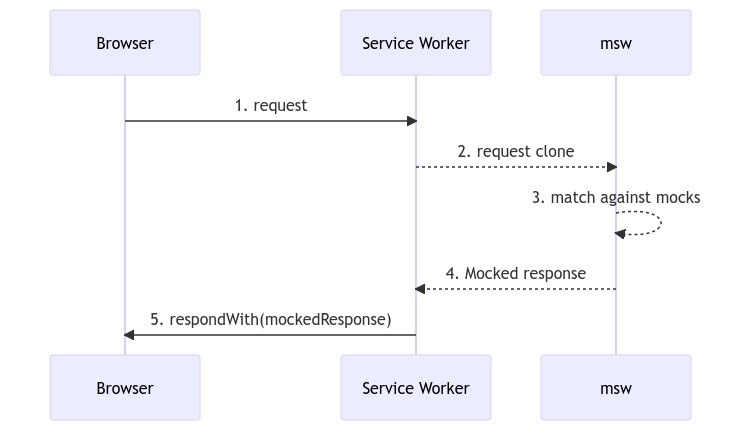

## MSW?
  

`Mock Server Worker` 는 네트워크 요청을 중간에 가로채서 모킹된 API의 **모의 응답을 내려주는 라이브러리**이다.  

### 장점
- **친숙하고 강력함**  
라우팅 핸들러를 작성하는데 있어서 `Express` 프레임워크와 유사한 형태를 하고 있기 때문에 친숙하게 이용할 수 있다.
- **원활함**  
MSW 는 네트워크 단에서 모킹을 진행하기 때문에 모킹된 API에 요청하는 코드를 작성할 때 실제 백엔드 API에 요청하는 형태와 크게 다르지 않게 작성할 수 있다.  
그래서 이후에 실제 백엔드 API로 대체하는 것도 손쉽게 할 수 있다.

### API를 모킹하는 이유
- **개발**  
제한된 마감 기한 내에 프로덕트를 완성하기 위해서 프론트엔드단의 기능을 구현해야 하는데 아직 백엔드 서버의 API가 완전하지 않은 경우가 있다.  
이럴 때 병렬적으로 개발하기 위해 모킹된 API를 임시로 사용하는 것이 유용하다.  
- **디버깅**  
프로덕트는 유효하지 않은 API 요청, 에러 핸들링, 예상하지 못한 응답 등에 대해서 적절하게 동작해야 한다.  
API를 모킹함으로써 문제를 일으키는 상황을 정확하게 모델링하고 적절한 동작을 구현할 수 있으며 특히 테스트 코드를 작성할 때 유용하다.    

## 설치 및 설정
`create-react-app` 으로 구성한 리액트 프로젝트를 기준으로 `MSW` 를 설치하고 설정하는 과정이다.  

`MSW` 는 실제 브라우저에서 발생하는 요청을 모킹할 수도 있고, 테스트 코드에서의 요청을 모킹할 수도 있는데 각각 설정해보겠다.

### 설치 및 공통 설정
#### 1. msw 패키지 설치
```sh
npm i -D msw
```

#### 2. 핸들러 파일 작성
```ts
/* src/mocks/handler.ts */
import { rest } from 'msw';

export const handlers = [
  rest.get('http://localhost:3030/users', (req, res, ctx) =>
    res(
      ctx.status(200),
      ctx.json([
        { id: 1, username: 'one' },
        { id: 2, username: 'two' },
        { id: 3, username: 'three' },
      ])
    )
  ),
  rest.get('http://localhost:3030/posts', (req, res, ctx) =>
    res(
      ctx.status(200),
      ctx.json([
        { id: 1, title: 'one', body: 'Esse occaecat ut occaecat cupidatat consequat dolor velit irure aute.' },
        { id: 2, title: 'two', body: 'In laborum ullamco reprehenderit consectetur aliqua qui.' },
        { id: 3, title: 'three', body: 'Nulla in adipisicing tempor id aliqua qui cillum minim adipisicing.' },
      ])
    )
  ),
];
```

### 브라우저 관련 설정
브라우저 내에서 `MSW` 를 동작하기 위한 설정은 [공식 문서](https://mswjs.io/docs/getting-started/integrate/browser)에서 자세하게 확인할 수 있다.

#### 1. 서비스 워커 설정 파일 작성
브라우저 내에서 `MSW` 는 서비스 워커를 통해서 작동하기 때문에 관련된 설정을 해줘야 하는데, 간단하게 아래 커맨드를 입력하면 된다.  

```sh
npx msw init public/ --save
```

`public` 디렉토리 내에 `mockServiceWorker.js` 파일이 생성되고,  
`package.json` 파일에 msw 의 `workerDirectory` 설정이 추가된다.

#### 2. 서비스 워커 생성
아까 작성한 핸들러를 `setupWorker()` 에 전달해서 서비스 워커를 생성한다.

```ts
/* src/mocks/worker.ts */
import { setupWorker } from 'msw'
import { handlers } from './handlers'

export const worker = setupWorker(...handlers)
```

#### 3. 서비스 워커 시작
개발 모드인 경우에는 서비스 워커가 네트워크 요청을 가로챌 수 있도록 서비스 워커를 실행하는 코드를 `index.tsx` 에 작성한다.

```tsx{4, 6-8}
import React from 'react'
import ReactDOM from 'react-dom'
import App from './App'
import { worker } from './mocks/worker';

if (process.env.NODE_ENV === 'development') {
  worker.start();
}

ReactDOM.render(<App />, document.getElementById('root'))
```

### Node 관련 설정
`Jest` 로 테스트 코드를 실행하는 경우처럼 브라우저를 통하지 않는 경우에는 `Node` 와 관련된 설정을 해줘야 한다.

#### 1. 서버 생성
`Node` 환경에서는 브라우저처럼 서비스 워커가 존재하는 것이 아니기 때문에 서버를 생성해준다.

```ts
/* src/mocks/server.ts */
import { setupServer } from 'msw/node';
import { handlers } from './handlers';

export const server = setupServer(...handlers);
```

#### 2. 테스트 코드 전역 설정
각 테스트 코드를 실행하기 전에 `MSW` 의 서버를 실행하고, 종료하는 과정을 하도록 `src/setupTests.ts` 파일에 내용을 추가해준다.

```ts
import { server } from './mocks/server.js';

beforeAll(() => server.listen());
afterEach(() => server.resetHandlers());
afterAll(() => server.close());
```

## 예시 코드
위에서 작성했던 핸들러 파일의 모킹 API를 이용해서 간단한 코드를 작성해보았다.

### User 컴포넌트
```tsx
export interface IPost {
  id: number;
  title: string;
  body: string;
}

export default function Post({ id, title, body }: IPost) {
  return (
    <div>
      <div>{id}</div>
      <div>{title}</div>
      <div>{body}</div>
    </div>
  );
}
```

### App 컴포넌트
```tsx
import { useState, useEffect } from 'react';
import axios from 'axios';
import User, { IUser } from './components/User';

function App() {
  const [users, setUsers] = useState<IUser[]>([]);

  useEffect(() => {
    axios
      .get('http://localhost:3030/users')
      .then(res => setUsers(res.data))
      .catch(err => {});
  }, []);

  return (
    <div className="App">
      <h1>회원</h1>
      {users.map(user => (
        <User key={user.id} id={user.id} username={user.username} />
      ))}
    </div>
  );
}

export default App;
```

### App 테스트 컴포넌트
```ts
import { render, screen } from '@testing-library/react';
import App from './App';

test('회원 정보를 정상적으로 가져옴', async () => {
  render(<App />);

  const users = await screen.findAllByText(/아이디:/);
  const texts = users.map(element => element.textContent);

  expect(texts).toHaveLength(3);
  expect(texts).toStrictEqual(['아이디: one', '아이디: two', '아이디: three']);
});

```

## axios 버전 관련 이슈
`axios`의 1.x 버전을 사용하는 경우, `setupTests.ts` 에 작성했던 내용을 실행하는 과정에 다음과 같은 에러가 발생할 수 있다:

```sh
SyntaxError: Cannot use import statement outside a module
```

이는 `axios`의 1.x 버전과 `create-react-app` 과의 호환 문제라고 한다. [Github Issue](https://github.com/axios/axios/issues/5026)  

### 해결 방법
`axios` 의 버전을 0.27로 낮추거나, `package.json` 에서 `test` 커맨드를 수정해준다.

#### 1. axios 버전 0.27 설치
```sh
npm install axios@^0.27
```

#### 2. test 커맨드 수정
```json
"test": "react-scripts test --transformIgnorePatterns \"node_modules/(?!axios)/\"",
```


## 참고 자료
[공식 문서](https://mswjs.io/docs/)  
[MSW로 백앤드 API 모킹하기 (DaleSeo)](https://www.daleseo.com/mock-service-worker/)  
[Mock Service Worker로 만드는 모의 서버 (rhostem)](https://blog.rhostem.com/posts/2021-03-20-mock-service-worker)  
[Jest 및 테스팅 라이브러리로 React 테스트하기](https://www.udemy.com/course/jest-testing-library)  