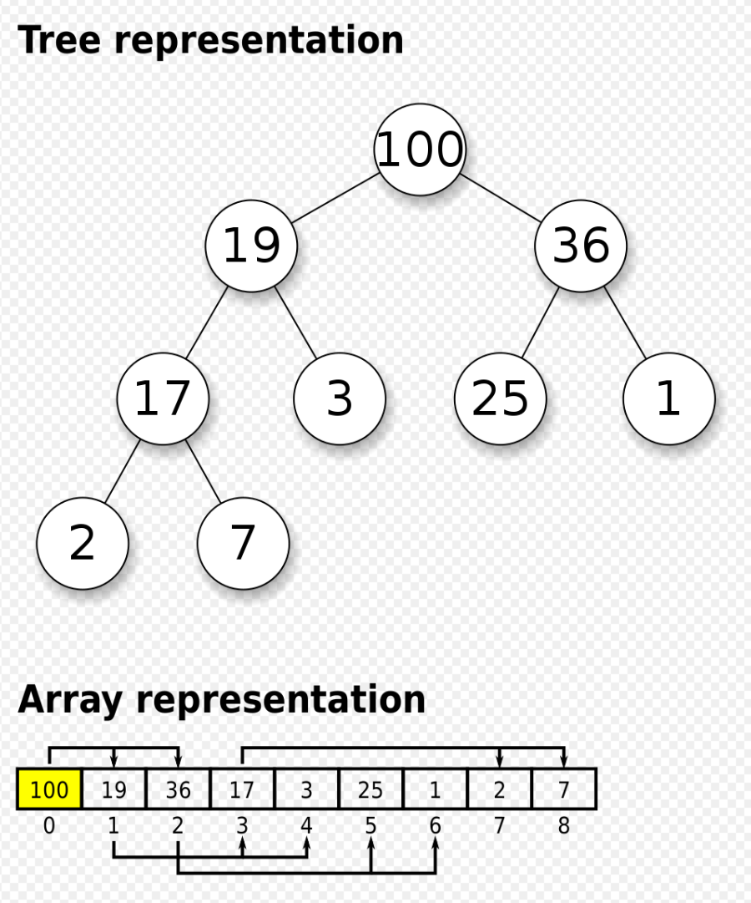

## 우선순위 큐
큐는 기본적으로 먼저 들어온 데이터가 먼저 나가는 FIFO(First In First Out) 형식의 자료구조이지만, 우선순위 큐는 자료구조가 아니다.  

우선순위 큐는 마치 `리스트` 나 `맵` 과 같이 추상적인 개념으로써 힙이나 다른 다양한 방법을 통해서 구현될 수 있다.  

## 힙
  

힙은 최대 값이나 최소 값을 찾아내는 연산을 빠르게 하기 위하여 고안된 자료구조로, 부모노드와 자식노드의 대소관계를 보장하는 완전 이진 트리의 일종이다.  
즉, 형제 노드 끼리의 값의 관계는 보장하지 않지만, 부모와 자식 간의 관계는 보장하는 일종의 반정렬 상태의 자료구조이다.  
또한 완전 이진 트리의 높이는 `logN` 이므로 삽입과 삭제 연산에 소요되는 시간은 `O(logN)` 이다.

배열로 구현하는 경우, 루트 노드를 1번째 인덱스로 지정하기 위해서 맨 처음에는 사용하지 않는 `null` 값을 넣어주면 편리하다.  

> **왼쪽 자식 노드**: `2n`  
> **오른쪽 자식 노드**: `2n+1`  
> **부모 노드**: `n/2`  

- **최대 힙(Max Heap)**: 부모 노드가 항상 자식 노드보다 큰 힙  
- **최소 힙(Min Heap)**: 부모 노드가 항상 자식 노드보다 작은 힙  

### 삽입
1. 힙의 가장 마지막 자리에 새로운 노드를 삽입한다.  
2. 삽입한 노드의 위치와 부모 노드의 값을 비교하면서 교체하는 과정을  
최대 힙이나 최소 힙의 정해진 조건을 만족할 때까지 반복한다.  

### 삭제
1. 힙에 아무런 데이터도 없다면 `undefined` 를 반환한다.  
2. 힙에 단 하나의 노드만 있다면 그 노드를 반환한다.  
3. 힙에 두 개 이상의 노드가 있다면 루트 노드의 값을 기억했다가 반환해야 한다.  
그리고 마지막에 있는 노드를 루트 노드로 옮긴 뒤, 자식 노드와 값 비교하면서 교체하는 과정을 최대 힙이나 최소 힙의 정해진 조건을 만족할 때까지 반복한다.  

## 소스코드
```js
class Heap {
  /**
   * @param {string} order 의 값은 'min' 이거나 'max' 일 수 있습니다.
   * 각각 최소 힙, 최대 힙을 나타냅니다.
   */
  constructor(order) {
    this.heap = [null];
    this.order = order;
  }

  isPriorThan(a, b) {
    const { heap, order } = this;
    if (order === 'max') return heap[a] > heap[b] ? true : false;
    else return heap[a] < heap[b] ? true : false;
  }

  push(value) {
    const { heap } = this;
    heap.push(value);

    let child = heap.length - 1;

    while (child > 1) {
      let parent = Math.floor(child / 2);
      if (this.isPriorThan(parent, child)) break;
      [heap[parent], heap[child]] = [heap[child], heap[parent]];
      child = parent;
    }
  }

  pop() {
    const { heap } = this;
    if (this.size() <= 0) return undefined;
    if (this.size() === 1) return heap.pop();

    const result = heap[1];
    heap[1] = heap.pop();
    let parent = 1;
    let child = 2;

    while (child < heap.length) {
      if (child + 1 < heap.length && this.isPriorThan(child + 1, child)) child++;
      if (this.isPriorThan(parent, child)) break;
      [heap[parent], heap[child]] = [heap[child], heap[parent]];
      parent = child;
      child *= 2;
    }

    return result;
  }

  size() {
    return this.heap.length - 1;
  }
}
```

## 참고 자료
[우선순위 큐 (위키백과)](https://ko.wikipedia.org/wiki/%EC%9A%B0%EC%84%A0%EC%88%9C%EC%9C%84_%ED%81%90)  
[힙 (위키백과)](https://ko.wikipedia.org/wiki/%ED%9E%99_(%EC%9E%90%EB%A3%8C_%EA%B5%AC%EC%A1%B0))  