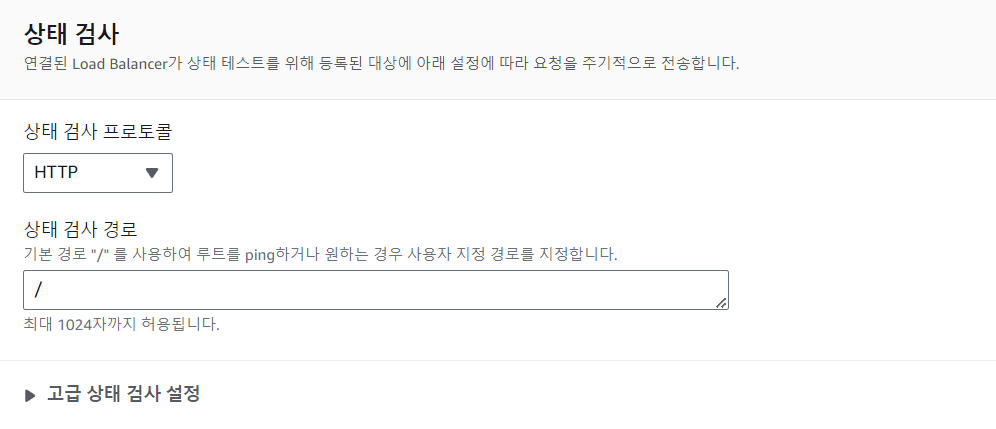
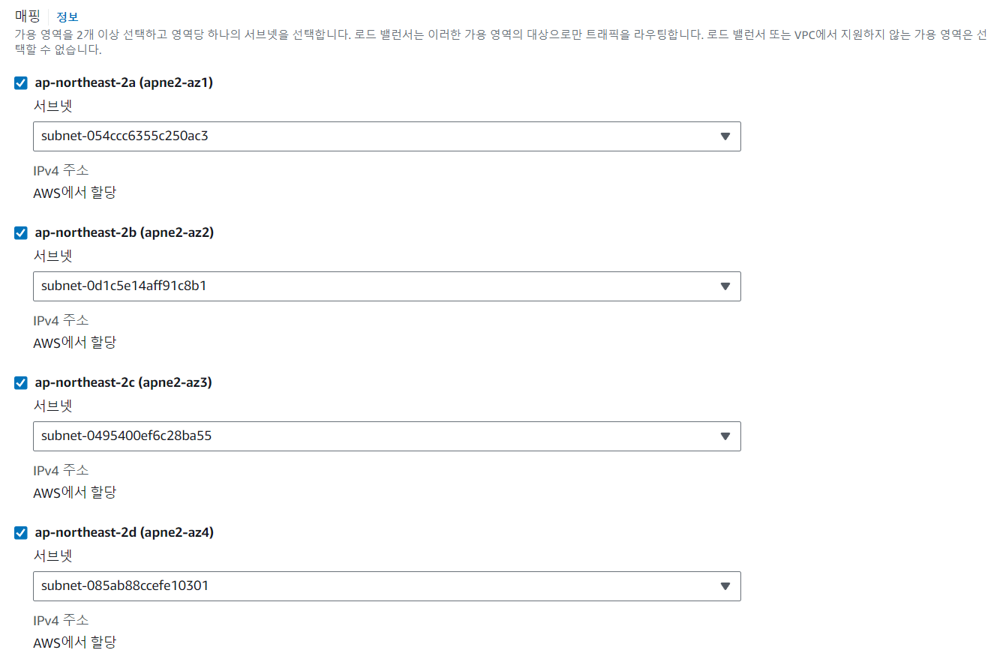
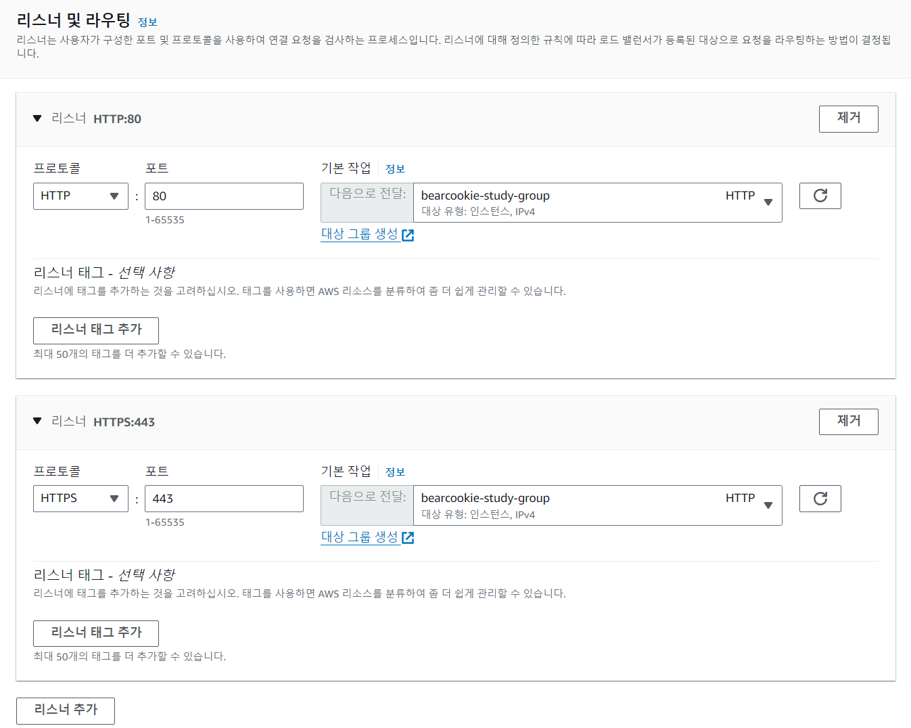

저번 포스트에 이어서 EC2에 도메인을 연결하고 ACM을 활용해서 HTTPS를 적용해보고자 한다.

## ACM 인증서 발급

[첫 번째 글](aws-deployment-1)의 내용과 동일한 방법으로 ACM 인증서를 발급받는다.

리액트 앱이 `www.bearcookiestudy.site` 에서 호스팅되고 있으니 이번에는 리전은 서울로, 도메인은 `api.bearcookiestudy.site` 로 해서 발급받자.

## ALB

리액트 앱의 경우에는 빌드된 정적 파일만 S3 버킷에 올리는 것이기 때문에 `HTTPS` 를 적용하기 위해서 앞 단에 `Cloudfront` 를 놓을 수 있다.  
이 경우에는 전 세계의 리전에 파일을 배포하기 때문에 사용자가 가까운 엣지로부터 파일을 받아와서 빠르게 컨텐츠를 받아볼 수 있었다.

그러나 Express 앱은 동적으로 동작하는 프로그램이기 때문에 CDN 에 올릴 수가 없다.  
그래서 앞 단에 `Application Load Balancer` 를 둬서 `HTTPS` 를 적용한다.

### 대상 그룹

로드 밸런서를 적용할 대상 그룹을 먼저 생성해야 한다.
EC2 사이드 바에서 대상 그룹을 클릭하고, 대상 그룹을 생성한다.

#### 기본 구성

EC2에 적용할 것이니 대상 유형을 인스턴스로, 프로토콜은 HTTP 로 선택한다.  
여기서 프로토콜은 EC2 인스턴스에 실제로 접근해야 할 포트를 의미한다.  
예를 들어, 우리는 외부에서 EC2의 80번 포트에 들어오면 Express 앱으로 요청하도록 구성해 놓았으니, 80번 포트인 HTTP 로 선택한 것이다.

#### 상태 검사

ALB가 주기적으로 EC2가 정상적인지를 체크하는데, 루트 URI에 간단한 헬스 체크 API를 작성해 두었으니 기본 값인 `/` 를 사용한다.

설정을 마쳤으면 다음 버튼을 누른다.

#### 대상 등록

대상 그룹을 적용할 EC2 인스턴스를 선택한 뒤, 아래에 보류 중인 것으로 포함 버튼을 눌러서 대상에 추가한다.  
마쳤으면 대상 그룹 생성 버튼을 눌러서 완료한다.

### 로드 밸런서

이제 로드 밸런서를 생성해야 하는데, EC2 사이드 바에서 로드 밸런서를 클릭하고 로드 밸런서를 생성버튼을 누른다.

유형을 Application Load Balancer 로 선택한다.

#### 네트워크 매핑

최소 2개 이상의 가용 영역을 선택해야 한다고 하는데, 필자는 모두 선택했다.

#### 보안 그룹

EC2 인스턴스에 적용된 보안 그룹을 그대로 사용한다.

#### 리스너 및 라우팅

HTTP, HTTPS 프로토콜을 추가하고, 방금 생성했던 대상 그룹으로 전달하도록 한다.

#### 보안 리스너 설정

아까 생성했던 ACM 인증서로 지정한다.

#### 요약

올바르게 입력했는지 요약 정보를 확인하고, 로드 밸런서 생성 버튼을 누른다.

## ALB에 도메인 연결

이제 ALB에 도메인을 연결하기 위해서 Route 53의 호스팅 영역에 레코드를 추가한다.

## 실행 확인

등록한 도메인 주소로 접속해보면, EC2 인스턴스에 `HTTPS` 프로토콜로 잘 접근하고 있다는 것을 확인할 수 있다.
