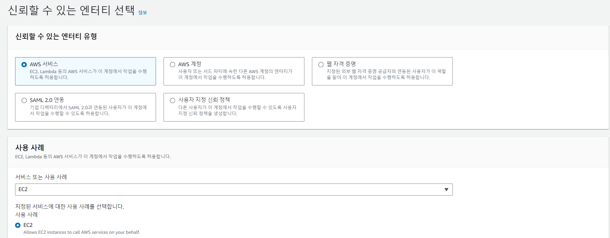
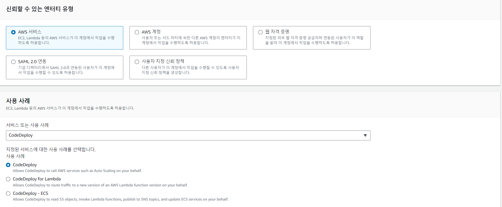
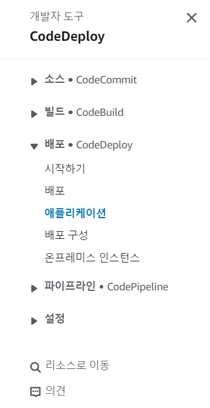
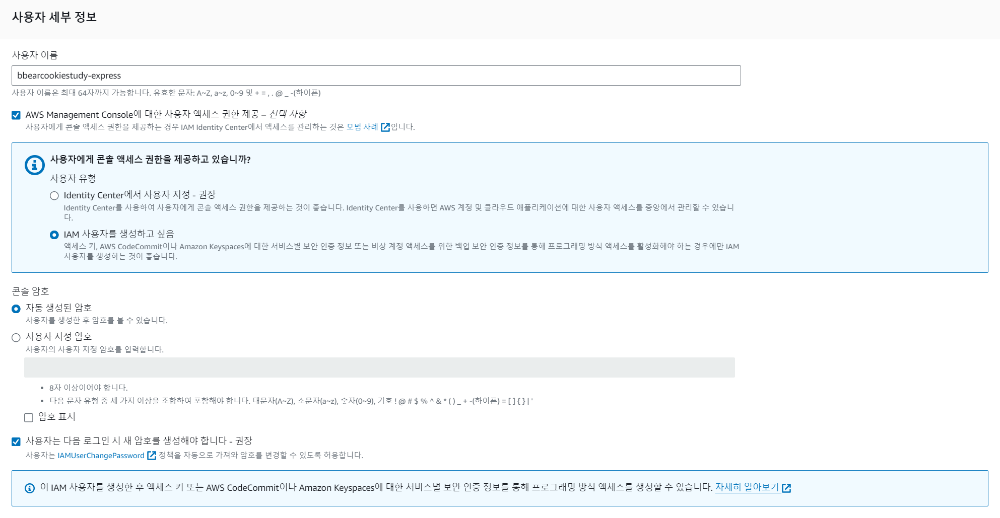

저번 포스트에서 `EC2` 인스턴스에 Express 앱을 설치하고, 외부에서 `HTTPS` 로 접근할 수 있도록 앞에 `ALB` 를 놓는 것 까지 구성했었다.

이번에는 `Github Action` 과 `AWS CodeDeploy` 를 활용해서 소스코드에 변화가 발생하면 자동으로 빌드하고 배포하는 과정을 진행해보겠다.

## S3 버킷 생성

소스코드에 변화가 발생할 때 CI 서버는 빌드 작업을 수행하는데, 빌드된 내용을 AWS 인프라 내에서 사용하려면 보관해 둘 스토리지가 필요하다.

[첫 번째 글](aws-deployment-1)의 내용과 유사한 방법으로 S3 버킷을 생성한다.


단, 외부에서 사용자가 직접적으로 접근할 필요는 없으므로 퍼블릭 액세스는 차단한다.

## IAM 역할 생성

### EC2의 IAM 역할 생성

EC2가 S3와 CodeDeploy를 이용할 수 있도록 권한을 설정해줘야 한다.

IAM > 역할 > 역할 생성 진행한다.

#### 신뢰할 수 있는 엔티티 선택



사용 사례에 EC2를 선택하고 다음 버튼을 클릭한다.

#### 권한 추가

```
AmazonS3FullAccess
AWSCodeDeployFullAccess
```

위 두개의 권한 정책을 추가한다.

#### 이름 지정, 검토 및 생성


역할 이름에 적당한 내용을 적어준다.


두 개의 권한이 정상적으로 들어왔는지 확인한다.  
문제가 없다면 역할 생성을 누른다.

### EC2에 IAM 역할 연결


이제 생성했던 IAM을 EC2에 연결해주면 되는데, EC2 대시보드 페이지에서 해당 EC2 인스턴스를 선택하고 작업 > 보안 > IAM 역할 수정을 누른다.


아까 생성했던 IAM을 선택하고 적용한다.

### CodeDeploy의 IAM 생성

CodeDeploy를 위한 IAM 역할도 생성해야 한다.

#### 신뢰할 수 있는 엔티티 유형



#### 권한 정책


#### 이름 지정, 검토 및 생성


역할 이름에 적당한 내용을 적어준다.


CodeDeploy 관련 권한이 정상적으로 있는지 확인하고 문제가 없다면 역할 생성 버튼을 누른다.

## CodeDeploy 생성



CodeDeploy 대시보드의 사이드 바에서 애플리케이션을 선택한 뒤, 애플리케이션 생성 버튼을 누른다.


CodeDeploy 애플리케이션을 생성한다.  
EC2를 대상으로 할 것이니 EC2/온프레미스를 선택한다.

### 배포 그룹 생성


CodeDeploy 상세 페이지에서 배포 그룹 생성 버튼을 눌러서, 이 CodeDeploy 애플리케이션에 배포 그룹을 등록한다.

#### 서비스 역할


아까 생성했던 CodeDeploy IAM 역할을 선택한다.

#### 배포 유형


#### 환경 구성


EC2 인스턴스를 체크하고, 태그 그룹의 키에 중복되지 않는 값을 임의로 넣어준다.

#### 배포 설정


#### 로드 밸런서


로드 밸런서는 체크를 해제해준다.

> 이 옵션을 체크하고 진행했을 때 `blocktraffic` 상태에서 5분씩 걸리는 문제가 있었으니 꼭 유의하고 체크를 해제해준다!!

## IAM 사용자 생성

`Github Actions` 이 동작하는 CI 서버가 우리 AWS 인프라에 접근할 권한을 부여하기 위해서 `IAM` 을 생성해야 한다.

IAM > 사용자 > 사용자 생성에서 진행한다.

### 사용자 세부 정보



IAM 사용자를 생성하고 싶음을 선택한다.

### 권한 설정


직접 정책 연결을 선택한 뒤, S3와 CodeDeploy에 대한 액세스 권한을 부여한다.

```
AmazonS3FullAccess
AWSCodeDeployFullAccess
```

### 검토 및 생성


검토 결과를 확인하고 사용자 생성 버튼을 누른다.

### 액세스 키 생성


[첫 번째 글](aws-deployment-1)의 내용과 유사한 방법으로 액세스 키와 시크릿 키를 생성하고 기억해둔다.

## CodeDeploy 에이전트

### EC2에 CodeDeploy 에이전트 설치

EC2 인스턴스에서 CodeDeploy를 이용하려면, EC2에 CodeDeploy 에이전트를 설치해야 한다.
[AWS 공식문서](https://docs.aws.amazon.com/ko_kr/codedeploy/latest/userguide/codedeploy-agent-operations-install-ubuntu.html)를 참고하여 설치한다.

```sh
# 1.
sudo apt update

# 2.
sudo apt install ruby-full

# 3.
sudo apt install wget

# 4.
cd /home/ubuntu

# 5.
wget https://<빌드된 파일이 존재하는 S3 버킷 이름>.s3.<리전>.amazonaws.com/latest/install
```

예를 들어, 서울 리전의 버킷과 CodeDeploy 에 대한 에이전트를 설치하기 위해서는 `wget https://aws-codedeploy-ap-northeast-2.s3.ap-northeast-2.amazonaws.com/latest/install` 를 입력한다.

```sh
# 6.
chmod +x ./install

# 7.
sudo ./install auto

# 8. CodeDeploy 에이전트 재실행
sudo service codedeploy-agent restart
```

## 프로젝트에 스크립트 작성

### CodeDeploy 관련 스크립트 작성

우리의 Express 프로젝트 내부에 CodeDeploy의 동작에 관한 파일을 몇 가지 작성해야 한다.

#### appspec.yml

`appspec.yml` 파일은 CodeDeploy에 대한 설정 파일이다.  
CodeDeploy는 작동하는 동안에 라이프 사이클이 존재하는데, 각각의 라이프 사이클에 수행해야 하는 동작이 있다면 `appspec.yml` 파일에 정의할 수 있다.


예를 들어 빌드된 파일을 EC2에 올렸을 때, 서버를 재시작하는 커맨드를 수행하기 위해 `AfterInstall` 를 이용할 수 있다.

```yml
version: 0.0
os: linux
files:
  - source: /
    destination: /home/ubuntu/codedeploy_build
    overwrite: yes

permissions:
  - object: /home/ubuntu
    pattern: "**"
    owner: ubuntu
    group: ubuntu

hooks:
  AfterInstall:
    - location: scripts/after-deploy.sh
      timeout: 300
      runas: ubuntu
```

#### scripts/after-deploy.sh

`appspec.yml` 에서 `scripts/after-deploy.sh` 파일을 실행하고 있는데 여기에는 아래와 같이 `pm2` 로 앱을 실행하는 명령어를 적어준다.

```sh
REPOSITORY=/home/ubuntu/codedeploy_build

cd $REPOSITORY

pm2 start "npm start"
```

#### 이슈: command not found

EC2로 받아온 파일을 실행하는 `AfterInstall` 과정에서 커맨드를 찾을 수 없다는 오류`(pm2: command not found)`가 발생할 수 있는데, 이는 nvm을 설치해서 노드를 사용하는 경우에 발생한다고 한다.

##### 경로 확인


```sh
whereis npm
whereis pm2
whereis node
```

위와 명령어를 입력해서 실행하려는 모듈의 위치를 찾는다.

##### 심볼릭 링크 추가

```sh
sudo ln -s /home/ubuntu/.nvm/versions/node/v20.9.0/bin/npm /usr/bin/npm
sudo ln -s /home/ubuntu/.nvm/versions/node/v20.9.0/bin/pm2 /usr/bin/pm2
sudo ln -s /home/ubuntu/.nvm/versions/node/v20.9.0/bin/node /usr/local/bin/node
```

원본 파일과 연결되는 심볼릭 링크를 만든다.

##### scripts/after-deploy.sh 수정

```sh
REPOSITORY=/home/ubuntu/codedeploy_build

cd $REPOSITORY

/usr/bin/pm2 start "npm start"
```

명령어를 직접 실행하는 대신, 심볼릭 링크를 활용하는 방식으로 스크립트를 변경한다.

### Github Action CI 작성

배포 브랜치에 내용이 올라오면 자동으로 빌드하고 업로드하고 배포하는 과정을 수행하는 스크립트를 작성한다.  
몇 가지의 환경 변수는 `Github Secret` 에 등록한다.

- `AWS_BACKEND_ACCESS_KEY`  
  아까 생성했던 `Github Action` 전용 AMI의 퍼블릭 액세스 키
- `AWS_BACKEND_SECRET_KEY`  
  아까 생성했던 `Github Action` 전용 AMI의 시크릿 액세스 키
- `AWS_BACKEND_S3_BUCKET`  
  빌드된 파일이 업로드되는 S3 버킷 이름
- `AWS_BACKEND_CODEDEPLOY_APPLICATION_NAME`  
  CodeDeploy 애플리케이션 이름
- `AWS_BACKEND_CODEDEPLOY_GROUP_NAME`  
  CodeDeploy 배포 그룹 이름

```yml
name: Express CI/CD

on:
  push:
    branches: ["deploy"]

jobs:
  deploy:
    runs-on: ubuntu-latest
    defaults:
      run:
        working-directory: ./backend/
    steps:
      - uses: actions/checkout@v3

      - name: Setup Node
        uses: actions/setup-node@v3
        with:
          node-version: 18.x
          cache: "npm"
          cache-dependency-path: ./backend/package-lock.json

      - run: npm ci
      - run: npm run build

      - name: AWS configure credentials
        uses: aws-actions/configure-aws-credentials@v4
        with:
          aws-access-key-id: ${{ secrets.AWS_BACKEND_ACCESS_KEY }}
          aws-secret-access-key: ${{ secrets.AWS_BACKEND_SECRET_KEY }}
          aws-region: ap-northeast-2

      - run: ls -al

      - name: Compress Files
        run: tar cvfz ./$GITHUB_SHA.gz *

      - name: Upload to S3
        run: aws s3 cp --region ap-northeast-2 ./$GITHUB_SHA.gz s3://${{secrets.AWS_BACKEND_S3_BUCKET}}/deployment/$GITHUB_SHA.gz

      - name: Code Deploy
        run: aws deploy create-deployment
          --application-name ${{secrets.AWS_BACKEND_CODEDEPLOY_APPLICATION_NAME}}
          --deployment-config-name CodeDeployDefault.AllAtOnce
          --deployment-group-name ${{secrets.AWS_BACKEND_CODEDEPLOY_GROUP_NAME}}
          --s3-location bucket=${{secrets.AWS_BACKEND_S3_BUCKET}},bundleType=tgz,key=deployment/$GITHUB_SHA.gz
```

## EC2 실행시 수행할 작업 등록

EC2 인스턴스를 재부팅하면 데몬이 종료되어 있기 때문에 실행해주는 과정이 필요하다.  
이런 부분을 일일히 커맨드를 입력해서 실행해줄 수도 있지만, 인스턴스가 켜지면 자동으로 실행하도록 설정해두면 편리하다.

### 에이전트 자동 실행

아래와 같은 커맨드를 순서대로 입력하면 EC2 인스턴스가 실행될 때 자동으로 CodeDeploy 에이전트가 실행된다.

```sh
## 1. 쉘 스크립트 생성
sudo vim /etc/init.d/codedeploy-startup.sh

## 2. 내용 작성
sudo service codedeploy-agent start

## 3. 실행 권한 수정
sudo chmod +x /etc/init.d/codedeploy-startup.sh
```

### PM2 자동 실행

EC2 인스턴스가 실행된 초기 상태에는 PM2에 아무런 앱도 올라오지 않은 상태이기 때문에 Express 앱을 실행하는 과정을 수동으로 수행해야 한다.  
그러나, PM2가 실행되고 있는 환경을 기록해놓고 인스턴스가 실행될 때

#### 1. pm2 확인


`pm2 ls` 명령어를 입력하고, 현재 PM2에 정상적으로 Express가 실행중인지를 확인한다.

#### 2. pm2 startup


`pm2 startup` 명령어를 입력하면 위와 같은 커맨드를 입력하라고 나온다.  
복사해서 붙여넣기 한다.

#### 3. 명령어 입력

```sh
sudo env PATH=$PATH:/home/ubuntu/.nvm/versions/node/v20.9.0/bin /home/ubuntu/.nvm/versions/node/v20.9.0/lib/node_modules/pm2/bin/pm2 startup systemd -u ubuntu --hp /home/ubuntu
```


화면에 나왔던 명령어를 입력하면, 재부팅할 때 현재 환경을 동력하고 자동으로 실행되기 위해서 `pm2 save` 명령어를 입력하라고 나온다.  
입력해준다.

#### 4. pm2 save


이제 인스턴스가 재부팅되면 PM2에 자동으로 Express가 실행된 환경이 올라갈 것이다!
또한, `CI` 스크립트에 작성했듯 `deploy` 브랜치에 새로운 내용이 올라오면 빌드 및 배포가 자동으로 되는 것도 확인할 수 있다.
