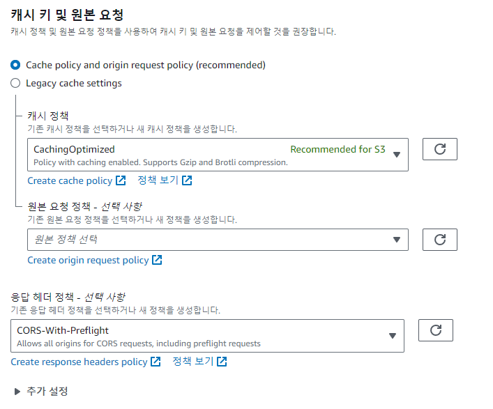

## 서론

이미지 다운로드 버튼을 누르면 파일을 다운로드하는 기능을 구현해야 했었다.  
이미지의 원본 데이터는 S3 버킷에 저장하고 있는 상태였는데 이미지 경로를 `img` 태그의 src 속성에 담아 보여주는 것 자체는 문제가 없었지만, 다운로드를 위해서는 파일 데이터를 ajax 요청으로 가져오고 Blob 데이터로 만들 필요성이 있었다.

따라서 **S3 버킷에서 허용하는 Origin을 설정**해 줄 필요성이 있었다.

> a 태그의 download 속성을 이용하는 방법도 사용해보려고 했으나, 이미지가 다운로드 되는 것이 아니라 **아예 이미지 경로로 redirect 되는 현상**이 있어서 찾아보니 보안 이슈로 인해 동일한 출처가 아니라면 다운로드를 트리거 하지 못하도록 수정되었다고 한다.

이번 글에서는 간단하게 해결 방법을 기록해보고자 한다.

### S3에 CORS 정책 추가하기

[AWS 공식 문서](https://docs.aws.amazon.com/ko_kr/AmazonS3/latest/userguide/enabling-cors-examples.html?icmpid=docs_amazons3_console)를 살펴보면 크게 3가지의 방법이 있다고 하는데, 가장 간단한 S3 콘솔을 통한 설정을 적용해보자.

해결 방법은 아주 간단한데, S3 버킷 > 권한 > CORS(Cross-origin 리소스 공유) 에 아래 내용을 적어주면 끝이다.

```json
[
  {
    "AllowedHeaders": ["*"],
    "AllowedMethods": ["GET", "HEAD"],
    "AllowedOrigins": ["*"],
    "ExposeHeaders": []
  }
]
```


### Cloudfront에 헤더 설정하기

그런데 이미지 자원을 위해서 항상 S3 버킷에 접근하는 것 보다는 CDN을 통해 캐싱하는 것이 직접 비용과 속도 차원에서 더 좋아보인다.  
그래서 Cloudfront를 이용했는데, 이 경우 Cloudfront에서도 요청/응답 헤더 설정을 해줘야 한다.  
Cloudfront > 배포 > 동작 에서 관련 설정을 해준다.



> 요청 헤더: CORS-S3Origin 을 선택했다.  
> 응답 헤더: SimpleCORS 를 선택했다.

설정을 마치면 Cloudfront를 무효화해서 설정이 즉시 반영될 수 있도록 한다.  
(만약 여전히 설정이 반영이 안되어있다면, 잠시 캐시 정책을 `CachingDisabled` 로 설정해보는 것도 방법이다.)

## References

[[HTML] a 태그를 이용한 다운로드 기능](https://redk.tistory.com/70)  
[S3의 CORS 정책을 이용하도록 CloudFront 설정하기](https://bigboss.dev/2021/11/cloudfront-settings-to-use-s3-cors/)
