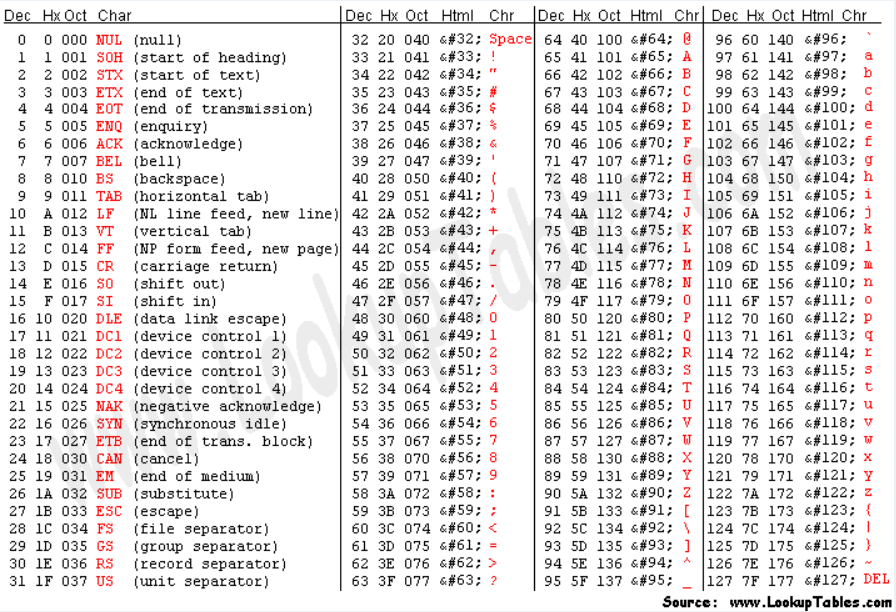
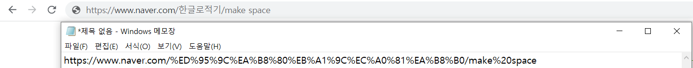
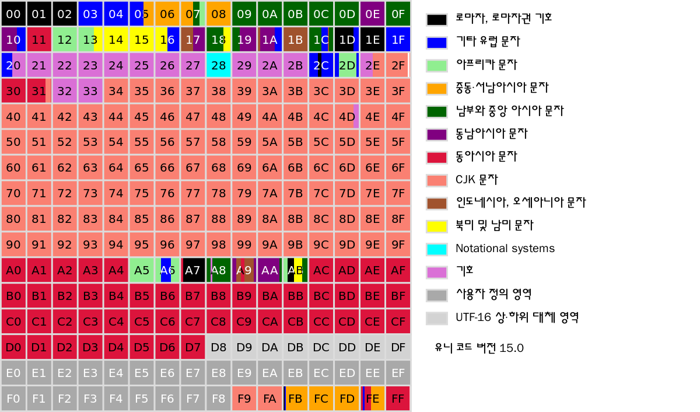
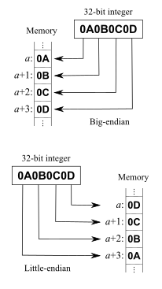
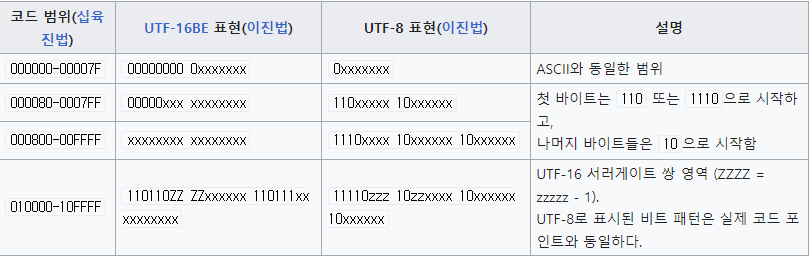

컴퓨터는 0과 1로만 정보를 표현할 수 있다. 그런데 한글, 알파벳, 히라가나 등 사람이 사용하는 문자는 어떻게 화면을 통해서 우리에게 보여지는 것일까?

컴퓨터가 문자를 표현하는 방법을 알기 위해서 필요한 몇 가지의 기본 개념이 존재한다.  

## 기본 개념
### CCS(Coded Character Set)


- 문자를 특정 정수 값 `Code Point` 에 매핑해 만든 코드화 된 문자들의 집합이다.  
- 즉, 문자를 정수로 표현할 수 있도록 하는 규칙 테이블인 셈이다.  
- 정수는 각 문자에 대한 식별자가 된다.  
- KS C 5601, ISO 10646, US-ASCII 등이 이에 해당된다.  

### CES(Character Encoding Scheme)
- `CCS` 를 문자의 기본 단위인 8bit 집합에 대응시키는 것이다.  
- 흔히 말하는 문자 인코딩에 해당한다.  
- UTF-8, UTF-16, EUC-KR, CP949 등이 이에 해당된다.  

> **인코딩**: 문자를 시스템이 인식할 수 있는 숫자와 같은 값으로 변환하는 것  
> **디코딩**: 인코딩된 값을 다시 문자로 변환하는 것  

### TES(Transfer Encoding Syntax)
- 인코딩된 문자를 통신 프로토콜을 통해서 전송하기에 적합한 형태로 바꾸는 것이다.  
- URL Encoding, BASE64 Encoding 등이 이에 해당된다.  

#### URL Encoding
  

URL에는 ASCII 코드의 문자 집합만 사용할 수 있게 되어 있다.  
따라서 한글이나 특수문자 등 ASCII 테이블에 존재하지 않는 문자는 변환하는 과정이 필요한데, 그걸 `URL Encoding` 이라고 한다.  

위 예시의 이미지를 보면 한글이나 공백과 같은 문자가 변환되어 있다는 것을 확인할 수 있다.  

### 요약
- **CCS**: 문자와 숫자의 관계를 나타내는 **테이블**  
- **CES**: 문자를 8bit(바이트) 단위의 **숫자로 변환**하는 과정 (인코딩)  
- **TES**: 인코딩된 문자를 프로토콜을 통해서 전송하기에 **적합한 형태로 변환**하는 것  

## 유니코드
다양한 나라가 사용하는 문자 세트와 인코딩 방식이 다양하다보니, 프로그램에서 문자가 깨지는 등 호환성과 확장성에 대한 문제가 많이 생겼었다.  
그래서 유니코드라는 표준 시스템이 등장하게 되었다.  

### 유니코드의 CCS  
  
- 유니코드는 4바이트 영역까지 사용할 수 있다.  
- 흔히 쓰이는 대부분의 문자가 들어있는 영역을 **다국어 기본 평면 (Basic multilingual plane, BMP)**이라고 한다.  
BMP 영역은 `U+0000` 부터 `U+FFFF` 까지의 영역을 차지하므로 2바이트 내로 표현할 수 있다.  
- BMP 영역을 벗어나는 문자를 표현하기 위해서는 2바이트보다 많은 공간이 필요한데, 이럴 땐 **Surrogate Pair** 방법을 이용한다.  
> **Surrogate Pair**  
> `Surrogate 영역` 에 있는 보조 문자와, `BMP 외부 영역` 에 있는 문자를 합쳐서 하나의 글자를 표현하는 방법이다.

### 유니코드의 CES
유니코드는 여러 방법으로 인코딩될 수 있는데, 대표적인 방법이 UTF 계열이다.  
기본 단위를 몇 비트로 사용할 것인지에 따라서 `UTF-8`, `UTF-16`, `UTF-32` 등이 존재하는데 보통 웹 문서에서는 크기를 줄이기 위해서 `UTF-8` 을 많이 사용한다.  

UTF 계열도 Little Endian 방식을 사용할 것인지, Big Endian 방식을 사용할 것인지에 따라 `UTF16-LE`, `UTF-16BE` 등 다양한 종류가 존재한다.  

#### Big Endian vs Little Endian  
  
- **Big Endian**: 사람이 숫자를 쓰는 방법처럼, 큰 단위의 바이트가 앞에 오는 방법이다.  
- **Little Endian**: 반대로 작은 단위의 바이트부터 앞에 오는 방법이다.  

#### 바이트 문서 표식(Byte Order Mark, BOM)
문서의 제일 앞에 추가하여 텍스트를 읽는 프로그램에 여러 정보를 전달한다.  
- 문서의 바이트 순서 또는 엔디언  
- 문서의 인코딩이 거의 확실히 유니코드임  
- 문서에 사용한 유니코드 문자 인코딩 방식  

#### UTF-8  
  

UTF-8은 유니코드를 위한 **가변 길이 문자 인코딩 방식** 중의 하나이다. 따라서 1바이트에서 4바이트까지 가변적으로 사용한다.  
몇 바이트를 사용하는지를 구분하는 방법은, 첫 바이트가 어떤 숫자로 시작하는지를 보고 구분할 수 있다.  

- **1바이트로 표현이 가능할 때**  
문자를 1바이트로 표현할 수 있다면 그대로 표현한다.  
- **2바이트로 표현이 가능할 때**  
첫 바이트는 `110` 으로 시작하고, 두 번째 바이트는 `10` 으로 시작한다.  
- **3바이트로 표현이 가능할 때**  
첫 바이트는 `1110` 으로 시작하고, 나머지 바이트는 `10` 으로 시작한다.  
- **4바이트로 표현이 가능할 때**  
첫 바이트는 `11110` 으로 시작하고, 나머지 바이트는 `10` 으로 시작한다.  

## 예시 코드
```js
// 알파벳은 BMP 영역에 포함되어 있고, 2바이트 내에서 표현할 수 있다. 따라서 length는 1이다.
const en = 'E';
console.log(en.charCodeAt(0).toString(16)); // 0x45
console.log(en.charCodeAt(1).toString(16)); // NaN
console.log(en.length); // 1

// 한글은 BMP 영역에 포함되어 있고, 2바이트 내에서 표현할 수 있다. 따라서 length는 1이다.
const kr = '한';
console.log(kr.charCodeAt(0).toString(16)); // 0xd55c
console.log(kr.charCodeAt(1).toString(16)); // NaN
console.log(kr.length); // 1

// 이모지는 BMP 영역에 존재하지 않고, 4바이트가 필요하다. 따라서 length는 2이다.
const poop = '💩';
console.log(poop.charCodeAt(0).toString(16)); // 0xd83d
console.log(poop.charCodeAt(1).toString(16)); // 0xdca9
console.log("\ud83d\udca9"); // 💩
console.log(poop.length); // 2
```


## 참고 자료
[ASCII Table](https://www.asciitable.com/)  
[[볼륨주의] 문자 인코딩, 유니코드, UTF-8이 뭔가요? (얄팍한 코딩사전)](https://www.youtube.com/watch?v=1jo6q4dihoU)  
[비트와 바이트 문자인코딩 개념 정리 10분 🙆‍♀️ (드림코딩)](https://www.youtube.com/watch?v=5IRFJt1C5o4)  
[유니코드 평면 (위키백과)](https://ko.wikipedia.org/wiki/%EC%9C%A0%EB%8B%88%EC%BD%94%EB%93%9C_%ED%8F%89%EB%A9%B4)  
[Surrogate, Surrogate Pair란? (Chan)](https://m.blog.naver.com/nakim02/221478419731)  
[엔디언 (위키백과)](https://ko.wikipedia.org/wiki/%EC%97%94%EB%94%94%EC%96%B8)  
[바이트 문서 표식 (위키백과)](https://ko.wikipedia.org/wiki/%EB%B0%94%EC%9D%B4%ED%8A%B8_%EC%88%9C%EC%84%9C_%ED%91%9C%EC%8B%9D)  
[UTF-8 (위키백과)](https://ko.wikipedia.org/wiki/UTF-8)  