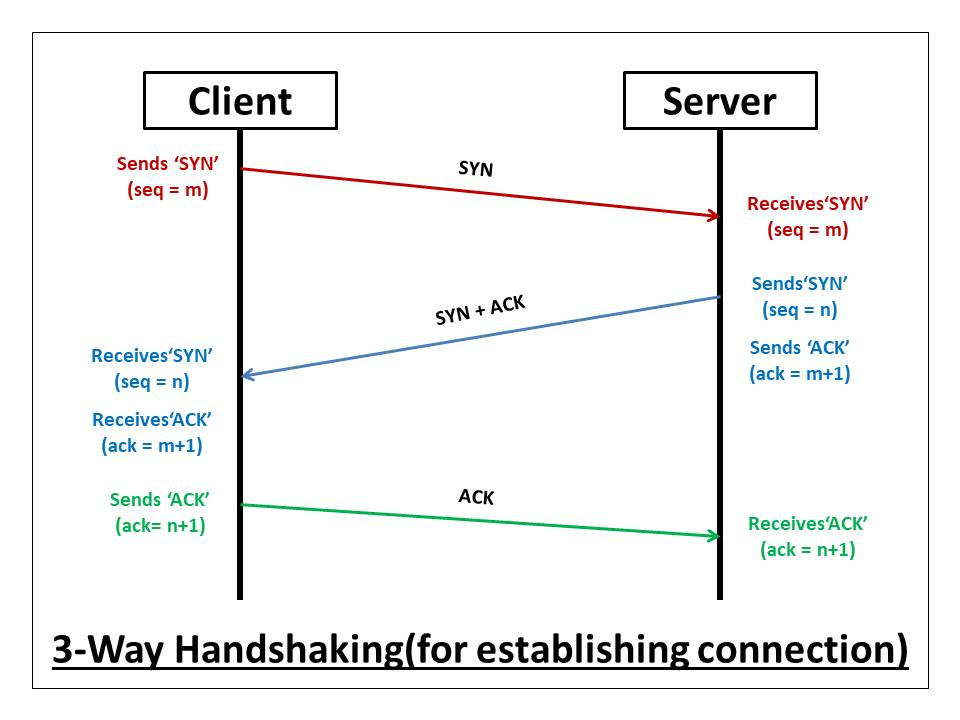

## 브라우저에 URL을 입력하면
### 1. URL을 해석
  

- **스키마**: 브라우저가 리소스를 요청하는 데 사용해야 하는 프로토콜을 나타낸다.  
- **권한**: 도메인과 포트 번호 부분이다.  
> *'도메인'* 은 요청하는 웹 서버를 나타내고,   
*'포트'* 는 웹 서버의 리소스에 접근하는 데 사용되는 기술적인 게이트를 나타낸다.  
- **리소스 경로**: 웹 서버에 있는 리소스의 경로를 나타낸다.  
- **매개변수**: 웹 서버에 제공되는 추가적인 매개변수이다.  
- **앵커**: 리소스 자체의 어떤 부분에 대한 앵커로, 일종의 책갈피 역할을 한다.  

### 2. DNS를 조회
  

DNS는 IP 주소 및 기타 데이터를 저장하고 이름별로 쿼리할 수 있게 해주는 계층형 분산 데이터베이스이다.  
즉, DNS를 사용하면 IP 주소와 도메인을 변환해주는 작업을 할 수 있다.  
도메인 이름에 대한 IP 주소를 찾기 위한 절차는 다음과 같다:  
1. 브라우저의 캐시를 확인한다.  
2. 컴퓨터에 저장되어 있는 hosts 파일을 확인한다.  
3. DNS 쿼리를 보낸다.  
3-1. Root Nameserver에 질의한다.  
3-2. TLD Nameserver에 질의한다.  
3-3. Authoritative Nameserver에 질의한다.  

### 3. 해당 IP가 존재하는 서버로 이동  
찾은 IP가 존재하는 서버로 라우터를 통해서 이동한다.  

### 4. ARP를 이용해서 주소 변환  
논리 주소인 IP 주소를, 물리 주소인 MAC으로 변환한다.  

### 5. TCP 통신을 위해 Socket 열기
    

신뢰성을 보장하는 TCP 통신을 수행하기 위해서 다음과 같은 3Way-Handshaking 과정을 거쳐서 소켓을 연다: 
1. 클라이언트가 `SYN 패킷` 을 보낸다.  
2. 서버가 정상적으로 받았다는 ACK 패킷과, 연결 수립을 요청하는 SYN 패킷을 합친 `SYN+ACK 패킷` 을 보낸다.  
3. 클라이언트가 정상적으로 받았다는 `ACK 패킷` 을 보낸다.  

### 6. 서버가 응답을 반환
클라이언트가 `html`, `css`, `js` 등의 파일이나, `json` 데이터를 서버에게 요청한 것에 대해서 적절한 응답을 반환한다.  
통신에는 `HTTP` 프로토콜 혹은 `HTTPS` 프로토콜이 사용된다.  

### 7. 브라우저가 렌더링  
브라우저의 렌더링 과정을 거쳐서 화면을 그린다.  

> 면접때 위와 같은 흐름 정도는 설명할 수 있어야 한다!

## 컴퓨터의 시간
시간을 표현하는데 있어서 다양한 요인을 생각해야 한다.  
1. **위치**: 한국에 있는지, 미국에 있는지 등 위치에 따라서 시간이 달라진다.  
2. **천문현상**: 지구의 자전주기와 공전주기같은 천문 현상으로 인한 시간 보정이 필요하다. (윤년)  
3. **문화**: 태양력, 태음력, 에티오피아력 등 문화에 따라서 시간 표현이 달라진다.  
4. **역사**: 1582년에 교황 그레고리오가, 이전의 율리오스력을 개정하여 새로운 그레고리력을 만든 것 처럼 역사적인 사건에 따라서 시간이 달라질 수 있다.  
5. **사회**: 일광 시간 절약제(Summer Time)과 같은 사회적 제도에 따라서 시간이 달라질 수 있다.  

그럼 이런 복잡한 요인들을 어떻게 정리해서 사용할까?  

### 협정 세계시(UTC)
1970년 1월 1일 자정을 0 밀리초로 설정하여 그 후의 시간의 흐름을 밀리초로 계산한다.

[그리니치 평균시(GMT)](https://ko.wikipedia.org/wiki/%EA%B7%B8%EB%A6%AC%EB%8B%88%EC%B9%98_%ED%8F%89%EA%B7%A0%EC%8B%9C)에 기반하므로 GMT라고 불리기도 하는데, 기술적인 표기에서는 UTC로 표기한다.  

#### 표기 예시
```js
2023-06-05T16:00:00.000Z // UTC+0 기준으로 2023년 6월 5일 오후 4시
2023-06-05T16:00:00.000Z+09:00 // UTC+9 (한국 시간) 기준으로 2023년 6월 5일 오후 4시
```

### 컴퓨터가 시간을 표현하는 방법
- **시스템 시간**: 특정 시각을 기준으로 시스템 클럭의 틱을 세는 방식으로 시간을 구현한다.  
메인보드에 들어있는 `RTC(Real Time Clock)` 모듈에는 카운터 회로가 존재하는데, 카운터 회로에서 결정 진동자가 클럭을 발생시키고, 결정 진동자가 만드는 주파수를 가지고 시간을 계산한다.  
- **타임스탬프(timestamp)**: 시스템 시간을 값으로 표현한 것이다.  

운영체제마다 타임스탬프의 기준 시간과 단위가 다를 수 있는데, 대표적으로 사용되는게 유닉스 계열에서 사용하는 `Unix Time` 이다.  
`Unix Time` 에서는 1970년 1월 1일 자정을 기준으로 이후의 시간은 양수로, 이전의 시간은 음수로 표현하며 초 단위로 시간이 증가한다.  

### 네트워크 타임 프로토콜(NTP)
    

**네트워크 타임 프로토콜(NPT)** 은 컴퓨터 시스템 간 시간 동기화를 위한 네트워크 프로토콜로 컴퓨터를 키면 자동으로 요청한다.  
NPT 서버는 `Stratum` 이라고 부르는 계층 구조로 이루어져 있으며, 최상위 계층을 `PRC(Primary Reference Clock)` 라고 한다.

### 시간대(Time Zone)
**시간대(Time Zone)**은 위치, 천문현상, 문화, 역사, 사회적 요인들을 고려해서 고안된 시간의 구분선이다.  

#### ZoneId
대륙/도시 형태로 ZoneId를 표현할 수 있다.
- Asia/Seoul  
- America/New_York  
- etc..

### 적합한 시간 기준  
- **UTC**: 사회적 요인을 고려하지 않고, 순수한 시간을 기록해야 할 때 사용.  
ex) 생일, 기업 설립일, 기념일, 국경일, 로깅, 시계열 데이터 등  
- **Time Zone이 적용된 시간**: 애플리케이션에 나타날 결제 시각, SNS 포스트 작성 시각 등 사용자에게 사용자 기준으로 보여줘야 할 때 사용.  

## 암호화
평문 자체를 네트워크 상에서 주고 받는건 보안에 위험할 수 있으므로 암호화 과정을 거쳐서 암호문으로 변환하는 알고리즘이 존재한다.  

### 단방향 암호화
    

평문을 암호문으로 암호화 하는 과정만 가능하여 다시 복호화할 수 없는 방식이다.  
사용자의 비밀번호를 저장할 때 자주 사용되며 대표적으로 `MD5`, `SHA` 알고리즘이 있다.  

#### 고려할 점
복호화가 불가능하지만, `Rainbow Table` 을 통해서 원문을 알아내는 방법이 가능하다.  
따라서 `Salt` 와 `Key Stretching` 기법을 적절하게 활용해야 한다.  

- **Salt**: 평문에 임의의 문자열을 추가하는 방법이다. 사용자마다 다른 Salt를 사용하고 128bit 이상으로 만들면 더 안전하다.  
- **Key Stretching**: 해시를 여러 번 반복(Iterate)하는 방법이다.  

이런 Salt와 Key Stretching 기법은 직접 구현하는 것보다는 `PBKDF2` 나 `bcrypt` 같이 이미 검증된 알고리즘을 사용하는 편이 더 안전하다.

> **Rainbow Table**  
해시 함수를 사용하여 변환 가능한 모든 해시 값을 저장시켜 놓은 표

### 양방향 암호화  
평문을 암호화할 수도 있고 암호문을 복호화할 수도 있는 방식으로,  
대칭키 암호 알고리즘과 비대칭키 암호 알고리즘으로 나눌 수 있다.  

#### 대칭키 암호 알고리즘
  

암호화를 위한 키와, 복호화를 위한 키가 동일한 방식이다.  
공개키 암호 알고리즘이라고도 부른다.  

#### 비대칭키 암호 알고리즘
  

암호화를 위한 암호화 키는 공개하고, 복호화를 위한 복호화 키는 개인이 가지고 있게 함으로써 암호 키 전달에 있어서 취약점을 해결하기 위해 탄생한 방식이다.  
대표적으로 소인수 분해를 기반으로 만들어 진 `RSA 암호화 알고리즘` 이 있다.  

## 프로그래밍 패러다임
프로그램은 순차, 분기, 반복, 참조로 구성되어 있는데 패러다임은 이 요소들을 어떤 방식으로 풀어서 이용할 것인지를 다루는 개념이다.  

- **객체지향**: 객체를 통해서 데이터와 메소드를 묶고, 객체 간의 통신으로 프로그램이 작동한다. 순차, 분기, 반복, 참조를 객체를 통해서 제어한다.  
- **함수형**: 함수에 데이터를 넣어서 새로운 데이터를 만들어 나가는 데이터 파이프라인 방식으로 프로그램이 작동한다. 순차, 분기, 반복, 참조를 변수 할당을 통해서 통제한다.  

### 절차지향 패러다임
- 공유 데이터를 각 함수가 절차적으로 통제한다.  

### 객체지향 패러다임
- 객체가 추상화의 최소 단위이다.  
- 각각의 객체는 자신의 데이터와 메소드를 가진다.  
- 객체간에 메세지를 주고받으며 통신하여 간접적으로 절차를 통제한다.  

> **추상화**: 현실에 있는 것을 그대로 코드로 옮기는 게 아니라, 사물이 지닌 여러 측면중 필요한 부분을 뽑아내는 것

### 함수형 패러다임
- 함수가 추상화의 최소 단위이다.  
- 재사용성이 높다.  
- 불변성을 지향하기 때문에 동작을 쉽게 예측하고 부수효과를 방지한다.  
- 동시성 문제를 해결한다.  
> **동시성 문제**  
여러 스레드가 동시에 같은 인스턴스의 필드 값을 변경하면서 발생하는 문제

### 명령형 프로그래밍 / 선언형 프로그래밍
- **명령형 프로그래밍**  
문제를 **어떻게 해결해야 하는지**를 컴퓨터에게 직접 명령을 내린다.  
`if`, `switch`, `for`, `while` 등을 사용하는 Control Flow 방식을 통해 데이터를 제어한다.  

```js
const arr = [1, 2, 3, 4, 5];
let sum = 0;
for (let i = 0; i < 5; i++) {
  sum += arr[i];
}
console.log(sum);
```

- **선언형 프로그래밍**  
**무엇을 해결할지**에 집중하고 해결 방법은 컴퓨터에게 위임한다.  
상태가 존재하지 않고 재귀가 파이프를 통해서 데이터가 흘러가는 Data Flow 방식을 사용한다.  
따라서 데이터를 직접 제어하지 않고 필요한 함수만 조합하여 문제를 해결할 수 있다.  

```js
console.log(
  [1, 2, 3, 4, 5].reduce((sum, value) => sum + value, 0)
);
```

> **자바스크립트에서는?**  
자바스크립트는 멀티 패러다임이 가능하기 때문에 상황에 따라서 적절한 패러다임을 적용해서 사용하면 좋다!

## 모듈
- 모듈: 설계 시점에 의미있는 요소  
- 컴포넌트: 런타임 시점에 의미있는 요소  

[모듈에 대한 자세한 내용](/module)

## 정규표현식
문자열에서 원하는 부분만 추출하기 위할 때 정규표현식을 이용하면 속도는 느리지만 편리하다.  

### 자바스크립트에서의 정규표현식  
`RegExp` 객체로 정규표현식 기능을 제공하며, 생성자를 사용하거나 리터럴 방식으로 생성할 수 있다.  
```js
const reg1 = new RegExp('^\\d+', 'gi')
const reg2 = /^\d+/
```

### RegExp.prototype.test
주어진 문자열이 정규표현식을 만족하는지 판별하고, `true` 혹은 `false` 를 반환한다.  

```js
/^\d+/.test('010-1234-5555') // true
^\d+/.test('ABCD') // false
```

### RegExp.prototype.exec
주어진 문자열에서 정규표현식을 만족하는지 판별하고, 있다면 일치한 패턴의 정보를 반환한다. 없다면 `null` 을 반환한다.  
패턴이 시작하는 문자열과 위치의 정보를 알 수 있다.  

```js
const regex = /foo*/
regex.exec("soccer football foobar"); // [ 'foo', index: 7, input: 'soccer football foobar', groups: undefined ]
```

### String.prototype.match
`RegExp` 프로토타입의 `exec` 와 비슷한 동작을 한다.

### String.prototype.replace
문자열에서 정규표현식을 만족하는 부분을 다른 문자열로 바꾼다.  

```js
const message1 = '안녕하세요? 저를 부르고 싶다면 010-1111-2222 로 연락주세요. 010-2222-1111 가 아니라 010-1111-2222 입니다.';
const message2 = '안녕하세요? 저를 부르고 싶다면 010-1111-2222 로 연락주세요. 010-2222-1111 가 아니라 010-1111-2222 입니다.';
message1.replace(/\d{3}-\d{3,4}-\d{4}/, '전화번호'); // 안녕하세요? 저를 부르고 싶다면 전화번호 로 연락주세요. 010-2222-1111 가 아니라 010-1111-2222 입니다.
message2.replace(/\d{3}-\d{3,4}-\d{4}/g, '전화번호'); // 안녕하세요? 저를 부르고 싶다면 전화번호 로 연락주세요. 전화번호 가 아니라 전화번호 입니다.
```

## 쿠키와 세션, 웹 스토리지
HTTP 통신은 기본적으로 상태가 존재하지 않기 때문에 어떤 사용자로부터 받은 요청인지 식별할 수 없다.  
그래서 쿠키나 세션이라는 개념을 통해서 웹 통신간 유지하려는 정보를 저장하고는 한다.

### 쿠키
- 클라이언트에서 저장하고 관리하며, 브라우저를 닫아도 데이터는 유지된다.  
- 서버가 `Set-Cookie` 를 응답 헤더로 보내주면, 클라이언트는 받아서 저장한다.  
- 클라이언트에서도 쿠키를 자체적으로 조작할 수 있다.  
- 클라이언트가 서버에 HTTP 패킷을 보내면 자동으로 헤더에 담아서 보낸다.  

#### Set-Cookie
`Set-Cookie` 의 속성에는 여러 가지가 있다.
- **Expires**: 쿠키의 만료 날짜 지정.  
- **Max-Age**: 쿠키의 수명 지정. (이 값을 주면 Expires 는 무시된다.)  
- **Secure**: HTTPS에서만 쿠키를 전송한다.  
- **HttpOnly**: 자바스크립트로 쿠키에 접근할 수 없게 막는다.  
- **Domain**: domain이 일치하는 요청한 쿠키를 전송한다.  
- **Path**: path가 일치하는 요청만 쿠키를 전송한다.

> **쿠키의 취약점**  
쿠키는 `XSS(Cross-Site Script)` 공격에 취약하다. 또한 암호화를 하지 않고 보내면 중간에 탈취 당할 가능성이 있다. 따라서 `HTTPS` 통신을 하는 것이 안전하다.

### 세션
- 클라이언트의 쿠키에는 식별자의 개념인 `SessionID` 만 보관하고, 실제 데이터는 서버에 저장하는 방식이다.  
- 브라우저를 닫거나, 서버가 세션을 삭제할 수 있기 때문에 쿠키에 정보를 보관하는 것보다 비교적 보안이 안전하다.  
- 세션에 저장할 내용이 많아진다면 서버에 부담이 된다.  
- 서버가 다양하다면 서버 간에 세션을 공유하고 관리하기가 어렵다.  

### 웹 스토리지
HTML5에 웹 스토리지가 등장한 이후에는 클라이언트만 필요한 데이터를 저장하고 관리하기 위해서 웹 스토리지를 많이 사용한다.  

#### 로컬 스토리지
- 데이터를 저장하면 반영구적으로 데이터가 저장된다.  
- 브라우저를 종료해도 데이터가 남는다.  
- 저장했던 도메인과 이용했던 도메인이 다르면 접근할 수 없다.

#### 세션 스토리지
- 브라우저가 열려있는 한 새로고침과 페이지 복구를 거쳐도 남아있다.  
- 페이지를 새로운 탭/창에서 열면, 새로운 세션을 생성한다. (탭마다 다른 세션 사용)  
- 탭/창을 닫으면 세션 스토리지 안의 객체를 초기화한다.  
- 일시적으로 필요한 일회성 로그인 정보, 입력 폼 내용 등을 저장하는데 유용하다.

## 그 외 내용들
[객체](/object), [프로토타입](/prototype), [클래스](/class), [문자와 유니코드](/char-and-unicode)에 관해서 정리한 내용입니다.

## 회고
오늘 강의에서는 DNS, 시간, 암호화, 유니코드, 쿠키, 세션 등 웹에서 중요하면서도 기본이 되는 중요한 CS 지식들을 방대하게 배운 것 같다.  

### 어려웠던 부분
방대한 내용을 정리하려다보니 찾아볼 자료도 많았고, 특히 유니코드 부분에서는 잘 이해가 되지 않아서 강의도 세네번 보고 다른 자료도 많이 찾으면서 추가적인 포스트로 따로 작성하기도 했다.  

생각해보니 컴퓨터가 문자를 어떻게 표현하고, 문자 인코딩과 URL 인코딩은 무엇이고, 유니코드로 표현된 문자를 몇 바이트를 차지하고.. 등등을 평소에 정확하게 알지 못하고 두루뭉술 했던 것 같다.  

### 보완할 부분
최대한 TIL을 작성해 보았지만 시간상 이벤트 루프 부분이랑 정규 표현식 부분은 나중에 따로 더 정리해야할 것 같다.

- **이벤트 루프**: 프로그램이 한 줄씩 실행되면서 콜 스택에 올라가고, 비동기적인 처리는 Web API 쪽에 위임되어서 이후에 작업이 완료되면 큐에 들어가고 이벤트 루프가 콜 스택이 비면 큐에서 꺼내서 콜 스택에 넣는다는 과정인데.. 자세한건 나중에 예시와 함께 새로운 포스트를 작성해야겠다.  
(우선 순위: 마이크로 태스크 큐 > 애니메이션 프레임 > 태스크 큐)
- **정규 표현식**: 정규 표현식은 필요할 때 사용하다가 평소에 안쓰면 자주 잊어버리는 개념이었는데.. 나중에 연습도 여러번 하고 다시 정리해보면 좋겠다.


## 참고자료
[URL이란? (MDN)](https://developer.mozilla.org/ko/docs/Learn/Common_questions/Web_mechanics/What_is_a_URL)  
[일반 DNS 개요 (Google Cloud)](https://cloud.google.com/dns/docs/dns-overview?hl=ko)  
[What is the DNS?](https://raidboxes.io/en/blog/webdesign-development/domain-name-system-dns/)  
[What is a TCP 3-way handshake process?](https://afteracademy.com/blog/what-is-a-tcp-3-way-handshake-process/)  
[그레고리력 (위키백과)](https://ko.wikipedia.org/wiki/%EA%B7%B8%EB%A0%88%EA%B3%A0%EB%A6%AC%EB%A0%A5)  
[협정 세계시 (위키백과)](https://ko.wikipedia.org/wiki/%ED%98%91%EC%A0%95_%EC%84%B8%EA%B3%84%EC%8B%9C)  
[Deep Dive into DateTime (kciter.so)](https://kciter.so/posts/deep-dive-into-datetime)  
[네트워크 타임 프로토콜 (위키백과)](https://ko.wikipedia.org/wiki/%EB%84%A4%ED%8A%B8%EC%9B%8C%ED%81%AC_%ED%83%80%EC%9E%84_%ED%94%84%EB%A1%9C%ED%86%A0%EC%BD%9C)  
[NTP architecture](https://techhub.hpe.com/eginfolib/networking/docs/switches/5980/5200-3929_nmm_cg/content/499628259.htm)  
[시간대](https://ko.wikipedia.org/wiki/%EC%8B%9C%EA%B0%84%EB%8C%80)  
[Crypto Cryptography(암호화)란 무엇인가?](https://raonctf.com/essential/study/web/cryptography)  
[레인보 테이블 (위키백과)](https://ko.wikipedia.org/wiki/%EB%A0%88%EC%9D%B8%EB%B3%B4_%ED%85%8C%EC%9D%B4%EB%B8%94)  
[동시성 이슈 (Techvu)](https://techvu.dev/143)  
[쿠키(Cookie), 세션(Session) 특징 및 차이 (넌 잘하고 있어)](https://hahahoho5915.tistory.com/32)  
[HTTP로 설명하는 쿠키(cookie) (DaleSeo)](https://www.daleseo.com/http-cookies/)  
[쿠키 vs 세션 vs 웹 스토리지(로컬 스토리지, 세션 스토리지)](https://doqtqu.tistory.com/306)  
[Web Storage API (MDN)](https://developer.mozilla.org/ko/docs/Web/API/Web_Storage_API)  