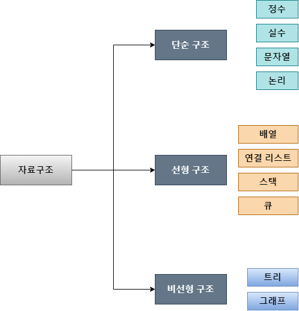
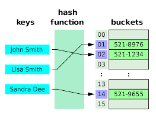

## 실무에서 중요한 3가지  
- **기초 코딩 능력**: 코딩 능력, 논리적 사격 능력, 문제 해결 능력  
> **문제 해결 능력**  
> 1. **논리적 사고**: 어떤 현상에 대해서 추론하고 구조화하고 해답을 낼 수 있는 능력  
> 2. **전산화 능력**: 현실의 문제를 소프트웨어로 구현할 수 있는 능력  
> 3. **엣지 케이스 탐색**: 버그를 방지하기 위해서 미처 생각하지 못했던 경우를 미리 파악할 줄 아는 능력  
- **전문 분야 지식**: 프론트, 백 등 전문 분야의 지식  
- **기본 CS 지식**: 운영체제, 네트워크, 소프트웨어 공학, 컴퓨터 구조 등의 학문적 지식  

## 프로그램의 성능
프로그램의 성능은 입력 크기, 하드웨어나 운영체제의 성능, 컴파일러 최적화 등등 환경 변수가 굉장히 다양하기 때문에 정확한 성능을 알 수는 없다.  
따라서 프로그램의 상대적인 성능을 가늠하는 빅오 표기법을 사용한다. 

- **시간 복잡도**: 문제를 해결하는데 걸리는 시간과, 입력 함수의 관계  
- **공간 복잡도**: 프로그램을 실행하고 완료하는 데 필요로 하는 자원의 공간  

## 자료구조와 알고리즘의 중요성
요리사가 좋은 재료를 가지고 좋은 도구를 활용하여 좋은 방법으로 요리를 해야 좋은 음식이 나오는 것 처럼  
개발자도 좋은 데이터를 가지고 좋은 자료구조를 활용하여 좋은 알고리즘으로 소프트웨어를 구현해야 좋은 프로덕트가 나온다.  

- **자료구조**  
메모리를 효율적으로 사용하며 빠르고 안정적으로 데이터를 처리하기 위한 목적으로 자료에 대한 접근과 수정을 가능케 하는 자료의 조직.  
상황에 맞는 올바른 자료구조를 사용하는 것이 중요하다.  
- **알고리즘**  
특정 문제를 효율적으로 빠르게 해결하기 위해 정해진 일련의 절차나 방법.  

## 자료구조의 종류
  

- **선형 구조**: 한 원소 뒤에 하나의 원소만이 존재하는 형태로, 자료들이 선형으로 이어져있는 구조이다.  
- **비선형 구조**: 원소 간 다대다 관계를 가지는 구조이다.  

> 자료구조는 누가 더 우월하고 열등한지를 가릴 수 없다.  
상황에 따라서 적합한 자료구조를 선택하는 것이 중요하다.  

### 배열
배열은 연관된 데이터를 연속적인 형태로 구성된 구조를 가진 자료구조이다.  

- 탐색: O(1)  
- 삭제 후 순서 맞추기: O(n)  
- 중간에 요소 삽입: O(n)  

추가와 삭제가 빈번한 로직이라면 배열은 좋은 선택지가 아니다.

### 연결 리스트
각 요소를 포인터로 연결하여 관리하는 자료구조이다.  

- **탐색**: O(n)  
- **삽입**: O(1)  
- **삭제**: O(1)  

배열과 비교했을 때 삽입과 삭제는 빠르지만, 탐색은 오래걸리는 자료구조이다.  

- **단방향 연결 리스트(Singly Linked List)**  
`head` 노드부터 `tail` 노드까지 한쪽 방향으로만 이어진 연결 리스트  
- **양방향 연결 리스트(Doubly Linked List)**  
다음 노드와 이전 노드로 가는 두 방향이 이어진 연결 리스트  
- **원형 연결 리스트(Circular Linked List)**  
마지막 노드인 `tail` 노드의 다음 노드로 `head` 노드가 이어진 연결 리스트  
원형 큐를 만들때도 사용된다.  

### 스택
Last In First Out 방식의 자료구조로, 가장 최근에 `push` 해서 넣은 데이터부터 `pop` 해서 꺼낼 수 있는 자료구조이다.  
스택은 배열 방식으로 구현할 수도, 연결 리스트 방식으로 구현할 수도 있다.  

## 큐
큐(Queue)는 선형 자료구조 중의 한 가지로, 먼저 집어 넣은 데이터가 먼저 나오는 FIFO(First In First Out) 개념을 가졌다.  

### 구현 방법
1. **배열**로 표현하기  
2. **연결 리스트**로 표현하기  

> **원형 큐**  
기본적으로 큐를 사용하면 큐가 꽉 찰 경우 새로운 데이터를 추가할 수 없고, 기존의 데이터를 재정렬하는 과정을 거쳐야 하기 때문에 비효율성이 발생한다.  
그런데 원형 큐로 구현하면 `rear` 의 다음 값으로 `front` 가 이어져 있는 형태이므로 한정된 공간을 효율적으로 이용할 수 있다.  

## 해시 테이블
  

값을 해시 함수에 넣어서 나온 결과인 해시 값으로 매핑하고, 그 해시값을 인덱스로 삼아서 데이터의 값을 보관하는 자료구조이다. 탐색 속도가 매우 빠르다는 장점이 있다.  

> **적재율**: 해시 테이블에 원소가 차 있는 비율.  
> **해시 충돌**: 해시 값을 key로 하는 값이 테이블에 이미 존재하는 경우.  
해시 충돌이 발생하면 해결하기 위한 방법에는 여러 가지가 있다.  

### 연산 속도
- **삽입**: O(1)  
- **삭제**: O(1)  
- **탐색**: O(1)  

### 해시 충돌 해결 방법
- **체이닝**: 같은 주소로 해싱되는 원소를 모두 하나의 연결 리스트에 매달아서 관리하는 방법  
- **개방 주소(Open Addressing)**: 충돌이 발생하면 다른 공간을 찾는 방법  
  - *선형 탐사*: 충돌이 발생한 메모리 공간의 바로 뒷 자리를 찾는 방법  
  - *제곱 조사*: 충돌이 발생한 메모리 공간의 뒷 자리를 찾는데, 이차 함수의 보폭으로 찾는 방법  
  - *이중 해싱*: 해시 결과를 또 다른 해시 함수에 넣어서 새로운 공간을 찾는 방법  

### 자바스크립트에서 활용  
1. `Array` 를 해시 테이블처럼 사용. (권장하는 방법은 아니다.)   
2. 객체를 해시 테이블처럼 사용.  
3. `Map` 을 사용.  
4. `Set` 을 사용.  

## 회고
2일차 ~ 3일차의 내용에서는 중요한 이론적인 부분을 학습했기에 파생되는 개념을 찾아서 공부하고 정리하기에 굉장히 바빴지만 오늘 공부한 내용은 정리할 내용이 많다기보다는 자료구조를 활용해서 실제로 구현도 해보고 문제를 많이 풀어보는 실전 연습이 중요하다고 느꼈다.  

자료구조를 나름대로 구현을 했는데 블로그에도 코드를 올릴지 아니면 `private` 레포지토리로 정리만 해놓을지.. 고민된다.  

[자료구조 (위키백과)](https://ko.wikipedia.org/wiki/%EC%9E%90%EB%A3%8C_%EA%B5%AC%EC%A1%B0)  
[알고리즘 (위키백과)](https://ko.wikipedia.org/wiki/%EC%95%8C%EA%B3%A0%EB%A6%AC%EC%A6%98)  
[시간 복잡도 (위키백과)](https://ko.wikipedia.org/wiki/%EC%8B%9C%EA%B0%84_%EB%B3%B5%EC%9E%A1%EB%8F%84)  
[공간 복잡도 (해시넷 위키)](http://wiki.hash.kr/index.php/%EA%B3%B5%EA%B0%84%EB%B3%B5%EC%9E%A1%EB%8F%84)  
[스택 (위키백과)](https://ko.wikipedia.org/wiki/%EC%8A%A4%ED%83%9D)  
[해시테이블 (해시넷 위키)](http://wiki.hash.kr/index.php/%ED%95%B4%EC%8B%9C%ED%85%8C%EC%9D%B4%EB%B8%94)  