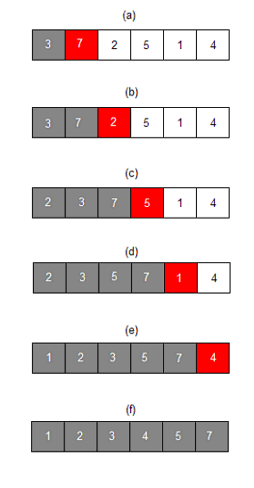

## 그래프
  

그래프는 `정점(vertex)` 과 `간선(edge)` 로 이루어진 비선형 자료구조이다.  

- **무향 그래프**: 모든 간선이 양방향으로 이동 가능한 그래프  
  

- **유향 그래프**: 간선에 방향이 존재하는 그래프  
  

- **연결 그래프**: 모든 정점이 서로 이동 가능한 상태인 그래프  
  

- **비연결 그래프**: 연결되어 있지 않은 정점이 존재하는 그래프  
  

- **완전 그래프**: 모든 정점들이 서로 연결되어 있는 그래프  
  

- **사이클**: 정점과 간선의 부분 집합에서 순환이 되는 부분
  

> **활용 사례**  
지하철 노선도, 페이지 랭크 알고리즘 등

### 구현 방법
그래프는 인접 행렬이나 인접 리스트로 구현할 수 있는데 자바스크립트에서는 두 방법 모두 간단하다.  

#### 인접 행렬  
각 정점을 인덱스로 표현하고, `a` 정점으로부터 `b` 정점으로 이어진 간선을 배열 요소의 값으로 표현하는 방법이다.  
인접 리스트에 비해서 <b style="color: blue">**탐색이 빠르지만**</b>, <b style="color: red">**메모리가 많이**</b> 소모되고 존재하는 노드에 비해서 간선이 너무 적은 경우에는 비효율적이다.  

```js
const graph = Array.from({ length: 5 }, () => Array.from({ length: 5 }, () => 0));

graph[0][2] = 1; // 0번째 요소에서 2번째 요소로의 간선
graph[0][4] = 1; // 0번째 요소에서 4번째 요소로의 간선
graph[3][2] = 1; // 3번째 요소에서 2번째 요소로의 간선
graph[2][1] = 1; // 2번째 요소에서 1번째 요소로의 간선
```

#### 인접 리스트  
각 정점마다 자신이 가지고 있는 간선 정보를 리스트의 형태로 갖고 있도록 표현하는 방법이다.  
인접 행렬에 비해서 <b style="color: blue">**메모리를 적게 소모**</b>한다.  

```js
const graph = Array.from({ length: 5 }, () => []);

graph[0].push(2); // 0번째 요소에서 2번째 요소로의 간선
graph[0].push(4); // 0번째 요소에서 4번째 요소로의 간선
graph[3].push(2); // 3번째 요소에서 2번째 요소로의 간선
graph[2].push(1); // 2번째 요소에서 1번째 요소로의 간선
```

## 트리
  

트리는 정점을 가리키는 간선이 하나만 존재하는 방향 그래프의 일종이다.  
따라서 그래프를 구현하는 방법과 동일하게 인접 행렬과 인접 리스트의 방식으로 구현할 수 있다.  

- **루트 노드**: 최상단에 존재하는 노드  
- **리프 노드**: 최하단에 존재하면서 자식이 존재하지 않는 노드  
- **레벨**: 루트 노드로부터의 거리  
- **부모 노드**: 자신 노드와 연결되어 있으면서, 레벨이 한 단계 높은 노드  
- **형제 노드**: 자신과 같은 레벨에 존재하는 노드  

### 트리의 특징
- 루트 노드를 제외한 모든 노드는 반드시 하나의 부모를 가진다.  
- 정점이 `N` 개인 트리는 간선을 반드시 `N-1` 개 가진다.  
- 루트에서 특정 노드로 가는 경로는 유일하다.  

### 이진 트리
  

이진 트리는 각 정점이 최대 2개의 자식을 가지는 트리로, 다음과 같은 특징을 가진다:

- 정점이 `N` 개인 이진 트리의 최악의 경우에 높이는 `N` 이다.  
- 정점이 `N` 개인 포화 이진 트리나 완전 이진 트리의 높이는 `logN` 이다.  
- 높이가 `H` 인 포화 이진 트리는 `2^h - 1` 개의 정점을 가진다.  

### 트리의 순회


트리를 순회하는 방법은 전위 순회, 중위 순회, 후위 순회가 있다.  

- **전위 순회**: 루트-왼쪽-오른쪽 순으로 탐색  
ex) 1, 2, 4, 8, 9, 5, 10, 11, 3, 6, 12, 13, 7, 14, 15 
- **중위 순회**: 왼쪽-루트-오른쪽 순으로 탐색  
ex) 8, 4, 9, 2, 10, 5, 11, 1, 12, 6, 13, 3, 14, 7, 15  
- **후위 순회**: 왼쪽-오른쪽-투르 순으로 탐색  
ex) 8, 9, 4, 10, 11, 5, 2, 12, 13, 6, 14, 15, 7, 3, 1  

## 힙  
힙에 대한 내용은 [여기](/priority-queue)에서 확인할 수 있습니다.  

## 트라이
  

트라이 자료구조는 문자열을 저장하고 효율적으로 탐색하기에 적합한 일종의 탐색 트리이다.  

### 특징
- 검색어 자동완성이나 사전 찾기 등에 활용하기 좋다.  
- 문자열의 길이를 `N` 이라고 할 때, 탐색이나 삽입 연산은 `O(N)` 이 소요된다.  
- 각 정점이 자식에 대한 간선을 모두 갖고 있는 형태이기 때문에, 메모리 공간을 많이 소모한다.  

### 규칙
- 루트 노드의 값은 비어있다.  
- 각 간선은 추가될 문자를 키로 가진다.  
- 각 정점의 값은 `이전 정점의 값 + 간선의 키` 이다.  
- 해시 테이블과 연결 리스트를 활용하여 구현할 수 있다.  

## 정렬
요소들을 일정한 기준을 가지고 순서대로 나열하는 것을 정렬이라고 한다.  
크게 **단순 비교식**과 **분산식 정렬**로 나눌 수 있다.  

### 단순 비교식 정렬
#### 버블 정렬(Bubble Sort)
  

두 개의 원소를 비교하면서 가장 큰 원소를 끝자리로 옮기는 과정을 반복하는 알고리즘이다.  
`O(N^2)` 의 시간 복잡도가 소요된다.  
중간의 배열이 이미 정렬이 되어 있는 상태라도 계속 끝까지 무의미한 순환을 반복하는 문제점이 있다.  

```js
function bubbleSort(arr) {
  for (let i = 0; i < arr.length; i++) {
    for (let j = i; j < arr.length; j++) {
      if (arr[i] > arr[j]) [[arr[i]], arr[j]] = [[arr[j]], arr[i]];
    }
  }
}
```

#### 선택 정렬(Selection Sort)


다음 위치의 인덱스에 와야 할 요소를 하나씩 선택하면서 자리를 교체하는 알고리즘이다.  
`O(N^2)` 의 시간 복잡도가 소요된다.  

```js
function selectionSort(arr) {
  for (let i = 0; i < arr.length; i++) {
    let selected = i;

    for (let j = i + 1; j < arr.length; j++) {
      if (arr[j] < arr[selected]) selected = j;
    }

    [[arr[i]], arr[selected]] = [[arr[selected]], arr[i]];
  }
}
```

#### 삽입 정렬(Insertion Sort)
  

이미 정렬되어 있는 작은 배열에 새로운 원소를 하나씩 추가해서 정렬하는 알고리즘이다.  
`O(N^2)` 의 시간 복잡도가 소요된다.  

```js
function insertionSort(arr) {
  for (let i = 1; i < arr.length; i++) {
    let prev = i - 1;
    const newItem = arr[i];

    while (prev >= 0 && arr[prev] > newItem) {
      arr[prev + 1] = arr[prev];
      prev--;
    }

    arr[prev + 1] = newItem;
  }
}
```

#### 병합 정렬(Merge Sort)
  

정렬해야 하는 배열을 둘로 나누는 과정을 재귀적으로 하고,  
가장 작은 단위로 나뉜 다음에 합치면서 정렬하는 알고리즘이다.  
평균적으로 `O(NlogN)` 의 시간 복잡도가 소요된다.

#### 퀵 정렬(Quick Sort)  
  

기준 원소를 `pivot` 으로 하여 기준 원소보다 작은 원소들을 왼쪽에, 큰 원소들은 오른쪽에 배치하는 과정을 재귀적으로 수행하는 알고리즘이다.  
평균적으로 `O(NlogN)` 의 시간 복잡도가 소요되며 굉장히 빠르지만, `pivot` 요소가 한 쪽으로 쏠리게 되는 최악의 경우에는 `O(N^2)` 까지 소요될 수 있는 알고리즘이다.

## 이진 탐색
배열 기반의 이진 탐색은 [여기](/binary-search)에서 확인할 수 있습니다.  

### 이진 탐색 트리
  

이진 탐색 트리는 각 노드에 대해서 왼쪽의 서브 트리에는 자신보다 작은 값이 모여있고, 오른쪽의 서브 트리에는 자신보다 큰 값이 모여있는 자료구조이다.  
따라서 이진 탐색 트리에 데이터를 삽입하고 조회하면 그 자체로 이진 탐색이 가능하다.  

#### 특징
- 각 노드에 값이 있다.  
- 노드의 왼쪽 서브트리에는 그 노드의 값보다 작은 값들을 지닌 노드들로 이루어져 있다.  
- 노드의 오른쪽 서브트리에는 그 노드의 값보다 큰 값들을 지닌 노드들로 이루어져 있다.  
- 좌우 하위 트리는 각각이 다시 이진 탐색 트리이다.  

#### 검색
특정 값 `x` 를 가진 노드를 찾으려고 할 때:  
- 일치한 노드를 찾으면 그 노드를 반환한다.  
- 불일치하고, 검색하려는 값이 현재 순회하는 노드의 값보다 작으면 왼쪽 서브트리에서 재귀적으로 검색한다.  
- 불일치하고, 검색하려는 값이 현재 순회하는 노드의 값보다 크면 오른쪽 서브트리에서 재귀적으로 검색한다.  

#### 삽입
삽입하려는 값을 검색하고, 키와 일치하는 노드가 없으면 마지막 노드의 값과 비교하여 왼쪽이나 오른쪽에 새로운 노드를 삽입한다.  

#### 삭제
삭제하려는 노드가 몇 개의 자식 노드를 가졌냐에 따라서 로직이 달라진다.  
1. **자식이 없는 경우**  
단순하게 자신의 부모에 연결된 자신의 정보를 지운다.  
2. **자식이 하나 있는 경우**  
2-1. *왼쪽 자식인 경우*: 자신의 왼쪽 자식을 자신의 부모의 왼쪽 자식으로 한다.  
2-2. *오른쪽 자식인 경우*: 자신의 오른쪽 자식을 자신의 부모의 오른쪽 자식으로 한다.  
3. **자식이 둘 다 있는 경우**  
삭제하려는 위치에 자신의 왼쪽 서브트리에서 가장 큰 노드를 놓거나, 오른쪽 서브트리에서 가장 작은 노드를 놓아야 한다.  

#### 편향 이진 트리
  

이진 탐색 트리에서 평균적으로 `O(log N)` 의 탐색 시간을 소요하지만,  
데이터가 한 쪽으로 편향되어 있는 경우에는 최악의 경우에 `O(N)` 의 순차 탐색과 동일한 시간 복잡도를 가질 수 있다는 문제점이 있다.  

이런 경우에는 `AVL 트리` 나 `레드-블랙 트리` 를 활용해서 편향되지 않은 이진 트리를 만드는 방법이 있다.  

## 회고
### 어려웠던 부분  
이진 탐색 트리를 오랜만에 실제로 구현해보았는데 개념을 실제 코드로 구현해보려고 하니 고민하는 시간이 오래 걸렸었다.  

### 잘못 알던 부분  
나는 기존에 우선순위 큐가 자료구조라고 알고 있었다.  
그러나 사실 자료구조가 아니라 추상적인 개념일 뿐이고 힙이라는 자료구조를 통해서 우선순위 큐라는 개념을 구현할 수 있는 것이 올바른 정보였다.  

기존에 우선순위 큐나 힙과 관련된 포스팅을 작성해두었는데, 이번에 새로 알게 된 정보들을 참고해서 약간의 수정을 했다.    


## 참고 자료
쉽게 배우는 알고리즘 (문병로 저)  
[Graph Data Structure And Algorithms](https://www.geeksforgeeks.org/graph-data-structure-and-algorithms/)  
[그래프 (위키백과)](https://ko.wikipedia.org/wiki/%EA%B7%B8%EB%9E%98%ED%94%84_(%EC%9E%90%EB%A3%8C_%EA%B5%AC%EC%A1%B0))  
[인접행렬, 인접리스트 (Mapin)](https://dailymapins.tistory.com/29)  
[[자료구조 1] 그래프(Graph) 이해하기 (괭이쟁이)](https://laboputer.github.io/ps/2017/09/29/graph/)  
[Introduction to Tree – Data Structure and Algorithm Tutorials](https://www.geeksforgeeks.org/introduction-to-tree-data-structure-and-algorithm-tutorials/)  
[이진 트리 (위키백과)](https://ko.wikipedia.org/wiki/%EC%9D%B4%EC%A7%84_%ED%8A%B8%EB%A6%AC)  
[트리 순회(전위 순회, 중위 순회, 후위 순회)](https://withhamit.tistory.com/282)  
[이진 탐색 트리 (위키백과)](https://ko.wikipedia.org/wiki/%EC%9D%B4%EC%A7%84_%ED%83%90%EC%83%89_%ED%8A%B8%EB%A6%AC)  
[선택 정렬 (위키백과)](https://ko.wikipedia.org/wiki/%EC%84%A0%ED%83%9D_%EC%A0%95%EB%A0%AC)  
[삽입 정렬 (위키백과)](https://ko.wikipedia.org/wiki/%EC%82%BD%EC%9E%85_%EC%A0%95%EB%A0%AC)  
[합병 정렬 (위키백과)](https://en.wikipedia.org/wiki/Merge_sort)  
[퀵 정렬 (위키백과)](https://ko.wikipedia.org/wiki/%ED%80%B5_%EC%A0%95%EB%A0%AC)  