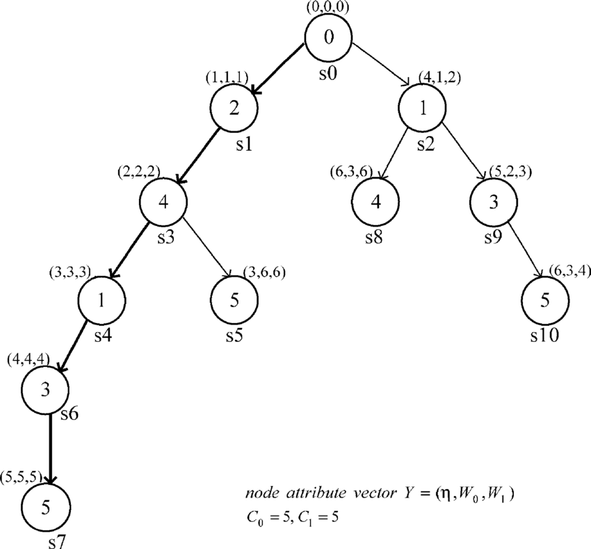
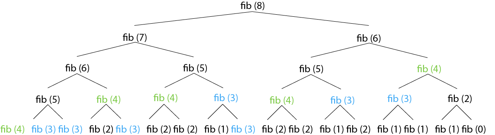

## 탐색 알고리즘
특정 노드로부터 다른 노드로 탐색하는 방법으로는 크게 DFS와 BFS로 나눌 수 있다.

### DFS


한 노드를 출발점으로 해서 최대한 갈 수 있는 곳까지 깊게 탐색하는 방식이다.  
- 스택으로 구현한다. (재귀 호출도 스택과 같은 구조이므로 재귀적인 방식으로 구현할 수도 있음)  
- 지나온 경로를 기억해야 하는 경우에 유용하다.  
- 순열, 조합을 구하는 알고리즘에 유용하다.  

### BFS
  

한 노드를 출발점으로 해서 가까운 정점을 먼저 방문하는 탐색 방식이다.  
- 큐로 구현한다.  
- 가장 짧은 거리와 같은 `depth` 를 구해야 하는 경우에 유용하다.  

## 그리디
그리디 알고리즘은 여러 경우 중 하나를 선택해야 할 때 그 순간에 가장 최적이라고 생각되는 것을 선택하는 알고리즘이다.  
이런 경우에는 그 순간에는 최적이었을지 몰라도 전역적으로 최적인 결과를 도출할거라는 보장은 없는데, 문제가 매트로이드 구조를 지닌 경우에는 그리디가 항상 최적의 결과를 도출한다는 점을 보장할 수 있다.  

### 매트로이드 구조
매트로이드 구조가 되기 위해서는 다음 두 조건을 만족해야 한다.  
1. **탐욕스러운 선택 조건(greedy choice property)**  
앞의 선택의 이후의 선택에 영향을 주지 않아야 한다.  
2. **최적 부분 조건(optimal substructure)**  
문제에 대한 최적해가 부분 문제에 대해서도 최적해임이 보장된다.  

## 백트래킹
백트래킹은 고려할 수 있는 모든 경우의 수를 `상태공간트리` 로 표현하고 정답이 될만한 유망한 경우가 아닌 경우에는 뒤로 돌아서서 다른 경우의 수를 찾아 나가는 문제 해결 방식으로 보통 DFS 나 BFS 를 통해서 구현한다.  

### 상태공간트리(State Space Tree)
  

상태공간트리는 각 경우의 수에 대한 탐색 공간을 트리 형태의 구조로 도식화한 것이다.  

실제로 백트래킹을 구현하기 위해서 이런 상태공간트리를 직접적으로 만든다기보다는 암묵적으로 상태공간트리를 머릿속으로 그려서 이해하고 구현한다.

### 유망함(Promising)
방문중인 노드의 하위 노드에서 정답을 발견할 가능성이 있다면 `유망(Promising)` 하다고 한다.  
만약 현재 방문중인 노드가 유망하지 않다면, 부모 노드로 되돌아가야 한다.  

### 가지치기(Prunning)
방문중인 노드가 유망하지 않은 노드라면, 굳이 더 깊게 탐색할 필요가 없다.  
따라서 하위 트리를 가지치기하고 부모 노드로 되돌아가야 한다.  

### 의사코드 예시
```js
function promising(now) {
  if (유망함 판별 조건 === true) return true;
  else return false;
}

function backtrack(now) {
  if (promising(now)) { // 현재 노드가 유망하다면 더 깊게 탐색
    if (정답 발견) {
      정답 처리
    } else {
      for (현재 노드 now의 하위 노드에 대해서) {
        backtrack(하위 노드);
      }
    }
  }
}
```

## 동적 계획법
동적 계획법은 주어진 문제를 풀기 위해서 문제를 여러 개의 하위 문제로 나누어 푼 다음, 그것을 결합하여 최종적인 목적에 도달하는 것이다.  
여러 개의 하위 문제들은 반복적으로 나타나기 때문에 한 번 계산했던 결과 값은 기억해두고 사용한다.  

- **메모이제이션(Memoization)**  
  - `Top-Down` 방식의 동적 프로그래밍으로 하향식 방법이다.  
  - 계산한 값을 저장해놓고, 나중에 동일한 계산을 수행해야 할 때 값을 꺼내서 사용한다.  
  - 결과가 필요해질 때 계산하는 `Lazy-Evaluation` 방식이다.  

- **타뷸레이션(Tabulation)**  
  - `Bottom-Up` 방식의 동적 프로그래밍으로 상향식 방법이다.  
  - 필요한 값을 미리 계산해서 저장해놓고, 계산 결과가 필요할 때 값을 꺼내서 사용한다.  
  - 최초에 필요하지 않은 값도 미리 계산해두는 `Eager-Evaluation` 방식이다.  

보통 코딩 테스트 문제에서는 메모이제이션을 활용한다.  

### 피보나치 수열 예시
  

피보나치 수열은 동적 계획법을 적용하기에 매우 적합한 사례이다.  
큰 수의 값을 찾기 위해서 작은 수의 값을 반복적으로 구하기에 값을 기억했다가 사용한다면 연산 횟수는 획기적으로 감소한다.  

### 어떤 문제를 DP로 풀어야 하는가?
동적 계획법으로 풀기 위해서는 다음 두 가지의 규칙이 필요하다.  
1. 가장 작은 문제를 정의할 수 있어야 함.  
2. 작은 문제를 통해 큰 문제를 해결할 수 있는 규칙이 있어야 함.  

## 참고 자료
[[알고리즘] 깊이 우선 탐색(DFS)이란](https://gmlwjd9405.github.io/2018/08/14/algorithm-dfs.html)  
[[알고리즘] 너비 우선 탐색(BFS)이란](https://gmlwjd9405.github.io/2018/08/15/algorithm-bfs.html)  
[탐욕 알고리즘 (위키백과)](https://ko.wikipedia.org/wiki/%ED%83%90%EC%9A%95_%EC%95%8C%EA%B3%A0%EB%A6%AC%EC%A6%98)  
[백 트래킹 기법의 이해 (잔재미코딩)](https://www.fun-coding.org/Chapter21-backtracking-live.html#gsc.tab=0)  
[파이썬으로 배우는 알고리즘 기초: 18. 백트래킹과 n-Queens 문제 (주니온TV)](https://www.youtube.com/watch?v=HRwFgtiqHH0&list=PLHqxB9kMLLaPOp0jh591QhPvbz4H266SS&index=19)  
[상태공간트리 이미지 출처](https://www.researchgate.net/figure/State-space-tree-construction-using-the-BB-algorithm_fig2_271846534)  
[동적 계획법 (위키백과)](https://ko.wikipedia.org/wiki/%EB%8F%99%EC%A0%81_%EA%B3%84%ED%9A%8D%EB%B2%95)  
[Fibonacci sequence](https://www.javatpoint.com/fibonacci-sequence)  
[메모이제이션 (위키백과)](https://ko.wikipedia.org/wiki/%EB%A9%94%EB%AA%A8%EC%9D%B4%EC%A0%9C%EC%9D%B4%EC%85%98)  