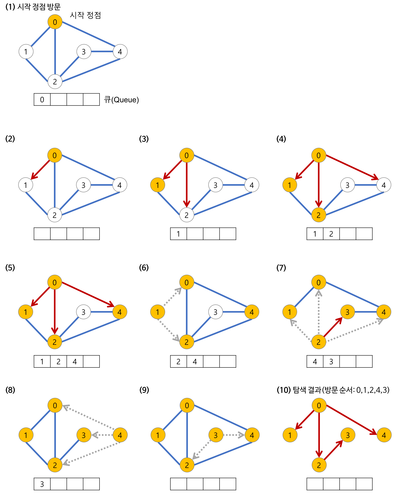

## 탐색 알고리즘
특정 노드로부터 다른 노드로 탐색하는 방법으로는 크게 DFS와 BFS로 나눌 수 있다.

### DFS

한 노드를 출발점으로 해서 최대한 갈 수 있는 곳까지 깊게 탐색하는 방식이다.  
- 스택으로 구현한다. (재귀 호출도 스택과 같은 구조이므로 재귀적인 방식으로 구현할 수도 있음)  
- 지나온 경로를 기억해야 하는 경우에 유용하다.  
- 순열, 조합을 구하는 알고리즘에 유용하다.  

### BFS
  

한 노드를 출발점으로 해서 가까운 정점을 먼저 방문하는 탐색 방식이다.  
- 큐로 구현한다.  
- 가장 짧은 거리와 같은 `depth` 를 구해야 하는 경우에 유용하다.  

## 그리디
그리디 알고리즘은 여러 경우 중 하나를 선택해야 할 때 그 순간에 가장 최적이라고 생각되는 것을 선택하는 알고리즘이다.  
이런 경우에는 그 순간에는 최적이었을지 몰라도 전역적으로 최적인 결과를 도출할거라는 보장은 없는데, 문제가 매트로이드 구조를 지닌 경우에는 그리디가 항상 최적의 결과를 도출한다는 점을 보장할 수 있다.  

### 매트로이드 구조
매트로이드 구조가 되기 위해서는 다음 두 조건을 만족해야 한다.  
1. **탐욕스러운 선택 조건(greedy choice property)**  
앞의 선택의 이후의 선택에 영향을 주지 않아야 한다.  
2. **최적 부분 조건(optimal substructure)**  
문제에 대한 최적해가 부분 문제에 대해서도 최적해임이 보장된다.  

## 참고 자료
[[알고리즘] 깊이 우선 탐색(DFS)이란](https://gmlwjd9405.github.io/2018/08/14/algorithm-dfs.html)  
[[알고리즘] 너비 우선 탐색(BFS)이란](https://gmlwjd9405.github.io/2018/08/15/algorithm-bfs.html)  
[탐욕 알고리즘 (위키백과)](https://ko.wikipedia.org/wiki/%ED%83%90%EC%9A%95_%EC%95%8C%EA%B3%A0%EB%A6%AC%EC%A6%98)  