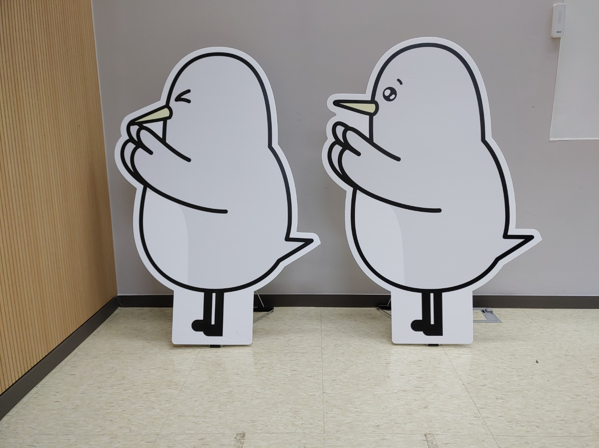
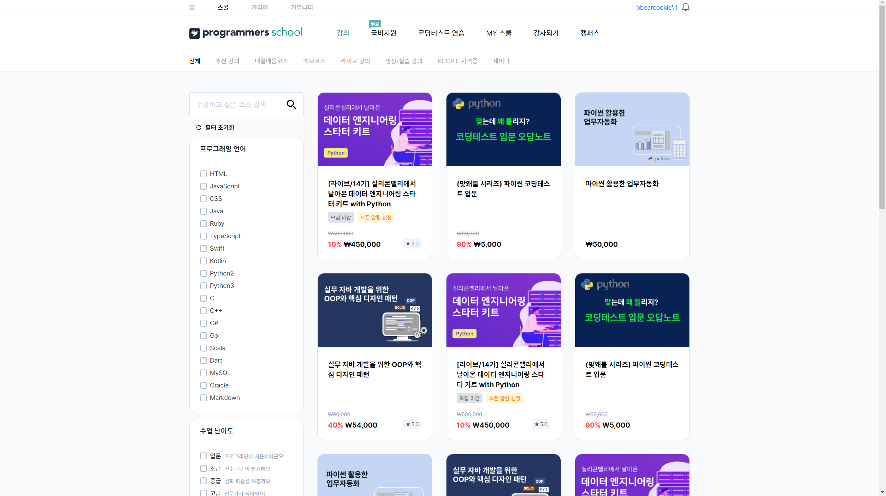

6월의 회고를 노션 클로닝 작업이 어느정도 마무리가 되어가던 무렵의 7월 5일에 작성했었는데, 회고록을 작성한 기간이 1주 정도 빠르게 작성하는 것이다보니 사실 한달이 아니라 **3주만의 회고록**이 된 듯한 느낌이다.  

저번 달에 `TypeScript`, `Next.js` 학습을 위주로 계획했었는데, 여러 스터디도 시작하고 발표도 도전해보게 되어서 계획으로부터 조금 달라진 느낌이 있지만, 그래도 새로운 도전을 통해서 나름대로의 경험도 하고 학습도 되었다고 생각한다.  

## 이번 달에 했던 것
### 알고리즘 스터디
같은 팀의 동료와, 오프라인 모임으로 여러 번 만났던 동료들과 함께 알고리즘 스터디를 시작했다. 프로그래머스에 수록되어 있는 코딩 테스트 연습 문제를 풀고 서로 코드리뷰도 하면서 꾸준히 연습하자는 취지였다.  

최근에 다른 공부를 위주로 하느라 코딩 테스트 문제를 풀지 못하고 있었는데, 함께 스터디하면서 일주일마다 최소한 몇 문제는 풀게 되다보니 감을 잃지 않고 꾸준히 유지하는데 있어서 도움이 될 것 같다. 또한 풀이를 스터디원과 공유하고 리뷰하는 과정에서 새로운 접근법을 알아간다거나 몰랐던 자바스크립트의 기능도 알게 되어서 좋다고 느껴진다.

### 기술면접 스터디
`FE 개발자` 로서 면접 자리에서 받게 되는 기술 질문에 대한 연습을 위해서 팀원들과 기술면접 스터디를 시작했다.  

브라우저, 프론트엔드 기술, 네트워크, 운영체제 등 다방면으로 자료를 조사해서 학습하고 서로 발표하면서 실제로 면접 질문에 대답해보는 느낌으로 연습하고 있는데 생각보다 깊게 학습하려고 하면 할 수록 정리해야 할 게 많아지다보니 스터디가 꽤 부담되게 느껴지기도 해서 어느 정도의 수준에서 학습을 마무리하고 정리해야 할 지 아직 감을 잘 잡지 못하겠는 부분이 있다. 그래도 말로 설명해보는 연습을 꾸준히 한다는 것은 결국 면접에서도 자연스럽게 대답할 수 있도록 하는데 도움이 될 거라고 생각하기 때문에 열심히 해봐야겠다.  

### 딥 다이브 발표
[자바스크립트는 왜 프로토타입을 선택했을까](https://medium.com/@limsungmook/%EC%9E%90%EB%B0%94%EC%8A%A4%ED%81%AC%EB%A6%BD%ED%8A%B8%EB%8A%94-%EC%99%9C-%ED%94%84%EB%A1%9C%ED%86%A0%ED%83%80%EC%9E%85%EC%9D%84-%EC%84%A0%ED%83%9D%ED%96%88%EC%9D%84%EA%B9%8C-997f985adb42)라는 주제의 아티클을 읽고 객체지향을 철학적인 측면으로 접근할 수 있다는 사실이 흥미로워서 동료들에게 내용을 공유하고 싶었다.  

그런데 저번 달 회고에서도 고민했듯 내가 알고 있는 것을 남에게 **말로 직접 설명해보는 것을 연습**을 해봐야겠다고 생각했었기에, 그냥 아티클의 링크만 공유하기 보다는 이번에 딥 다이브 발표를 통해서 직접 공유해보는 것도 좋은 경험이 될 것 같아서 도전하게 되었다!

#### 어려웠던 부분
아티클을 처음 읽고 새로운 시각을 얻게된 것 같아서 무척 신났지만, 발표 자료를 만들면서 지식을 구체화하고 여러 자료를 수집하여 교차적으로 검증해보는 과정에서 이해가 잘 안되는 부분들이 있었다. 크게 보자면 **상속**과 **복제**의 개념이다.  

#### 상속
클래스 기반은 `상속(Inheritance)` 방식으로 다른 클래스의 프로퍼티를 물려받고 프로토타입 기반은 `위임(Delegation)` 방식으로 객체들의 관계를 나타낸다고 하는데, <b style="color: red">**프로토타입 상속(prototypal inheritance) 이라는 용어는 무엇일까?**</b> 프로토타입 기반에서는 클래스가 존재하지 않는데 마치 자바에서 `extends` 키워드로 수퍼 클래스를 상속받는다는 느낌의 뉘앙스로 느껴져서 너무 헷갈렸다.  

그런데 이 부분은 [Inheritance](https://en.wikipedia.org/wiki/Inheritance_(object-oriented_programming)) 문서와 You Don't know JS 에서 궁금점을 해결할 수 있었다.  

> The term "inheritance" is loosely used for both class-based and prototype-based programming, but in narrow use the term is reserved for class-based programming (one class inherits from another), with the corresponding technique in prototype-based programming being instead called delegation (one object delegates to another).  
출처: Inheritance (object-oriented programming) (Wikipedia)

> '상속'은 이미 무수한 정신적 선례를 남긴 아주 강력한 의미를 가진 단어다. 실상 자바스크립트는 작동 방식이 정반대에 가까운 터라 '프로토타입'을 앞에 붙여 구별하려는 의도였는데, 거의 20년동안 엄청난 혼란을 일으킨 근원으로 남게 되었다.  
'상속' 앞에 '프로토타입'을 붙여 실제 의미를 극적으로 뒤집어버린 것은 비유하자면 왼손에 귤을, 오른손에 사과를 들고서 사과를 '빨간 오렌지'라고 말하는 것과 비슷하다. 말도 안되는 스티커를 붙여놓고 헷갈리게 해도 각각 오렌지와 사과라는 사실은 바뀌지 않는다.  
출처: You Don't Know JS: this와 객체 프로토타입, 비동기와 성능(카일 심슨 저 이일웅 역), P126

즉, 상속이라는 개념은 이미 객체지향에서 다른 대상의 프로퍼티를 재사용 하는데 있어서 느슨하게 사용되는 용어이기에 자바스크립트에서도 상속과는 엄연하게 차이가 있지만 비슷한 용어로 사용되는 것이었다.  

#### 복제
또, 프로토타입 기반에서는 <b style="color: red">**원형으로부터의 복제 과정으로 객체가 생성된다**</b>는 이야기도 이해하기가 너무 어려웠다.  

특히 <b style="color: red">**복제의 원형이 바로 함수 객체의 `prototype` 프로퍼티가 가리키는 객체라고 적혀있는 글**</b>을 봤는데 내가 보기에는 프로토타입은 복제라기보다는 <b style="color: blue">**객체끼리의 연결 관계를 포인터로 표현하는 것**</b>에 가까워보였기 때문에 너무 난해하게 느껴졌다.  

왜냐하면 일반적으로 `prototype 객체` 의 내부에는 여러 인스턴스가 공유해서 사용하는 프로퍼티를 포함하고 있는데, 만약 `prototype 객체` 로부터 복제가 일어나는 것이라면 **그 프로토타입 객체가 가지고 있는 공유 프로퍼티는 모두 새로운 인스턴스에게 똑같이 복제되어야 한다**는 것인데 실제로 그런 일은 일어나지 않기 때문이다.  

내가 생각하기에는 `new` 연산자로 생성자 함수를 호출하면 새로운 Empty Object를 <b style="color: blue">**&lt;복제가 아닌 생성&gt;**</b>해서 함수 실행 컨텍스트의 `this`에 그 Empty Object가 바인딩되는 것에 가까워보였다. 그리고 새로운 객체의 `[[Prototype]]` 슬롯에는 함수 객체의 `prototype 객체` 를 포인터로 가리키도록 되는 것이다.  

이렇게 혼란스러웠던 부분은 You Don't know JS 를 통해서 해결할 수 있었다.  

> 자바스크립트 객체는 상속받거나 인스턴스화해도 자동으로 복사 작업이 일어나지는 않는다. 쉽게 말하면 자바스크립트엔 인스턴스로 만들 '클래스'란 개념 자체가 없고 오직 객체만 있다. 그리고 객체는 다른 객체에 복사되는 게 아니라 서로 연결된다.  
출처: You Don't Know JS: this와 객체 프로토타입, 비동기와 성능(카일 심슨 저 이일웅 역), P106  

> Foo.prototype 객체의 프로퍼티/함수가 a, b 생성 시 각각의 객체로 복사될 거라 짐작하기 쉽지만 절대로 그런 일은 일어나지 않는다.  
출처: You Don't Know JS: this와 객체 프로토타입, 비동기와 성능(카일 심슨 저 이일웅 역), P131  

#### 소감
이해하기 어려웠던 부분에 대해서 여러 자료를 찾아보는데 글마다 상반되는 내용도 많고 공감이 잘 되지 않는 내용도 많았어서 잘 정리해서 발표하기 위해서는 어떻게 명확하게 이해 할 수 있을지가 막막했다.   

또한 자료를 탐색하고 습득하는 과정에 시간이 너무 많이 소모되다보니 한편으로는 다른 공부를 할 시간을 많이 뺏기고 있는 것 같은 느낌도 들었다.  

그래도 발표를 마치니 나름 뿌듯하기도 하고 객체지향이라고 하는 난해한 주제에 대해서 한 발자국 더 나아간 이해를 하게 된 느낌이다. 특히 클래스 기반의 프로그래밍과 프로토타입 기반의 프로그래밍의 차이가 도대체 무엇인지, 왜 달라야 하는지 이해하지 못한 채 그냥 JS에서는 객체끼리 연결해서 상속 관계를 표현하는구나.. 정도만 이해하고 프로토타입과 관련한 프로퍼티를 난해하게 외우고 있었구나 싶은 생각이 들었다.  

이번 주제는 프로토타입이었지만 객체지향 프로그래밍에 대한 하나의 시각인 만큼 클래스 기반과 프로토타입 기반의 차이점을 명확하게 알게 되었기도 하고, `Composition`, `Aggregation` 과 같은 관계나 `SOLID 5원칙` 같은 주제들이 왜 존재하는 것인지 어렴풋이 알게되는 계기가 된 것 같다.  

물론 최근 리액트는 함수형 패러다임으로 컴포넌트를 작성하는 추세이다보니 프론트엔드와 직접적인 연관까지는 없어보이지만, 그래도 나중에 여유가 된다면 알아보면 좋은 주제가 될 것 같다!  

이번 발표로 얻은 부분은 다음과 같다:  

1. **영어에 대한 두려움 완화**  
잘 이해되지 않던 난해한 부분들을 찾아보는 과정에서 같은 주제에 대한 문서라도 한국어로 번역된 문서에서는 내용을 온전하게 담고있지 않은 경우를 발견했었다. 특히 위키백과에서 많이 겪었는데, 덕분에 영어 문서를 읽는것에 대한 거부감이 줄어들었다. 오히려 한국어로 번역된 문서보다 영어 원문이 더 명확하게 적혀있어 이해가 잘 되는 부분도 있었다.  
2. **말로 설명하는 연습**  
특정 주제에 대해서 남에게 설명하는 연습은 기술면접을 위해서도 중요한데, 이번에 발표 흐름을 어떻게 할지 구성하는 것 부터 시작해서 말로 직접 설명하고, 발표가 끝나고는 여러 좋은 질문들에 대해서 답변해보는 과정을 통해 말로 설명하는 연습이 되어서 좋았다.  

## 주차별 학습내용
### Vanilla JS
무한 스크롤을 구현할 때 고려해야 할 부분과 Intersection Observer API 에 대해서 학습하고, Drag & Drop 기능을 구현하는 방법을 학습했다.  

다만 이번 달에 시작한 두 개의 스터디, 딥 다이브 발표 준비, 멘토님과의 현실 커피챗 및 여러 오프라인 일정들로 인해서 깊은 학습까지는 진행하지 못한 것 같아서 나중에 해당 기능을 구현해야 할 때 추가적으로 학습이 필요할 것 같다.  

바닐라 자바스크립트로 진행하는 마지막 과제로 **고양이 사진첩**을 만들었는데, 기존 노션 클로닝 과제와는 또 다른 시도를 해봤던 것은 크게 두 가지이다:

1. **클래스 문법을 활용하여 기본 컴포넌트 형태를 추상화**  
과제의 요구사항으로 컴포넌트에 들어오는 상태의 정합성을 체크해야 하고, 또한 기존 상태와 변경하려는 상태를 비교해서 변화가 발생하지 않은 경우에는 화면을 렌더링하지 않도록 막아야 하는 부분이 있었다.  
이런 로직들은 모든 컴포넌트마다 반복되었고, 그렇기 때문에 반복되는 부분을 하나의 추상 클래스같은 느낌으로 묶어서 사용하게 되었다.  

```js
export default class Component {
  constructor({ $target, initialState = {}, defaultState = {}, props = {} }) {
    this.$target = $target;
    this.state = { ...defaultState, ...initialState };
    this.defaultState = defaultState;
    this.props = props;

    this.initComponent();
    this.children = this.initChildComponents();

    this.initEvents();
    this.render();
  }

  validateState(nextState) {
    // 코드 생략: 컴포넌트가 받을 수 있는 형태의 state인지 비교하고 업데이트
  }

  setState(nextState) {
    // 코드 생략: 이전 상태, 다음 상태 비교하고 상태 업데이트
  }

  initEvents() {}
  initComponent() {}
  initChildComponents() {}
  render() {}
}
```

이렇게 작성하니 `validateState`, `setState` 의 내용을 한 번만 정의해도 모든 컴포넌트가 공유해서 사용할 수 있으니 **코드의 재사용성** 관점에서 좋았고, 생성자에서 기본적인 프로퍼티 초기화나 라이프 사이클과 관련된 메소드가 작성되어 있으니 특별한 로직이 추가적으로 필요하지 않는 이상은 `constructor` 메소드를 **다시 정의하지 않아도 되서** 편했다.

2. **컴포넌트가 가진 하위 컴포넌트 묶기**  
컴포넌트가 가져야 하는 하위 컴포넌트 객체들을 `children` 이라는 프로퍼티에 묶어서 사용했다. 컴포넌트 객체 내부에는 `state`, `props`, `children` 등 보관해야 할 내용이 많은데 각각의 하위 컴포넌트 객체를 `this` 객체에 바로 할당하기 보다 `this.children` 에 한번 래핑해서 정리하니 더 체계적으로 구성된 느낌이면서 이후에 키가 겹치는 문제도 사라질 것 같아서 좋았다.    

```js
const defaultState = {
  isRoot: false,
  isLoading: false,
  selectedImageURL: '',
  nodes: [],
  paths: [],
};

export default class App extends Component {
  initChildComponents() {
    const children = {};

    children.loading = new Loading({ $target: this.$target });

    children.breadcrumb = new Breadcrumb({
      $target: this.$target,
      initialState: {
        paths: this.state.paths,
      },
      props: {
        onClick: (id) => jumpToPage.call(this, id),
      },
    });

    children.explorerNodes = new ExplorerNodes({
      $target: this.$target,
      initialState: {
        isRoot: this.state.isRoot,
        nodes: this.state.nodes,
      },
      props: {
        onClick: (node) => moveToNextPage.call(this, node),
        onPrevClick: () => moveToPrevPage.call(this),
      },
    });

    children.imageViewer = new ImageViewer({
      $target: this.$target,
      props: {
        onClose: () => closeImageViewer.call(this),
      },
    });

    return children;
  }

  initEvents() {
    // 코드 생략: 이벤트 등록
  }

  render() {
    const { children } = this;
    const { isRoot, isLoading, nodes, paths, selectedImageURL } = this.state;

    children.loading.setState({ isLoading });
    children.breadcrumb.setState({ paths });
    children.explorerNodes.setState({ isRoot, nodes });
    children.imageViewer.setState({ selectedImageURL });
  }
}
```

### CSS
`flex` 와 `grid` 속성으로 레이아웃을 구성하는 방법, `transition` 속성, CSS 변수, 미디어 쿼리로 반응형 웹 구성하는 방법 등 기존에도 어느정도 알고있던 내용도 있었지만 3D 요소를 표현하기 위한 `transform` 관련 속성이나 그래픽 요소를 조작하는 `filter` 속성같은 경우는 새롭게 알아가기도 했다.  

`SCSS` 같은 경우에는 예전에 프로젝트에 적용해본 적이 있었는데, 거의 `Nesting` 기능을 제외하고는 잘 활용하지 못한 기억이 있었다. 이번에 학습하면서 `SCSS` 에는 조건문, 반복문, 함수, `mixin` 등의 강력한 기능이 많다는 것을 새삼 느끼게 되었는데 인상적인 부분을 짚어보자면:  

1. `SCSS` 에서는 `&` 로 부모 선택자의 내용을 그대로 사용할 수 있는데, 이런 특징이 `BEM 네이밍` 에서 엄청난 효과를 발휘한다고 느꼈다.  
`Nesting` 해서 사용할 때 `&__element` 처럼 사용한다면 선택자 부분이 굉장히 간결하게 유지되면서도 `BEM 네이밍` 의 체계적인 느낌을 사용할 수 있기 때문이다.  
2. 함수에는 매개변수의 기본 인자값도 지정해줄 수 있으며, `null` 로 지정한 뒤 내부에서 조건문에 따라서 인자가 `null` 이면 기본 값을 지정해줄 수 있는 등 굉장히 유연하게 사용할 수 있다고 느꼈다.  



과제로는 프로그래머스 강의 목록 사이트를 클론했는데 이번 과제를 하면서 `BEM 네이밍` 과 `SCSS` 를 활용하는 방법에 익숙해지는 것에 한 발자국 나아간 것 같다.  

  

또, 말풍선 모양의 디자인을 CSS로 어떻게 구성해야 하는지 몰랐었는데, `::before`, `::after` 가상 선택자를 적절하게 활용해서 `border` 를 주면 구현할 수 있던 점이 신기했다.  

### TypeScript
타입을 지정하고 사용하는 기본적인 흐름은 어느정도 숙지하고 있었는데 이번에 `타입 단언`, `타입 선언`, `타입 추론`, `타입 가드` 등의 명확한 용어로 학습하게 되었다.  

또한, 제네릭 문법에서 `extends`, `infer` 등의 키워드, `d.ts`과 일반 `ts` 파일의 차이점, `declare` 키워드에 대해서는 잘 몰랐던 부분이라 새롭게 알아가기도 했다.  

타입스크립트에 대해서는 현재 읽고 있는 이펙티브 타입스크립트와, 핸드북, 공식 문서를 통해서 더 깊은 학습을 해야겠다는 생각을 하고 있다.  

### Vue
`Vue` 를 처음 접해서 현재 학습하고 있는 과정인데, 리액트랑은 다른 부분들도 있고 나름대로의 장점도 있는 것 같아서 흥미롭게 배우고 있다.  

데브코스 면접에서 나온 질문으로 **리액트와 뷰의 차이점** 에 대해서 설명해달라는 질문이 있었는데 내가 잘 모르는 상태에서 리액트는 데이터의 흐름이 단방향으로 바인딩되고, 뷰는 양방향으로 바인딩된다고 말씀드렸는데 반은 맞고 반은 틀린 설명을 했었구나 싶은 생각이 들었다. (부모와 자식의 관계에서 데이터 흐름이 양방향이라고 틀린 답변을 했었다.)  

양방향으로 바인딩된다는 것은 부모와 자식간의 관계라기보다는, `view` 의 변화가 발생하면 그대로 `model` 에도 반영될 수 있냐 없냐의 차이였다.  

뷰에서는 예를 들어서 `input` 요소의 값에 변화가 발생했을 때 자동으로 실제 `state` 값에도 반영되도록 `v-model` 이라는 디렉티브를 사용해서 제공해줄 수 있는데, 리액트에서는 무조건 `model` 의 내용을 가지고 `view` 에 단순히 보내주기만 하는 단방향 바인딩 방식만 제공하기 때문에, 값 변경 이벤트가 발생하면 이벤트 핸들러에서 직접 상태 값을 수정해야 하는 로직이 필요하다.  

`Vue` 는 아직 강의가 남아있기 때문에 다음 달에도 더 학습하고 과제도 진행해보면서 다시 회고해볼 것 같다.

## 앞으로의 계획
### Poka 프로젝트 리팩토링  
새로운 프로젝트를 만들면서 공부를 할지, 아니면 기존 프로젝트를 리팩토링하면서 공부를 할지 고민이 됐었다.  
특히 학습이 완전하지 않은 상태에서 공부와 함께 Poka 프로젝트를 만들었다보니 코드를 작성하는 방법을 여러 번 바꾸면서 도전을 하기도 하고 좋은 코드의 작성 방법을 고민하느라 시행 착오를 겪은 느낌이라 전체적인 코드의 일관성에 문제가 있을 거라고 생각을 했는데 멘토님과의 1:1 커피챗을 통해서 방향성에 대한 고민이 해결되었다.  

내 우려와는 다르게 프로젝트가 나름대로 잘 정리되어 있는 편이라고 말씀으로 응원해 주셨고, 다만 코드를 보시면서 이런 부분은 왜 이렇게 구현했는지에 대한 의도를 물어보시면서 실제로 면접에서 이런 방식으로 물어볼 것이니 나름대로의 생각을 잘 정리해두는 것이 중요하다고 하셨다.  

또한 개발바닥에서 [클린코딩 하는데 구현을 못하는 개발자](https://www.youtube.com/watch?v=cyoUrxDVGXE)를 보게 되었는데 좋은 코드의 구조를 고민하는 것도 좋지만, 구현력을 키우는 것도 중요하겠다는 생각을 하게 되었다.  

물론 기술면접에서 내가 작성한 프로젝트에 대한 내용을 잘 설명하기 위해서 히스토리를 잊어 버리지 않게끔 꾸준히 리팩토링은 진행할 것이지만, 힘줘서 진행한다기 보다는 조금씩 꾸준히 유지하기로 했다.  

### 이펙티브 타입스크립트 공부
현재 아이템 8까지 읽은 상태인데, 이번 달에 스터디 활동이나 매주 주어지는 과제, 코드리뷰 그리고 딥 다이브 발표까지 생각보다 시간이 나지 않아서 많이 진행하지 못했다. 다음 달에는 더 열심히 공부해보도록 해야겠다.  

### Next.js 공부
아직 시작하지 못한 상태이기에 공부를 해야겠다.  

### 리액트 공식문서 공부
리액트도 직접 사용해보면서 학습하느라 기본기가 아직 부족한 느낌이 있는데, 공식 문서를 읽으면서 잘 몰랐던 부분을 보완해야겠다. 특히 딥 다이브 발표를 준비하면서 영어 문서에 대한 거부감이 많이 줄었는데, 이 자신감으로 리액트 공식문서의 학습도 도전해야겠다.  