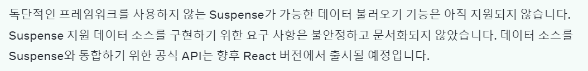

이번 달에는 2차 팀이 구성되어서 새로운 동료들과 학습하게 되었다. Vue와 React의 학습과 과제를 하면서 새롭게 알게된 내용을 적용해보기도 하고 동료나 멘토님과의 코드리뷰 과정을 통해서 빠르게 성장했다는 느낌이 든다.  

또한 드디어 데브코스 내에서 제공되는 강의와 과제가 어느정도 마무리되었고 9월부터는 팀원들과 본격적인 프로젝트를 만드는 과정에 들어가게 되는데 약 한달간 기획, 설계, 구현, 테스트, 본격적으로 협업하며 프로젝트를 진행해보는 경험은 처음이어서 함께 결과물을 만들어내는 과정에 필요한 지식과 경험을 많이 얻어가게 될 것이라는 기대가 된다. 😁  

## 이번 달에 했던 것
### React 공식문서 스터디
팀원들과 본격적인 프로젝트를 진행하기에 앞서서 우리 각자가 지금까지 학습해왔던 내용이나 깊이는 어느 정도의 차이가 존재할 수 밖에 없기 때문에 지식의 베이스라인을 맞추고, 리액트에서 권장하는 활용 방법을 명확하게 알고, 리액트에 익숙해지면서, 서로 지식을 말로 설명해보는 연습을 하면 좋겠다는 생각에 [리뉴얼된 리액트 공식문서](https://react.dev/)의 Learn React 파트를 읽고 발표하는 스터디를 했다.  

공식문서가 상세하면서도 친절하게 잘 되어 있었는데, 덕분에 두루뭉슬하게 알고 무의식적으로 사용하고 있던 Snapshot의 개념, Batching Update, Reducer의 유용함 등을 명확하게 학습할 수 있었다. 특히 내가 발표를 하거나 동료의 발표를 들으면서 내용을 다시 한 번 복습하는 효과도 있었고 궁금증이 생긴 부분은 서로 공유하면서 의견을 나눌 수 있어서 학습한 내용이 기억에 오래 남는데 도움이 될 것 같다.  

이번 달에서 가장 잘 했다고 생각하는 부분이 이 리액트 공식문서 스터디를 했다는 것이다.  

### 룰렛 프로젝트 마이그레이션
기존에 바닐라 자바스크립트로 구현하던 룰렛 프로젝트를 리액트로 마이그레이션하기로 했다.  
나는 이번에 룰렛 파트를 맡았는데 덕분에 캔버스에 대한 내용을 학습하는 계기가 되어서 좋았고, 한편으로는 아직 많이 어려워서 나중에 캔버스를 더 자유자재로 활용하기 위해서는 학습이 필요할 것 같다.  

또, 스토리북을 적용했는데 사용하다보니 컴포넌트 단위로 개발하는데 있어서 유용하다고 느꼈다. 컴포넌트를 만들 때에도 실제 동작을 스토리북 환경에서 볼 수 있기도 하지만, 일종의 문서화나 수동 테스트의 역할까지 한다고 느껴서 내가 만든 컴포넌트를 다른 팀원이 확인하는 데에도 유용했다.  

### Vue 영화 검색 사이트
Vue로 [영화 검색 사이트](/movue-searcher/)를 구현했다. 역시 강의 내용과 공식 문서를 가지고 학습한 내용을 나의 지식으로 체득하기 위해서는 직접 만들어 보는 것이 최고라고 느꼈다.  

Vue는 처음 사용해보는 것이라 생소한 부분이 있었는데 그래도 나름 익숙해진 것 같아서 좋았고 양방향 데이터 바인딩이나 여러가지 이벤트 수식어를 통해서 편하게 이벤트 핸들링을 할 수 있다는 특징이 유용하다고 생각되었다.  

이번에 영화 검색에 필요한 API 키를 `.env` 파일에 숨겨서 클라이언트에서 직접 요청하는 방식으로 작성했더니 크롬 개발자 도구를 통해서 API 키를 조회할 수 있다는 점을 알게 되었다. 그래서 Vercel 서버리스 함수를 사용하여 영화 검색 API 를 대신 요청해주는 일종의 프록시 서버 느낌으로 사용했는데, 민감한 정보는 절대로 클라이언트에서 조회할 수 있는 형태로 만들지 말아야 하겠다는 생각을 했다.  

### Transition 학습
Vue에서 제공하는 `Transition` 컴포넌트가 굉장히 유용하다고 느꼈는데, React에서는 조건에 따라서 컴포넌트가 mount, unmount 될 때마다 트랜지션 효과를 어떻게 줘야하는지 의문이 있었다. 그래서 찾아보니 `react-transition-group` 이라는 라이브러리가 있었다.  

#### 문제점 1. 페이지 변경시 unmount가 안됨
```tsx
<TransitionGroup>
  <CSSTransition key={page}>
    {/* 컴포넌트 ... */}
  </CSSTransition>
</TransitionGroup>
```

처음에는 위와 같은 방식으로 작성했었는데, 페이지가 변경될 때마다 기존에 존재하던 컴포넌트가 사라지는 것이 아니라 그대로 존재한 채로 새로운 컴포넌트가 나타나서 페이지 컨텐츠가 무한히 증식하는 문제가 있었다.  

이 부분은 `TransitionGroup` 이 아니라, `SwitchTransition` 을 사용하면 해결할 수 있었다.

#### 문제점 2. 애니메이션 방향 전환
이동하려는 페이지가 현재 페이지보다 왼쪽에 존재하면 왼쪽으로 이동하는 애니메이션을 출력하고, 반대라면 오른쪽으로 이동하는 애니메이션을 출력하고 싶었다.  

그런데 나는 애니메이션 효과를 위해서 `CSSTransition` 을 주고 애니메이션은 CSS 스타일 시트에 등록해서 사용했었는데, 이미 페이지의 내용이 mount될 때 방향 정보가 클래스 이름에 들어있다보니 한쪽 방향으로 전환하다가 갑자기 반대쪽 방향으로 전환해야할 때 불가능하다는 문제가 있었다.  

```tsx
<SwitchTransition>
  <Transition key={page}>
    {/* 컴포넌트 ... */}
  </Transition>
</SwitchTransition>
```

그래서 `Transition` 으로 컴포넌트의 mount, unmount 시점을 딜레이하고, 애니메이션을 위한 CSS 속성은 JS 로 줬다.  

#### 문제점 3. Batching 업데이트
```tsx
const handleNextPage = useCallback(() => {
  setDirection('right');
  pushPage(page + 1);
}, [page, pushPage]);
```
애니메이션이 동작해야 할 방향을 `direction` 상태로 관리하고, 페이지 번호를 `page` 상태로 관리했다. 그런데 이렇게 구현했더니 `direction` 과 `page` 의 상태가 하나의 snapshot에 동시에 변경되어서 여전히 방향 전환이 불가능하다는 문제가 있었다.  

```tsx
const handleNextPage = useCallback(() => {
  setDirection('right');

  setTimeout(() => {
    pushPage(page + 1);
  }, 0);
}, [page, pushPage]);
```

그래서 이렇게 `page` 상태가 업데이트되는 시점을 한 턴 미루는 코드를 작성했는데, 나중에 `flushSync()` 라는 상태를 배칭하지 않고 즉시 업데이트 시키는 함수를 알게 되었다.

```tsx
const handlePrevPage = useCallback(() => {
  flushSync(() => {
    setDirection('left');
  });

  pushPage(page - 1);
}, [page, pushPage]);
```

### Suspense 학습
멘토님이 `render-as-you-fetch` 방식의 학습을 권해주셔서 이번에 Suspense에 대한 학습을 했다.  

사실 `react-query`, `swr`, `Next.js` 등의 라이브러리나 프레임워크가 제공하는 `Suspense` 기능을 활용하면 더 편할 것 같았지만 Suspense가 동작하는 원리를 학습해보고자 직접 패칭에 대한 부분을 구현해보기로 했다.  

```ts
import axios from 'axios';
import type { AxiosRequestConfig } from 'axios';

const client = axios.create({
  baseURL: 'https://jsonplaceholder.typicode.com'
});

export interface Resource<TData> {
  read: () => TData;
}

export const suspenseFetch = <TData>(config: AxiosRequestConfig): Resource<TData> => {
  let status: 'pending' | 'success' | 'error' = 'pending';
  let data: TData;
  let error: unknown;

  const suspender = client<TData>(config)
    .then((res) => {
      status = 'success';
      data = res.data;
    })
    .catch((err) => {
      status = 'error';
      error = err;
    });

  const read = () => {
    switch (status) {
      case 'pending':
        throw suspender;
      case 'error':
        throw error;
      default:
        return data;
    }
  };

  return { read };
};

export default suspenseFetch;
```

핵심은 아직 데이터를 가져오는 상황이면 Promise를 `throw` 하고, 데이터가 존재하면 data를 `return` 하는 함수였는데, 문제는 어떤 컴포넌트에서 `postID` 등의 ID 만 가지고 내용을 패칭하고 싶은 경우에 API 요청 데이터로 ID 정보를 보내줘야 하는데, resource 객체를 외부에 선언해야 컴포넌트가 준비되지 않아도 미리 `Fetching` 이 일어나기에 객체를 일일히 선언하는 과정이 불편하다는 문제가 있었다.

뭔가 더 깔끔한 방법이 없을지 궁금하고.. 아직 리액트에서 해당 부분의 표준이 나오지 않아서 그런건가 싶기도 하다. (https://ko.react.dev/reference/react/Suspense)



## 앞으로의 계획
### 팀 프로젝트
익명/기명 편지 전송 SNS 서비스를 기한 안에 성공적으로 마무리하는 것이 목표이다!
사실 완성도 좋지만 동료와 함께 프로젝트를 진행하면서 문제를 해결해나가는 과정이나, Git으로 서로 만든 코드를 잘 합치고 형상관리하는 경험이 더 중요하다고 생각된다.

### 이펙티브 타입스크립트
현재 아이템 45까지 왔는데 뜨문뜨문 읽다보니 내용이 명확하게 기억나지 않는 것들도 많은 것 같다. 어서 읽고 2회독도 하면서 정리 글을 올리고 싶다.

### poka 마이그레이션
예전에 CRA로 세팅했었는데 Vite로 마이그레이션하는 작업을 해보고 싶어졌다.  

CRA를 사용하는 목적이 빠르게 개발환경을 세팅한다는 것 이었는데.. deprecated된 현재에는 관리가 잘 안되기도 하고 번들링이나 실행 속도도 너무 느리고 설정을 커스텀하려면 eject를 해야 하거나 craco로 오버라이딩을 해야하는데 다른 라이브러리에는 웹팩이나 바벨설정이 제대로 안들어간다거나.. 하는 문제점들이 너무 번거로워서 차라리 Vite가 빠르면서 커스텀하기도 좋다고 생각된다.
