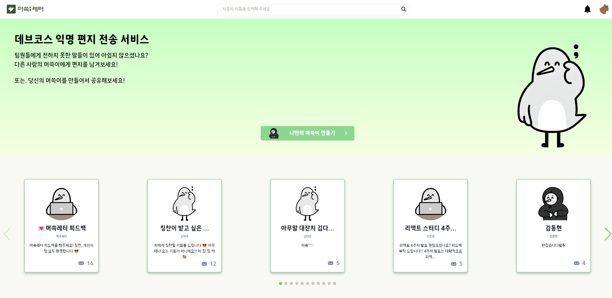
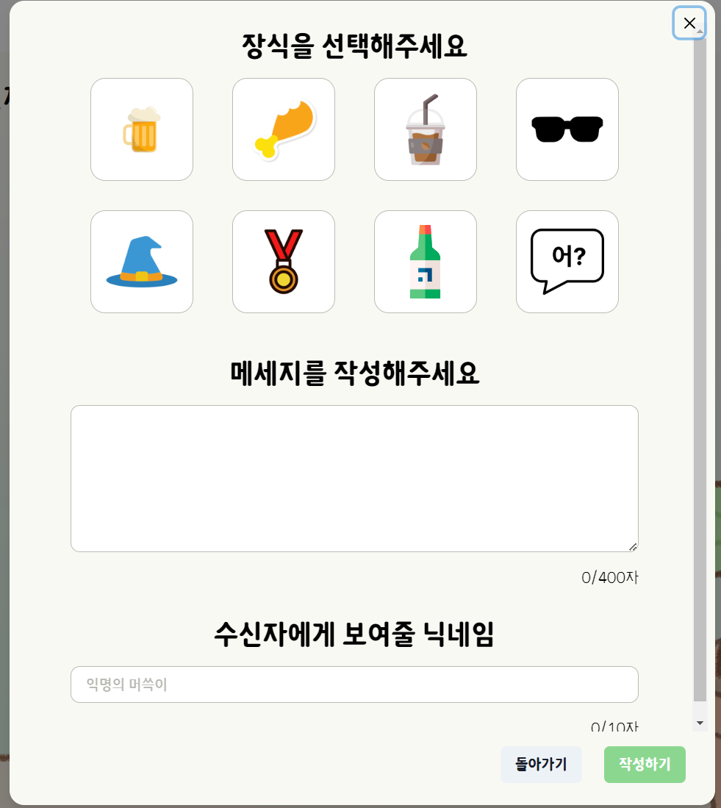

이번 달에는 기획, 설계, 개발, QA, 발표 과정을 거쳐서 팀원들과 함께 결과물을 만들어보는 경험을 했다.

타겟층을 같은 데브코스 교육생들로 했고, 서로 익명이나 기명으로 편지를 주고받는 서비스를 기획했는데 만들다보니 생각보다 재밌게 느껴지고 실제로 사용해볼만 할 것 같아서 꾸준히 개선해보고 싶은 욕심이 드는 프로젝트이다.

## 배웠던 부분

### 1. Node.js

구현 단계에 생각보다 진척 속도가 빨라서 추가 기능으로 고려했던 슬랙 연동 기능을 시도해볼 수 있었는데, API 키를 숨겨야 하고 본인 인증 flow가 필요하다는 판단이 들어서 서버 사이드가 필요해졌다.

우리가 생각했던 해결 방안은 크게 세 가지였는데:

> 1. Node.js 기반의 서버
> 2. Serverless Function
> 3. Next.js

이 중에서는 Express.js를 사용하는 첫 번째 선택지를 선택했는데, 가장 큰 이유는 익숙한 기술이어서였다.

물론 새로운 방법을 시도하고 공부하는 방법도 좋지만 기간이 한정되어 있기도 하고 혼자서 하는게 아닌 여럿이 진행하는 프로젝트인만큼 일정에 차질이 없을 방향으로 선택하는게 좋을 거라고 판단했다.

결과적으로는 좋았던 선택지였던 것 같다. 왜냐하면 예전에 사용해봤던 기술이긴 한데 시간이 꽤 지나서 오랜만에 다시 환경설정하려니 기억이 잘 나지 않았던 부분도 있었고 과거에 명확한 이해를 하지 못한채 사용했다고 느껴지는 부분도 있어서 다시 학습할 기회가 되었다.

그리고 개발환경과 배포환경에서는 API 주소, DB 주소, redis 주소같은 정보가 다 달라지기 때문에 조건에 따라서 환경변수로 잘 정리해야겠다는 생각을 적용해보기도 했고, Express의 미들웨어에 대해서도 확실하게 이해하지 못했던 부분이 있었는데 이번 프로젝트를 진행하면서 정리할 수 있었다.

Next.js로도 풀스택 개발이 가능하다고 하기 때문에 관심이 가는 기술이긴 한데, 이제 공부하면서 어느 정도까지 서버 사이드의 개발을 지원하는지를 알아가야겠다.

### 2. 모노레포 구성

yarn berry의 workspace 기능을 활용해서 Express 서버와 React 앱을 하나의 레포지토리로 구성했다.

모노레포를 구성하는 것도 처음 해보는 경험이어서 개발 일정에 차질이 없도록 어느 정도의 기능 구현이 완성될 때까지는 임시로 멀티레포로 각각의 작업을 수행하다가 나중에 마이그레이션하는 과정을 거쳤었는데.. 생각보다 공식 문서를 읽고 따라가기에는 별로 친절하지는 않은 편이라고 느껴졌다.

왜 SDK를 추가로 설치해야 하는지, 왜 IDE에서 타입스크립트 버전을 workspace 버전으로 맞추는 것도 수동으로 해야하는지를 이해하는 것도 어려웠고 패키지를 먼저 설치하고 SDK를 이어서 설치해야만 정상적으로 세팅이 되는 등 세팅 순서도 중요했어서 더 삽질을 하게 된 것 같다.

그래도 결국 여러 블로그 글을 참고하면서 방법을 찾아내기도 했으며, 운이 좋게도 삽질하던 당일에 선배님으로부터 학습 방향성이나 키워드를 구할 수 있어서 다음 날 환경 설정을 마칠 수 있었다.

이번 프로젝트에는 yarn berry를 적용해보면서 zero-install의 개념을 맛볼 수 있었는데 나중에는 NX 나 Turborepo 같은 키워드도 추가로 학습해보면서 어떤 장점이 있을지 알아볼 계획이다.

### 3. husky 설정

협업하는 프로젝트이다보니 eslint 규칙에 어긋나는 경우에는 커밋이 생성되는 것을 막기 위해 husky를 적용했다.

husky와 lint-staged를 설정하는 것도 처음이어서 삽질을 하면서 알아갔는데 Windows 환경에서 설정했던 husky가 특정 리눅스 환경에서는 동작하지 않아서 왜 그런가 살펴보니 파일 권한과 연관된 문제였었다..

이번에는 pre-commit hook만 적용했는데, git의 동작이 발생할 때 제어할 수 있는 더 다양한 hook이 있다는 것도 알게 되어서 다른 프로젝트에서 설정이 필요할 때 도움이 될 것 같다.

### 4. 페어 프로그래밍

vscode의 익스텐션 `Live Share` 를 이용해서 동료랑 함께 페어 프로그래밍을 했다.  
페어 프로그래밍의 경험 자체도 처음이었지만 동료와 함께 하나의 소스코드를 작성할 수 있다는 것도 신기했다.

페어 프로그래밍을 하면서 서로가 생각하는 구현 방향의 Sync를 맞출 수 있는 장점을 느꼈고 내가 알고 있는 지식을 동료에게 직접 설명하는 과정에는 어렴풋하게만 알고 있던 지식이 더 명확하게 학습되는 느낌도 받았다.
