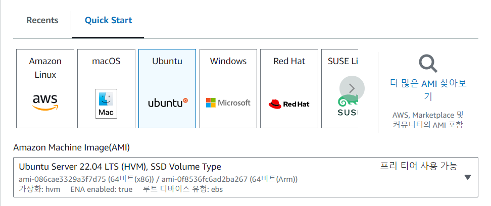
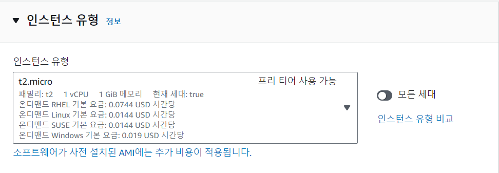
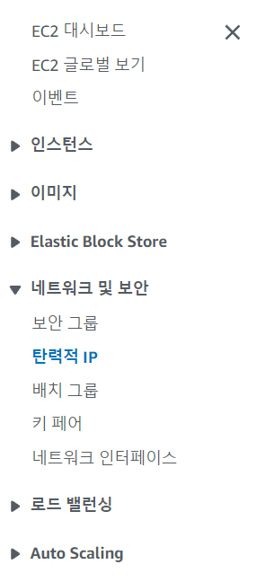
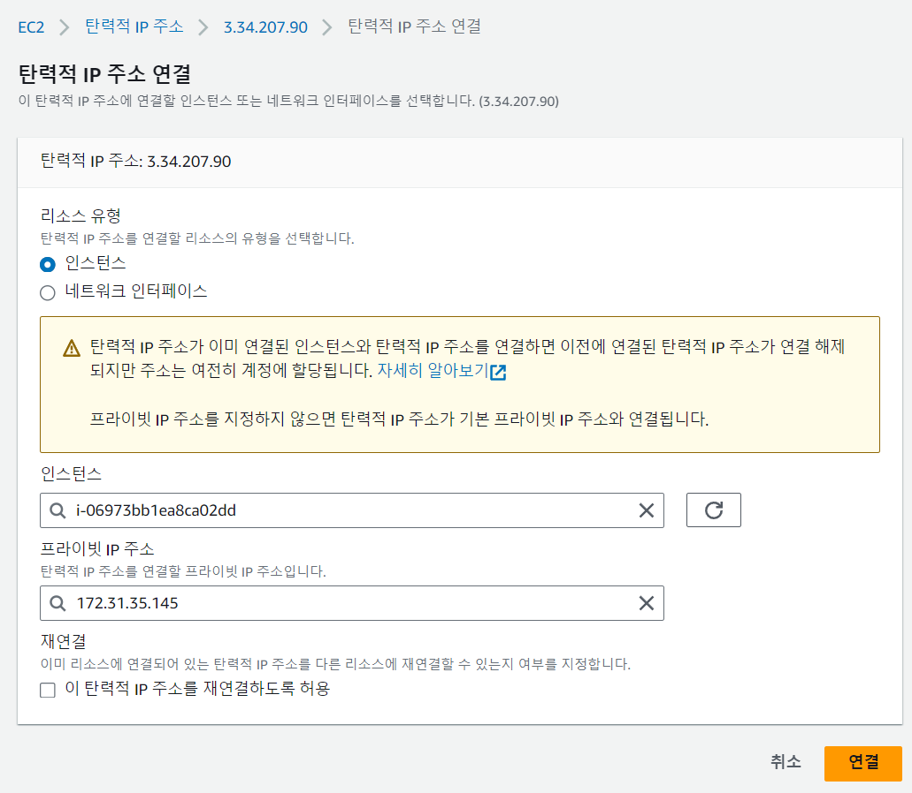
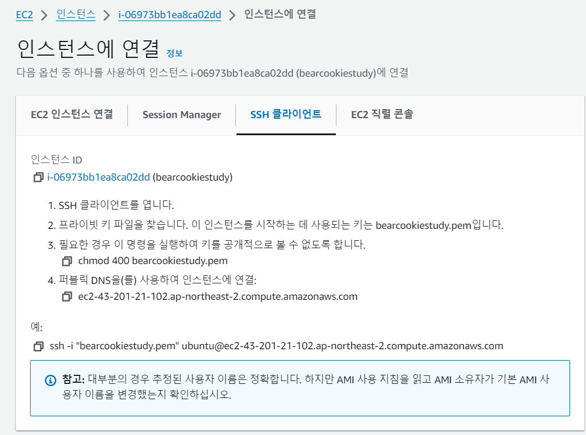
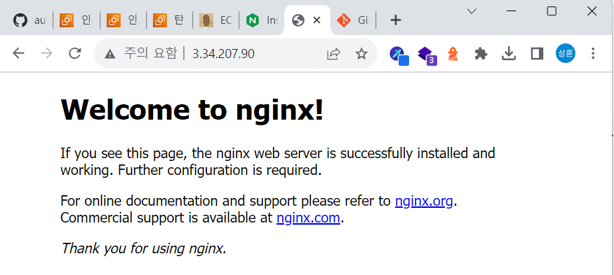

이번 포스트에서는 Express 앱을 EC2에 올리고 실행하는 과정을 적어보고자 한다.  
Express 앱의 포트를 숨기기 위해서 앞 단에 Nginx 웹서버를 먼저 설치하고, 리버스 프록시로 연결하는 과정을 수행할 것이다.

## EC2 인스턴스 생성

먼저, AWS 에서 컴퓨팅 파워를 하나 빌려야 하기 때문에 EC2 인스턴스를 하나 생성해야 한다.

### AMI 선택



AWS에서 기본적으로 제공해주는 시스템 환경을 선택할 수 있는데, 개인적으로 WSL2로 Ubuntu를 사용하고 있어서 가장 익숙한 Ubuntu로 선택했다.

### 인스턴스 유형 선택



프리 티어가 지원되는 t2.micro 인스턴스를 선택했다.

### 키 페어


대여한 EC2 컴퓨터에 접속하기 위해서는 키 페어가 필요한데, 아직 없다면 키 페어 생성을 눌러서 생성해준다.  
필자는 `OpenSSH` 를 활용해서 컴퓨터에 원격 접속할 것이기 때문에 `.pem` 으로 생성했다.

생성된 `.pem` 파일은 꼭 잘 보관한다!

### 기타

그 외 보안 그룹과 디스크 볼륨 등의 설정은 자유롭게 한다.  
(편의를 위해서 필자는 모든 위치에서 SSH 접근이 가능하도록 했다!)

그리고 인스턴스 생성 버튼을 누르면 성공적으로 인스턴스가 생성된다!

## EC2 인스턴스 설정

인스턴스가 생성되었다면, 몇 가지의 설정이 필요하다.

### 보안 그룹

EC2에 적용된 보안 그룹에서 퍼블릭 IP의 특정 포트를 열어줘야만 외부에서 `http`, `https` 프로토콜로 접속이 가능하다.


이를 설정하기 위해서는 `EC2 > 인스턴스 > 인스턴스 상세` 에서 확인할 수 있는 보안 그룹의 링크를 클릭한다.


나타나는 페이지에서 인바운드 규칙 버튼을 클릭한다.


`HTTP`, `HTTPS` 를 규칙에 추가하고, 소스는 모든 IP에서 접근할 수 있도록 선택한다.  
입력을 마쳤다면 규칙 저장을 클릭한다.

### Elastic IP

EC2에 자동 할당되는 퍼블릭 IP를 통해서 외부에서 접속할 수는 있지만, 이 IP는 유동적이기 때문에 인스턴스를 재부팅하면 변경된다.  
따라서 인스턴스에 고정 IP를 부여해줘야 하는데, 이는 `Elastic IP` 를 이용하면 된다.

> 아직 인스턴스에 연결하지 않은 Elastic IP가 있으면 비용이 부과되니 유의해야 한다!



등록을 위해 EC2 대시보드의 사이드바에서 `탄력적 IP` 를 선택하고, 탄력적 IP 주소 할당 버튼을 클릭한다.

옵션은 크게 손볼 건 없이 할당 버튼을 클릭하면 된다.


그러면 주소 하나가 할당되었음을 확인할 수 있다.


할당된 IP 상세 페이지로 들어간 뒤에, 탄력적 주소 IP 연결 버튼을 누른다.



EC2 인스턴스에 이 IP를 부여한다.

그럼 이제 외부에서 고정된 퍼블릭 IP로 인스턴스에 접근할 수 있게 된다!

## EC2 인스턴스 접속

### 인스턴스 연결



생성한 EC2 인스턴스에 연결하려면, EC2 인스턴스 상세 페이지에서 연결 버튼을 누른다.

그러면 SSH 클라이언트로 접속하는 방법이 나오는데, 가장 하단에 있는 예에 해당하는 커맨드를 그대로 복사해서 내 컴퓨터의 터미널에서 실행하면 EC2에 원격 접속이 된다.

#### 연결 실패시

```sh
Permissions 0644 for 'bearcookiestudy.pem' are too open.
```

만약 위와 같은 메시지가 등장하면서 접속에 실패한다면, `chmod 400 bearcookiestudy.pem` 커맨드로 키 파일의 액세스 권한을 변경한 뒤에 다시 접속하면 된다.

#### 쉘 파일 생성

매번 EC2에 접속할 때마다 ssh 커맨드를 치는게 귀찮을 수 있는데, 그렇다면 쉘 파일을 하나 만들어놓아도 좋다.

```sh
ssh -i "bearcookiestudy.pem" ubuntu@ec2-43-201-21-102.ap-northeast-2.compute.amazonaws.com
```

위와 같은 `bearcookiestudy.sh` 파일을 생성해 놓으면, `sh bearcookiestudy` 명령어만 입력해도 EC2에 접속이 가능하다!

## EC2 인스턴스에 프로그램 설치

Git, NVM, PM2, Nginx 등의 프로그램을 설치하기 위해서 몇 가지의 커맨드를 입력한다.

### 각종 프로그램 설치

```sh
### 1. 패키지 목록 업데이트
sudo apt update

### 2. Nginx 설치
sudo apt install nginx

### 3. Git 설치
sudo apt install git

### 4. nvm 설치
curl -o- https://raw.githubusercontent.com/nvm-sh/nvm/v0.39.5/install.sh | bash

source ~/.bashrc

### 5. node 설치
nvm install --lts

### 6. pm2 설치
npm install pm2 -g

pm2 install typescript
```

### MongoDB 설치

이 부분은 배포하려는 앱이 mongodb를 활용하기 때문에 설치했다!  
[설치 가이드 공식 문서](https://www.mongodb.com/docs/manual/tutorial/install-mongodb-on-ubuntu/)

```sh
### 1.
sudo apt-get install gnupg curl

### 2.
curl -fsSL https://pgp.mongodb.com/server-7.0.asc | \
   sudo gpg -o /usr/share/keyrings/mongodb-server-7.0.gpg \
   --dearmor

### 3.
echo "deb [ arch=amd64,arm64 signed-by=/usr/share/keyrings/mongodb-server-7.0.gpg ] https://repo.mongodb.org/apt/ubuntu jammy/mongodb-org/7.0 multiverse" | sudo tee /etc/apt/sources.list.d/mongodb-org-7.0.list

### 4.
sudo apt-get update

### 5.
sudo apt-get install -y mongodb-org
```

## Nginx 실행

다음과 같은 커맨드를 입력하고 등록했던 퍼블릭 IP에 접속하면 Nginx 초기 화면이 나온다!

```sh
sudo systemctl start nginx
```



## Express 앱 실행

[auth-playground](https://github.com/bbearcookie/auth-playground.git) 레포지토리의 `backend` 디렉토리의 내용을 클론 받아서 실행해보자.

```sh
git clone https://github.com/bbearcookie/auth-playground.git
cd auth-playground/backend
npm install
pm2 start "npm start"
```


위 명령어를 실행하면 Express 앱이 실행된다!  
그런데, 80번 포트로 접속했을 때 Express 앱을 실행한 포트로 연결해주는 작업을 하지 않았기 때문에 외부에서 이 앱에 접근할 수 있는 방법이 없다.

그래서 Nginx에 reverse proxy 설정을 해줘야 한다.

> Express 앱이 실행되는 포트를 80번으로 하는 방법도 있겠지만, 앞 단에 Nginx와 같은 웹 서버를 프록시로 놓는게 실제 앱의 포트를 숨길 수도 있고 다른 앱이 추가되었을 때에도 유연할 것이라고 생각했기에 Nginx를 뒀다.

## Nginx 설정

`/etc/nginx/site-availables` 에 존재하는 파일을 수정한다.  
(필자의 경우 `default` 라는 이름의 파일이 있었다.)

### 기본 값

```nginx
server {
        listen 80 default_server;
        listen [::]:80 default_server;

        root /var/www/html;

        index index.html index.htm index.nginx-debian.html;

        server_name _;

        location / {
                try_files $uri $uri/ =404;
        }
}
```

### 변경 값

```nginx
server {
        listen 80 default_server;
        listen [::]:80 default_server;

        server_name _;

        location / {
                proxy_pass http://127.0.0.1:5010/;
        }
}
```

기본 내용은 Nginx의 기본 html 파일을 내보내는 것이었는데, 이를 제거하고 요청을 `5010` 번 포트로 전달하는 것으로 변경한다.

### 심볼릭 링크 확인

실제로 Nginx에 적용되는 설정 파일이 방금 작성한 파일과 심볼릭 링크로 잘 이어져 있는지 확인한다.  
만약 연결되어 있지 않다면 커맨드를 입력해서 연결해준다.

`ln -s /etc/nginx/sites-enables/<원하는 파일> /etc/nginx/sites-availables/default`


#### 설정 파일

- **/etc/nginx/sites-enables**: Nginx의 실제 설정이 작동하는 곳이다.  
  보통 `sites-availables` 에서 작성한 설정 파일을 `ln -s <origin> <destination>` 명령어로 연결해서 사용한다. (심볼릭 링크)
- **/etc/nginx/sites-availables**: Nginx에 등록할 수 있는 여러가지 설정을 프리셋처럼 등록해놓는 곳이다.

## 실행 확인


EC2 인스턴스에 등록했던 퍼블릭 IP로 접속해보면 Express 앱이 잘 작동하고 있다는 것을 확인할 수 있다.
