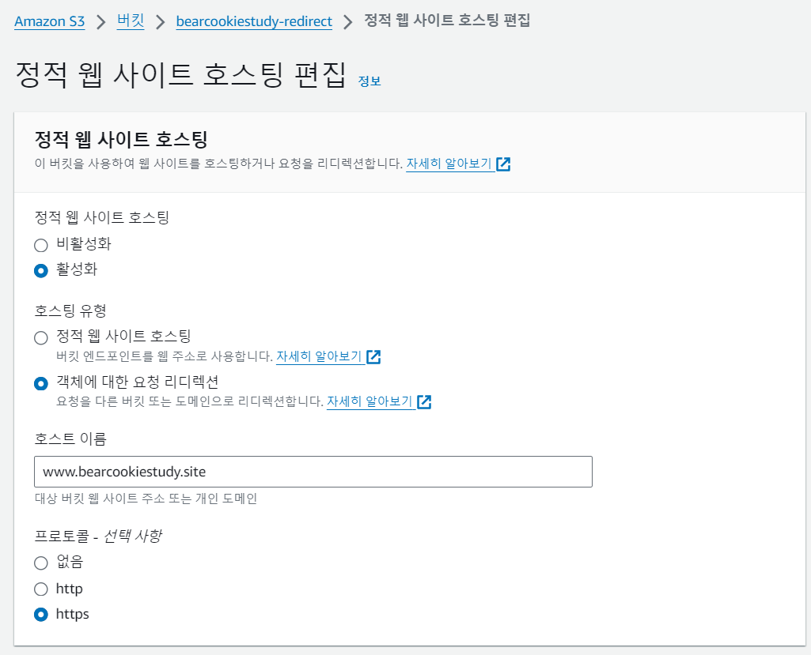
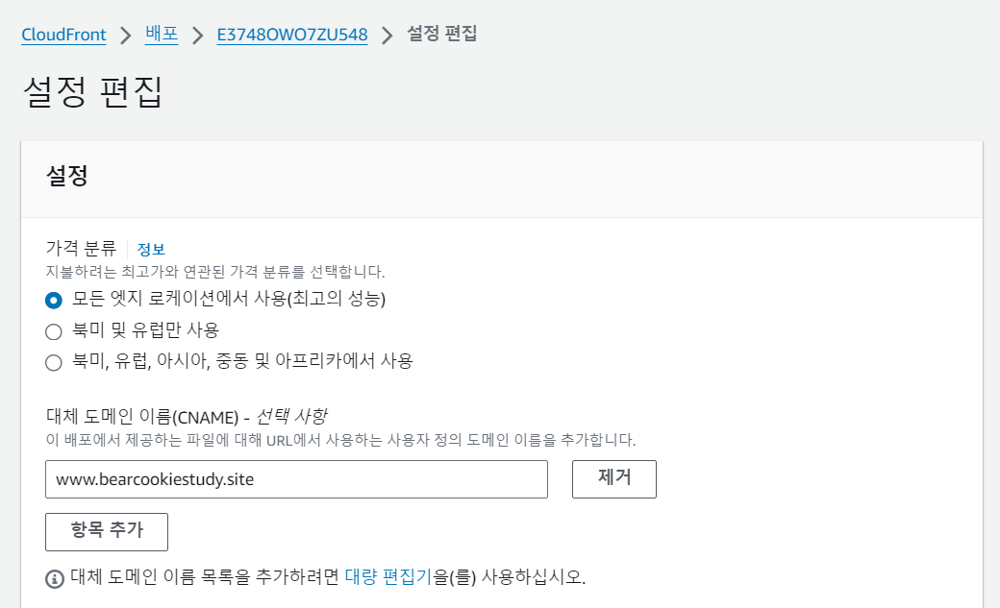
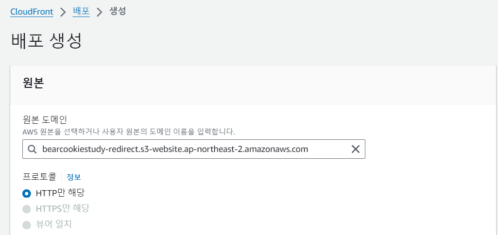

## www 리다이렉션

빌드된 React 앱을 **S3 + Cloudfront**에 배포하는 과정을 [이전 포스트](/aws-deployment-1)에 기록한 적이 있었다.  
당시에 하나의 Cloudfront 배포가 연결하는 대체 도메인으로 두 개를 같이 등록했었는데, 큰 문제가 되는 건 아니지만 사용자가 `non-www` 로 접속할 수도 있고 `www` 로 접속할 수도 있게 되는 것이기 때문에 백엔드 서버에서 허용해야 할 origin 설정이 늘어나게 된다.

따라서 Cloudfront에서 `non-www` 로 접속시 임의로 `www` 로 리다이렉션 하도록 주소를 통일화 하는 것도 좋아보인다. [(S3 공식문서)](https://docs.aws.amazon.com/ko_kr/AmazonS3/latest/userguide/how-to-page-redirect.html#redirect-endpoint-host)

### 1. S3 버킷 생성

리다이렉션용 버킷을 하나 생성해준다.  
퍼블릭 액세스는 차단해도 좋다.

### 2. 정적 웹 사이트 호스팅 설정

S3 버킷에 접속하면 리다이렉션 할 호스트 이름을 입력해준다.  
지금은 `bearcookiestudy.site` 로 접속하면 `www.bearcookiestudy.site` 로 이동하도록 설정하려고 한다.

### 3. Cloudfront 설정 변경

기존에 `non-www`와 `www` 두 개의 CNAME 속성을 갖던 Cloudfront 배포에서 최종 도메인 하나만 남도록 한다.

### 4. Cloudfront 배포 생성

리다이렉션 용 버킷으로 연결되는 Cloudfront 배포를 하나 생성해주면 브라우저에 `bearcookiestudy.site` 를 입력해도 `www.bearcookiestudy.site` 로 리다이렉션 되는 것을 확인할 수 있다.
