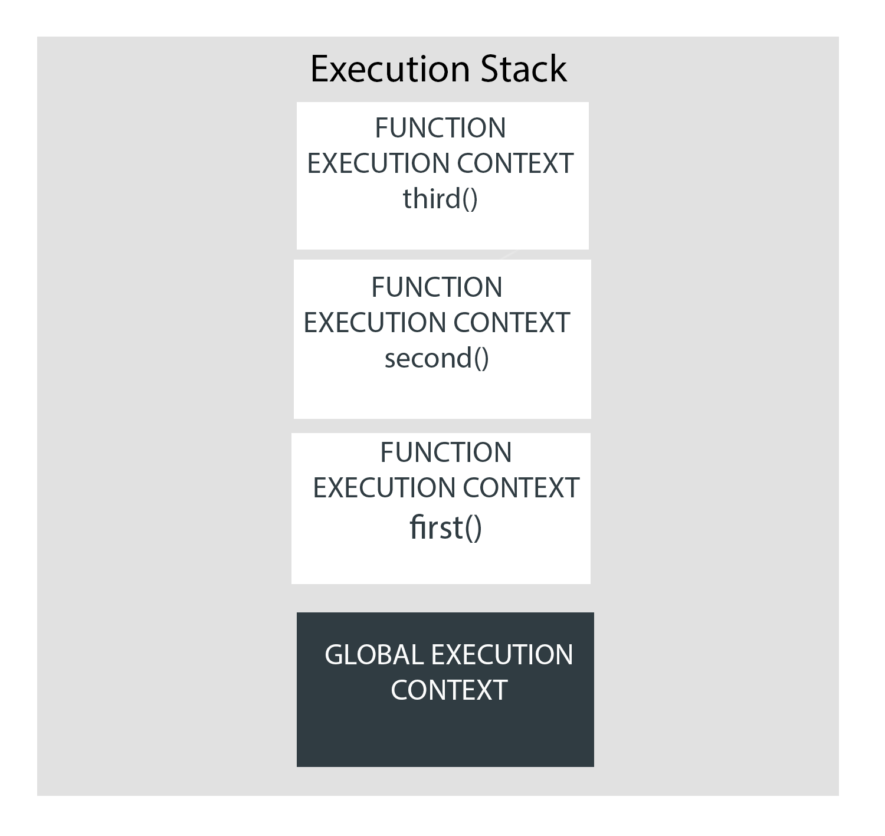
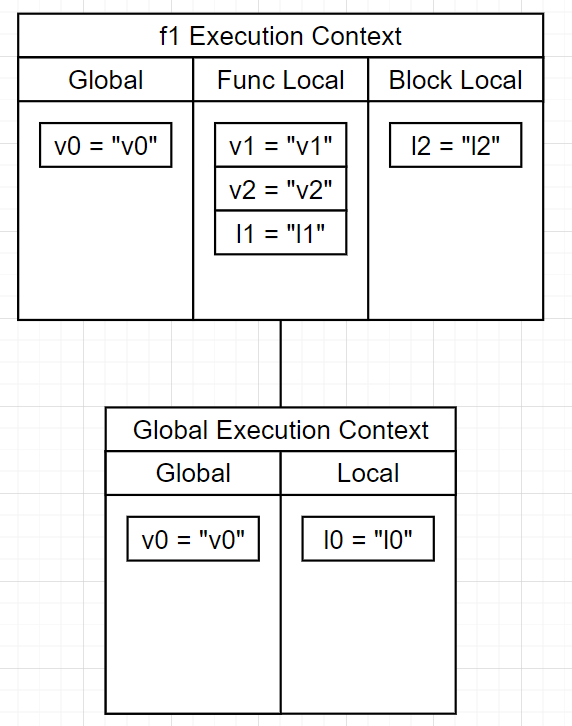

## 실행 컨텍스트(Execution Context)란?

자바스크립트 엔진이 프로그램을 해석하고 실행하기 위한,  
<b style="color:red">함수나 변수 및 그것들의 유효 범위 등의 정보가 기록된 실행 환경</b>을 의미한다.  
기본적으로 프로그램이 실행되면 Global 실행 컨텍스트가 생성되어 스택의 맨 아래에 깔리고  
이후에 함수가 호출될 때마다 새로운 실행 컨텍스트가 생성되어 스택의 위에 차곡차곡 쌓이는 방식으로 저장된다.  
자바스크립트 엔진은 프로그램을 해석하면서 어떤 자원에 대한 접근이 필요할 때마다  
스택의 상위에 있는 실행 컨텍스트를 우선순위로 하여 아래로 내려가며 자원을 찾는다.
- <b>전역 실행 컨텍스트</b>  
기본적으로 프로그램이 실행될 때 생성된다.
- <b>함수 실행 컨텍스트</b>  
함수가 실행될 때 생성된다.

## 스코프(Scope)란?
자원에 접근할 수 있는 범위를 의미한다.

### 기준
스코프의 범위를 정하는 기준에 따라 두 가지로 분류할 수 있다.
- <b>블록 레벨 스코프</b>  
블록을 기준으로 스코프를 나눈다.
대부분의 언어는 블록 레벨 스코프이다.  
- <b>함수 레벨 스코프</b>  
함수를 기준으로 스코프를 나눈다.
Javascript는 함수 레벨 스코프이지만,  
ES6부터 등장한 let, const를 이용하면 블록 레벨 스코프를 사용할 수 있다.  

### 위치
자원을 어디에서 선언하냐에 따라 두 가지로 분류할 수 있다.
- <b>전역 스코프(Global Scope)</b>  
어느 위치에서든 접근 가능한 영역이다.  
실행 컨텍스트마다 하나만 존재한다.  
기본적인 built-in 함수들이 들어있다.  
- <b>지역 스코프(Local Scope)</b>  
자기 자신이나 하위의 스코프에서만 접근 가능한 영역이다.  
var 키워드로 변수를 선언하면 같은 함수 내에서 접근 가능하다.  
let, const 키워드로 변수를 선언하면 같은 블럭 내에서 접근 가능하다.  

### 방식
스코프의 선언이 언제 이루어지냐에 따라 두 가지로 분류할 수 있다.
- <b>동적 스코프(Dynamic Scope)</b>  
스코프의 결정이 함수를 실행하는 순간에 결정되는 방식이다.  
함수를 어디서 호출하냐에 따라 스코프가 달라진다.  
- <b>정적 스코프(Global Scope)</b>  
스코프의 결정이 함수의 선언 시점에 결정되는 방식이다.  
자원을 어디에 선언했냐에 따라 스코프가 정해진다.  
대부분의 언어는 이 방식을 선택하며, 자바스크립트도 이에 해당된다.  
렉시컬 스코프(Lexical scoping) 라고도 한다.  

## 실행 예시
```js
// Global Execution Context.
// v0은 글로벌 스코프에서 접근 가능하다.
// l0은 로컬 스코프에서 접근 가능하다.
var v0 = "v0";
let l0 = "l0";

function f1() {

  // f1 Execution Context.
  // v1, l1는 함수 단위 로컬 스코프에서 접근 가능하다.
  var v1 = "v1";
  let l1 = "l1";
  {
    // v2는 var로 선언되었기 때문에 함수 단위 로컬 스코프에서 접근 가능하다.
    // l2는 블럭 단위 로컬 스코프에서 접근 가능하다.
    var v2 = "v2";
    let l2 = "l2";
  }
}

f1();
```


## 참고
https://www.freecodecamp.org/news/execution-context-how-javascript-works-behind-the-scenes/
