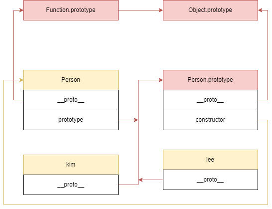

## 프로토타입이란?
객체 내부에 정의된 함수를 ***'메소드'*** 라고 하는데, 메소드는 <u>*공통적으로 사용되는 경우*</u>가 많다. 그래서 객체가 생성될 때마다 메소드의 세세한 내용까지 복사해서 놓는다면 메모리를 비효율적으로 사용하게 될 것이다.

그렇기에 프로토타입 개념을 적용할 수 있는데, 객체 내부에는 **프로토타입 객체를 가리키는 링크**만 놓고 공통된 실제 내용은 **프로토타입 객체의 내부**에 저장하는 방식을 적용하여 메모리를 아낄 수 있다.  

또한 프로토타입이 존재하기 때문에 클래스라는 개념 없이도 자바스크립트에서 객체지향을 구현할 수 있다. **자신의 프로토타입의 링크가 부모의 프로토타입을 가리키게 한다면** 부모의 프로퍼티 또한 모두 사용할 수 있게 되기 때문이다.  

이렇듯, 프로토타입은 객체지향 프로그래밍에서의 <b style="color: red;">**코드의 재사용성**</b>과 <b style="color: red;">**상속 개념**</b>을 지원하는 개념이다.  

> #### 객체지향 프로그래밍
> - **클래스 기반**  
객체의 기본적인 틀을 정의하는 **클래스**가 존재하고,  
사용할 수 있는 객체 형태인 **인스턴스**를 생성해서 사용한다.  
> - **프로토타입 기반**  
클래스가 존재하지 않는 대신 모든 객체는 다른 객체를 기반으로 생성되고 프로토타입 체인을 통해 상속 관계를 표현한다.  

## 프로토타입 프로퍼티
### \_\_proto\_\_  
자신을 **생성하게 한 객체의 프로토타입**을 가리키는 프로퍼티로, 모든 객체는 `__proto__` 프로퍼티를 갖는다.  
이 프로퍼티는 객체 내부의 `[[Prototype]]` 슬롯에 접근하게 해주는 getter/setter 역할을 하는데, 저장되는 값은 객체를 생성할 때 생성 방식에 따라서 결정된다.

- **객체 리터럴에 의해 생성된 객체**  
`__proto__` 는 `Object.prototype` 이 된다.  
- **생성자 함수에 의해 생성된 객체**  
`__proto__` 는 `생성자 함수.prototype` 이 된다.  
- **Object.create(proto)**  
`__proto__` 는 `Object.create(proto)` 함수로 넘긴 첫 번째 인자가 된다. 

> **주의 사항**  
`__proto__` 을 직접 조작하는 것도 가능하지만 호환을 위해서 표준으로 남겨둔 방법일 뿐 권장하지는 않는다. 대신에 `Object.getPrototypeOf()`, `Object.setPrototypeOf()` 로 프로토타입을 조작하는걸 권장한다.  
또한, 객체의 프로토타입을 직접 수정하기보다는 `Object.create()` 로 원하는 프로토타입을 가리키는 새로운 객체를 새로 만드는 것이 성능에 도움되는 방법이다.

### prototype
함수 객체만이 가질 수 있는 프로퍼티로, **자신의 프로토타입**을 가리킨다.  
함수 코드는 자신이 평가될 때 함수 객체가 생성이 되는데, 동시에 자신의 프로토타입도 함께 생성하여 `prototype` 프로퍼티가 자신의 프로토타입을 가리키게 한다.

```js
function Person(name) {
  this.name = name;
}

console.log(Person.prototype); // {}
```

### constructor
`constructor` 프로퍼티는 프로토타입이나 객체를 **생성하게 한 생성자 함수나 클래스**를 가리킨다.  

```js
function Person(name) {
  this.name = name;
}

let kim = new Person('김철수');
let shin = Object.create(Person.prototype, { name: { value: '신짱구' } });

console.log(Person.prototype.constructor); // [Function: Person]
console.log(kim.constructor); // [Function: Person]
console.log(shin.constructor); // [Function: Person]
```

## 예제 코드
`Person` 생성자 함수를 통해서 `kim` 과 `lee` 객체를 생성하는 예제이다: 

```js
function Person(name, age) {
  this.name = name;
  this.age = age;
}

// 정적 메소드
Person.sayHello = function () { 
  console.log("안녕하세요!");
}

// 프로토타입 메소드
Person.prototype.showName = function () { 
  console.log(`제 이름은 ${this.name} 입니다.`);
};

let kim = new Person("김철수", 20);
let lee = new Person("이미리", 25);

Person.sayHello(); // 안녕하세요!
kim.showName(); // 제 이름은 김철수 입니다.
lee.showName(); // 제 이름은 이미리 입니다.
```



#### Person 함수 객체에 포함된 프로퍼티  
- **\_\_proto\_\_**  
자신의 상위 객체의 프로토타입인 `Function.prototype` 을 가리킨다.
- **prototype**  
자신의 프로토타입인 `Person.prototype` 을 가리킨다.
- **constructor**  
자신의 상위 객체인 `Function` 을 가리킨다.

#### Person.prototype 에 포함된 프로퍼티
- **\_\_proto\_\_**  
자신의 상위 객체의 프로토타입인 `Object.prototype` 을 가리킨다.  
- **constructor**  
자신을 생성하게 한 함수인 `Person` 을 가리킨다.

#### kim, lee 객체에 포함된 프로퍼티
- **\_\_proto\_\_**  
자신을 생성하게 한 함수의 프로토타입인 `Person.prototype` 을 가리킨다.  
- **constructor**  
자신을 생성하게 한 함수인 `Person` 을 가리킨다.

#### 정적 메소드와 프로토타입 메소드
- **정적 메소드**  
`Person` 함수 객체에 정의한 함수로, `kim` 과 `lee` 같은 인스턴스에서는 접근할 수 없다.  
- **프로토타입 메소드**  
`Person.prototype` 프로토타입 객체에 정의한 함수로, `kim` 과 `lee` 에서 접근할 수 있다.

## 프로토타입 체인
객체들이 프로토타입 개념을 통해서 연결되어 있다는 점을 통해서 객체의 프로퍼티에 접근할 때 상위 객체의 프로토타입까지 순차적으로 검색하는데, 이를 프로토타입 체인이라고 한다.  

자바스크립트 엔진은 이런 과정을 거쳐서 프로퍼티를 찾는다:  
1. 객체 자기 자신이 해당 프로퍼티를 가지고 있는지 찾는다.  
2. `__proto__` 가 가리키는 자신의 프로토타입에서 찾는다.  
3. 자신의 프로토타입의 `__proto__` 가 가리키는 상위 객체의 프로토타입에서 찾는다.  
4. 순차적으로 올라가면서 `Object.prototype` 까지 찾는다.  
5. 없다면 `undefined` 를 반환한다.  

### 예제 코드
```js
function Person(name, age) {
  this.name = name;
  this.age = age;
}

let kim = new Person("김철수", 20);
let lee = new Person("이미리", 25);

lee.hello = function () {
  console.log("안녕하세요? 전 이미리에요.");
}

Person.prototype.hello = function () {
  console.log("안녕하세요?");
}

Object.prototype.bye = function () {
  console.log("잘가요~");
}

lee.hello(); // 안녕하세요? 전 이미리에요. (lee 객체에 존재하는 메소드)
kim.hello(); // 안녕하세요? (Person의 프로토타입에 존재하는 메소드)
kim.bye(); // 잘가요~ (Object의 프로토타입에 존재하는 메소드)
console.log(kim.num); // undefined (Object의 프로토타입까지 올라갔지만 발견하지 못한 프로퍼티)
```

## 직접 상속
`ES6` 에 등장한 클래스 문법을 사용하지 않고 직접 상속을 구현하기 위해서는 크게 두 가지의 방법이 있다.

### Object.create()
`Object.create()` 함수를 사용해서 객체의 프로토타입 정보와 프로퍼티를 입력해주는 방법이다.

```js
const Animal = Object.create(null, {
  eat: {
    value: function () {
      console.log(`${this.name} 이(가) 맛있게 식사를 합니다.`);
    },
  },
});

const Cat = Object.create(Animal, {
  name: { value: '고양이' },
  meow: {
    value: function () {
      console.log('미야옹');
    },
  },
});

const BlackCat = Object.create(Cat, {
  name: { value: '검은 고양이' },
});

BlackCat.eat(); // 검은 고양이 이(가) 맛있게 식사를 합니다.
BlackCat.meow(); // 미야옹
```

### 객체 리터럴
객체 내부에 `__proto__` 접근자 프로퍼티를 사용하여 상속을 구현하는 방법이다.

```js
const Animal = {
  eat() {
    console.log(`${this.name} 이(가) 맛있게 식사를 합니다.`);
  }
};

const Cat = {
  name: '고양이',
  meow() {
    console.log('미야옹');
  },
  __proto__: Animal
};

const BlackCat = {
  name: '검은 고양이',
  __proto__: Cat
};

BlackCat.eat(); // 검은 고양이 이(가) 맛있게 식사를 합니다.
BlackCat.meow(); // 미야옹
```

## 참고 자료
모던 자바스크립트 Deep Dive 19장 프로토타입  
[프로토타입과 프로토타입 상속 (코어 자바스크립트)](https://ko.javascript.info/prototypes)  
[프로토타입 기반 프로그래밍 (위키백과)](https://ko.wikipedia.org/wiki/%ED%94%84%EB%A1%9C%ED%86%A0%ED%83%80%EC%9E%85_%EA%B8%B0%EB%B0%98_%ED%94%84%EB%A1%9C%EA%B7%B8%EB%9E%98%EB%B0%8D)  
[Object.prototype.\_\_proto\_\_ (MDN)](https://developer.mozilla.org/ko/docs/Web/JavaScript/Reference/Global_Objects/Object/proto)  