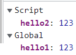
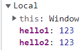
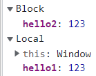

## 변수
변수는 <b style="color: red">**하나의 값을 저장하기 위해 확보한 메모리 공간을 식별하기 위해 붙인 이름**</b>이다. 변수는 식별자라고도 할 수 있는데, **어떤 값을 구별해서 식별할 수 있는 고유한 이름**이기 때문이다.  

메모리 공간을 확보하고 값을 저장하는 과정까지 몇 가지의 용어가 있다.  

### 선언
값을 저장하기 위한 **메모리 공간을 확보**하고  
변수가 그 메모리 공간을 가리키는 것을 의미한다.
```js
var name; // 선언
```

### 초기화
변수가 가리키는 메모리 공간의 **최초 값을 지정**해 주는 것을 의미한다.
```js
var name = "cookie"; // 초기화
```

### 할당
선언된 변수에 대입 연산자(=)를 사용하여 **값을 지정**해 주는 것을 의미한다.
```js
var name; // 선언
name = "cookie"; // 할당
```

## 변수 생성 방법
자바스크립트에서 변수나 상수를 생성하는 키워드는 `var`, `let,` `const` 가 존재한다. 
이 글에서 `var` 와 `let` 에 존재하는 몇 가지의 차이점을 서술해보고자 한다.  

- **var**: ES6가 등장하기 전에 변수를 생성하는 유일한 키워드이다.  
현재는 사용하지 않기를 권장한다.
- **let**: ES6에서 등장한 키워드이다.  
기존의 `var` 를 사용했을 때 실수가 발생할 수 있었던 부분을 방지한다.  
- **const**: ES6에서 등장한 키워드이다.  
값의 재할당이 불가능하다는 점을 제외하고는 `let` 과 동일한 동작을 한다.

### 중복 선언
`var`는 중복 선언이 가능하지만, `let`은 중복 선언이 불가능하다.
```js
var hello = "hello";
var hello = "rehello"; // (O)

let bye = "bye";
let bye = "rehello"; // (X) Cannot redeclare block-scoped variable 'bye'.
```

### 호이스팅
자바스크립트 엔진은 실제 코드를 런타임 환경에서 실행하기 전에 먼저 코드 평가 과정을 통해서 실행 컨텍스트를 생성하는 과정을 거친다.  

코드 평가 과정에서는 <b style="color: red">**함수나 변수의 선언 부분을 맨 위로 끌어올려 메모리 공간을 미리 할당하는**</b> 호이스팅 과정이 일어나는데 `var` 와 `let` 으로 선언한 변수에는 차이가 존재한다.  

- **var**: 호이스팅시 **선언**과 **초기화** 단계가 발생하여 값이 `undefined` 가 된다.
- **let**: 호이스팅시 **선언** 단계만 발생하여 값이 존재하지 않는다.  
따라서 코드상으로 변수를 생성한 코드 구문 위에서 접근할 수 없는데  
변수는 선언이 되었지만 아직 초기화가 되지 않아 접근할 수 없는 구간을 <b style="color: red">**일시적 사각지대(Temporal Dead Zone)**</b> 라고 한다.

```js{2}
console.log(v); // undefined
console.log(l); // ReferenceError: Cannot access 'l' before initialization
func(); // 안녕하세요

var v = "hello";
let l = "bye"; 

function func() {
  console.log("안녕하세요");
}
```

### 스코프
`var` 는 전역에서는 전역 스코프로, 함수 내부에서는 **함수 레벨 스코프**로 동작한다.  
`let` 은 **블럭 레벨 스코프**로 동작한다.  

#### 전역 스코프에서
```js
var hello1 = 123;
let hello2 = 123;
```



`var` 로 선언한 변수는 전역 객체에, `let` 으로 선언한 변수는 전역이 아닌 블럭 개념의 영역에 저장되고 있다.

#### 함수 스코프에서
```js
function func() {
  var hello1 = 123;
  let hello2 = 123;
}
func();
```



`var` 로 선언한 변수와 `let` 으로 선언한 변수 모두 함수의 스코프에 저장되고 있다.

#### 블럭 스코프에서
```js
function func() {
  {
    var hello1 = 123;
    let hello2 = 123;
    console.log();
  }
}
func();
```



`var` 로 선언한 변수는 함수의 스코프에, `let` 으로 선언한 변수는 블럭 개념의 스코프에 저장되고 있다.

#### 예시 코드
```js{9-12}
var v = "global"; // global scope

function func() {
  var v = "v"; // func scope
  let l = "l"; // func scope
  console.log(v); // v
  console.log(l); // l
  
  {
    var v = "vv"; // func scope
    let l = "ll"; // block scope
  }
  
  console.log(v); // vv
  console.log(l); // l
}

func();
console.log(v); // global
```

## 메모리
변수가 실제로 가리키는 값은 메모리 공간에 저장되어 있는데, 원시 타입인지 참조 타입인지에 따라서 저장하는 방식에 차이가 존재한다.  

- **원시 타입**  
숫자, 문자열, 논리값 같이 불변한 값을 저장할 땐 메모리 공간을 얼마나 확보해야 하는지를 정확히 파악할 수 있다.  
따라서 값이 <b style="color: red">**스택 영역**</b>에 저장된다.  
- **참조 타입**  
객체, 배열과 같이 동적으로 프로퍼티가 변화하거나 길이가 달라질 수 있는 값을 저장할 땐 메모리 공간을 얼마나 확보해야 하는지 알 수 없다.  
따라서 값은 동적으로 할당할 수 있는 <b style="color: red">**힙 영역**</b>에 저장되고,  
변수에는 힙 영역의 주소를 가리키는 값이 **스택 영역**에 저장된다.  

### 메모리 할당
#### 원시 타입 예시
```js
let num1 = 100; // (0x00)
let num2 = 200; // (0x04)
let num3 = num1; // (0x00)
num1 = num2 - 50; // (0x08)
```
1. `num1` 과 `num2` 는 원시 값을 참조하는 변수이므로,  
스택 영역에 각각 메모리가 할당된다.  
2. `num3` 은 `num1` 이 참조하는 공간을 함께 참조한다.  
3. `num1` 에 새로운 원시 값이 할당되면, 스택 영역의 새로운 공간에 할당된다.

#### 참조 타입 예시
```js
const kim = {};
kim.name = 'kim';
kim.age = 20;

const lee = kim;
lee.name = 'lee';

console.log(kim); // { name: 'lee', age: 20 }
console.log(lee); // { name: 'lee', age: 20 }
```

1. `kim` 은 참조 타입이다.  
따라서 실제로 값이 보관되는 힙 영역 메모리를 확보하고  
`kim` 변수는 해당 힙 메모리의 주소를 가리키는 값을 스택 영역에 저장한다.  
2. `lee` 또한 참조 타입이다.  
따라서 `kim` 변수에 저장된 값인 힙 메모리 주소의 참조 값을 스택 영역에 저장한다.  
3. `kim` 과 `lee` 가 가리키는 힙 메모리 주소가 같기 때문에  
`lee` 객체의 프로퍼티 값을 변경하면 `kim` 객체의 프로퍼티 값도 같이 변경된다.  

### 메모리 해제
더 이상 사용하지 않는 메모리 공간에 대해서는 가비지 컬렉터가 자동으로 삭제한다.  
여기에는 **Mark and Sweep** 알고리즘이 사용되는데, 최상위 객체은 `window` 객체에서부터 내려가면서 접근하지 않는 메모리 공간은 사용하지 않는 값이라고 판단하여 제거하는 방식이다.  

## 참고 자료
모던 자바스크립트 Deep Dive 4장 변수  
[호이스팅 (MDN)](https://developer.mozilla.org/ko/docs/Glossary/Hoisting)  
[03. 원시 값과 객체는 메모리에 어떻게 저장되는가? 객체의 복제란? (좋아요 요정)](https://ji-u.tistory.com/21)  