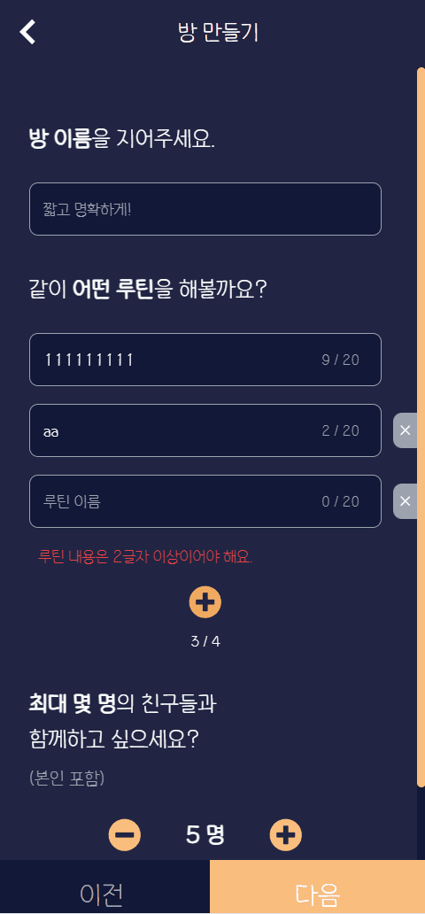
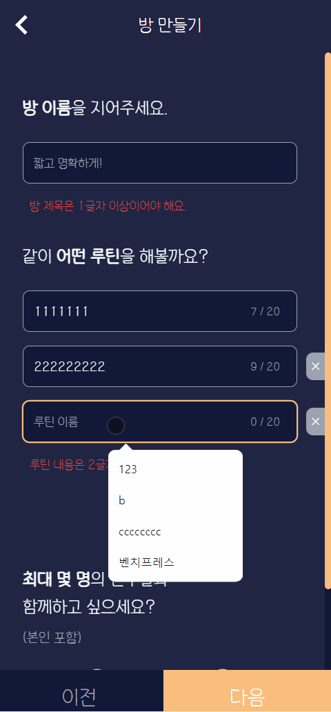

## 서론


웹에서 사용자로부터 제출 양식을 입력받는 것은 자주 사용되는 패턴인데요. 이러한 기능을 구현해야 한다면 고려해야 할 내용은 다음과 같습니다.

1. 각 필드에 입력된 내용을 기억하고 있어야 합니다.
2. 각 필드의 유효성 여부를 판단하고, 적절한 오류 메시지를 보여줄 수 있어야 합니다.
3. 사용자가 각 필드에 대해 상호작용했는지의 여부를 기억해야 합니다. (예를 들어, 사용자가 아직 상호작용하지 않은 필드에 대해서 먼저 오류 메시지를 보여준다면 입력을 재촉하는 경험을 줄 수 있기 때문입니다.)
4. 상황에 따라 필드의 값이 변경되면 화면에 즉시 새로운 내용을 반영해야 하기도 합니다. (ex. 글자수 길이 표시)

이러한 기능을 구현하는 방식은 크게 두 가지로 분류할 수 있는데요:

- **비제어 컴포넌트**: HTML의 `<form>` 태그가 제출되면 작동하는 `submit` 이벤트 핸들러에서 입력 요소의 값을 읽어서 사용하는 방식으로, 값의 변화를 리액트가 감지하지 않습니다.
- **제어 컴포넌트**: 입력 요소의 값을 리액트의 State로 관리하고, onChange 등의 이벤트 핸들러에서 상태의 값을 업데이트하여 Model과 View를 동기화하는 방식으로, 값의 변화를 리액트가 감지합니다.

제어 컴포넌트는 값의 변화에 따라서 화면에 변경되어야 할 컨텐츠를 즉시 업데이트할 수 있다는 장점이 있지만, 입력 요소를 조작하는 과정에 이벤트 핸들러가 동작하고 상태를 변경하기 때문에 상황에 따라서는 불필요한 렌더링을 야기하기도 합니다.

만약 단순히 입력 요소의 값을 기억하기 위함이라면, 상태로 관리하지 않고 비제어 컴포넌트로도 성능적인 관점에서 충분하지 않을까요?

이렇듯 [불필요한 렌더링을 최소화하자는 아이디어](https://react-hook-form.com/faqs)에서 출발한 라이브러리가 바로 react-hook-form입니다.

> 💡 제출 양식을 구현하는 데 비제어/제어 컴포넌트 방식을 복합적으로 사용해야 하는 경우도 있을텐데요, RHF를 사용하면 필요한 부분만 제어 컴포넌트로 활용할 수 있습니다.

## 제출 양식 만들기

### useForm

```ts
const form = useForm<Inputs>({
  defaultValues: {
    username: "",
    password: "",
  },
  mode: "onBlur",
  resolver: zodResolver(formSchema),
})
```

우선 제출 양식에 어떤 내용이 들어갈 것인지를 정의해야 하는데요, 이는 [useForm API](https://react-hook-form.com/docs/useform)를 통해서 UseFormReturn 객체를 만들 수 있습니다. 상세한 내용은 공식 문서에 잘 나와 있기에, 자주 사용했던 몇 가지 옵션에 대해서만 정리해보았습니다.

- **defaultValues**: 폼 내부의 입력 요소에 기본 값을 부여할 수 있습니다. 주의해야 할 점은 <b style="color: red;">**제어 컴포넌트 방식으로 활용하려는 필드**</b>에 대해서는 기본 값이 `undefined` 가 되어서는 안된다는 점입니다.
- **mode**: 최초 `submit` 이벤트가 발생하기 전에 유효성 검사를 언제 수행할지를 의미합니다. 보통 최초의 유효성 검사는 사용자가 양식을 제출할 때 작동하는 경우가 많기 때문에 기본 값은 `submit` 으로 되어 있습니다.
- **reValidateMode**: 최초 `submit` 이벤트가 발생한 이후에 유효성 검사를 언제 수행할지를 의미합니다. 보통 제출이 끝난 후에는 오류 메시지가 화면에 남아있을텐데, 사용자가 올바른 값으로 수정하면 오류 메시지도 바로 사라져야 사용자에게 좋은 경험을 줄 수 있기 때문에 기본 값은 `onChange` 로 되어있습니다.
- **resolver**: 외부 유효성 검사 라이브러리와의 통합에서 사용됩니다.

### register

useForm API로 생성한 UseFormReturn 객체의 프로퍼티에는 [register](https://react-hook-form.com/docs/useform/register)가 존재하는데요.

[타입 정의](https://github.com/react-hook-form/react-hook-form/blob/master/src/types/form.ts#L181)를 살펴보면, register 객체의 타입인 UseFormRegisterReturn는 아래와 같은 타입을 갖고 있다는 점을 알 수 있습니다.

```ts
export type UseFormRegisterReturn<
  TFieldName extends InternalFieldName = InternalFieldName
> = {
  onChange: ChangeHandler
  onBlur: ChangeHandler
  ref: RefCallBack
  name: TFieldName
  min?: string | number
  max?: string | number
  maxLength?: number
  minLength?: number
  pattern?: string
  required?: boolean
  disabled?: boolean
}
```

이 객체는 입력 요소를 다루는 데 필요한 이벤트 핸들러, ref, name 등의 값이 들어있는 것인데, 때문에 **RHF가 특정 입력 요소를 관리할 수 있도록** `<input>` 요소에 prop으로 전달해주는 과정이 필요합니다.

```tsx
const { onChange, onBlur, name, ref } = register('username');

<input
  onChange={onChange}
  onBlur={onBlur}
  name={name}
  ref={ref}
/>

// 이렇게 간결하게 표현할 수도 있습니다.
<input {...register("username")} />
```

또한 register API의 두 번째 인자로는 유효성 검사에 대한 내용을 적을 수 있는데요. 예를 들어 아래와 같은 형태로 최소 길이와 최대 길이를 표현할 수 있습니다:

```tsx
<input
  {...register("username", {
    minLength: 4,
    maxLength: 8,
  })}
/>
```

하지만 유효성 검사 조건을 각 필드에 산재해서 작성하는 방식은 비즈니스 요구사항이 변화하는 등의 이유로 조건을 변경해야 하는 경우에서 유연하게 대응하기가 쉽지 않다는 생각이 드는데요.

그래서 유효성 검사를 이러한 방식으로 다루지 않고, 스키마를 선언할 수 있는 유효성 검사 라이브러리와 통합해서 사용했습니다. 자세한 내용은 뒷 부분에 이어서 후술하겠습니다.

### handleSubmit

입력 요소를 UseFormReturn 객체에 등록했다면, 이제 제출에 대한 처리도 해줘야 하는데요.  
이는 UseFormReturn 객체의 프로퍼티에 존재하는 [handleSubmit](https://react-hook-form.com/docs/useform/handlesubmit) 을 `<form>` 태그의 `onSubmit` 이벤트로 전달해주면 됩니다.

`handleSubmit` 은 두 가지를 인자로 받는데요.

1. 유효성 검사가 **성공**했을 때 작동할 콜백 함수
2. 유효성 검사가 **실패**했을 때 작동할 콜백 함수

예를 들어 아래와 같이 사용할 수 있습니다:

```tsx
import {
  SubmitErrorHandler,
  SubmitHandler,
  useForm,
  UseFormReturn,
} from "react-hook-form"

const Component = () => {
  const { handleSubmit } = useForm<Inputs>()

  const onSubmit: SubmitHandler<Inputs> = data => {
    console.log("유효성 검사 성공!")
  }

  const onError: SubmitErrorHandler<Inputs> = errors => {
    console.error(errors)
  }

  return <form onSubmit={handleSubmit(onSubmit, onError)}>{/* 생략.. */}</form>
}
```

### FormProvider

코드의 규모가 커지다보면 자연스럽게 컴포넌트를 분리하게 되는데요.  
이 때 컴포넌트 계층 단계가 깊어질수록, 상위 컴포넌트에 존재하는 UseFormReturn 객체를 사용하기 위해 props를 전달받아야 하는 현상이 발생합니다.

그래서 이 부분에 Context API를 활용할 수 있는데요, 다행히 RHF에서는 기본으로 제공하는 [FormProvider](https://react-hook-form.com/docs/formprovider)가 있어서 컨텍스트를 생성하는 보일러 플레이트 과정을 생략할 수 있습니다.

예를 들어서 상위 컴포넌트에서 Provider로 UseFormReturn 객체를 주입하면:

```tsx
import { useForm, FormProvider } from "react-hook-form"

const Component = () => {
  const form = useForm<Inputs>()
  const { handleSubmit } = form

  return (
    <form onSubmit={handleSubmit(onSubmit, onError)}>
      <FormProvider>
        <Username />
        <Password />
      </FormProvider>
    </form>
  )
}
```

하위 컴포넌트에서는 [useFornContext](https://react-hook-form.com/docs/useformcontext) 훅으로 가져와서 사용할 수 있습니다:

```tsx
import { useFormContext } from "react-hook-form"

const Username = () => {
  const { register } = useFormContext<Inputs>()

  return <input {...register("username")} />
}
```

## 변경에 유연하게 관리하기

### zod

앞서 register 객체에서 보았듯 유효성 검사 조건을 RHF에서 제공하는 기능으로 관리할 수 있습니다.

하지만 각 입력 요소에 register 객체를 등록할 때 유효성 검사 로직도 산재해서 작성해야 하다 보니, 만약 방 제목의 최대 길이가 변경된다거나, 등록할 수 있는 루틴의 최대 갯수가 늘어나야하는 등 **변경 사항이 발생한다면 관련 있는 값을 컴포넌트를 찾아가면서 모두 수정**해야 하는 상황이 발생합니다.

즉, 변경의 대응에 비교적 덜 유연할 수 있는 것입니다.

그래서 스키마 선언형 유효성 검사 라이브러리를 통합해서 사용하면 좋은데요, RHF에서는 [resolvers](https://github.com/react-hook-form/resolvers) 라는 서브 라이브러리로 통합을 지원하고 있습니다.

RHF에서 제공하는 기본 기능보다는 대부분의 유효성 검사 라이브러리가 제공하는 기능이 다양하고 강력하기 때문에 이를 활용할 수 있다는 장점도 있습니다. (ex. 이메일 형식 검증)

> RHF와 통합 가능한 다양한 유효성 검사 라이브러리의 종류는 [resolvers 레포지토리](https://github.com/react-hook-form/resolvers)에서 확인할 수 있습니다.

#### 설치

`resolvers` 는 `react-hook-form` 라이브러리와는 별개로 존재하는 패키지이기 때문에 설치를 해야합니다.

```sh
npm i @hookform/resolvers
```

#### 사용

이제 유효성 검사 스키마를 선언하고, `useForm()` 의 인자로 zodResolver와 함께 전달해주면 됩니다.

```tsx
export const formSchema = z.object({
  roomType: z.enum(["MORNING, NIGHT"], {
    required_error: "방 종류를 선택해주세요.",
  }),
  certifyTime: z.number(),
  routines: z.array(
    z.object({
      value: z
        .string()
        .trim()
        .min(2, "루틴 내용은 2글자 이상이어야 해요.")
        .max(20, "루틴 내용은 20글자 이하로 입력해주세요."),
    })
  ),
  title: z
    .string()
    .trim()
    .min(1, "방 제목은 1글자 이상이어야 해요.")
    .max(20, "방 제목은 20글자 이하로 입력해주세요."),
  userCount: z
    .number()
    .gte(1, "인원을 1명 이상 선택해주세요.")
    .lte(10, "인원을 10명 이하로 선택해주세요."),
  password: z.literal("").or(
    z
      .string()
      .min(4, "비밀번호는 4자리 이상이어야 해요.")
      .max(8, "비밀번호는 8자리 이하로 입력해주세요.")
      .refine(v => /^\d*$/.test(v), {
        message: "비밀번호는 숫자로만 입력해주세요.",
      })
  ),
})

const useRoomForm = () => {
  const form = useForm<Inputs>({
    resolver: zodResolver(formSchema),
  })
}
```

> zod에 대한 상세한 내용은 [zod 공식문서](https://zod.dev/)에서 살펴볼 수 있습니다.

### 상수화

이제 유효성 검사에 대해서는 방금 정의했던 스키마의 값만 변경하면 새로운 조건이 적용됩니다.  
그러나, 스키마 내에서 사용하는 매직 넘버는 높은 확률로 다른 곳에서도 공유해서 사용하게 되는데요.

가령 방 비밀번호 입력 요소에 15글자의 내용이 들어온다면, `handleSubmit` 의 두 번째 인자인 `onError` 콜백이 실행되겠지만 아직 입력 자체를 막는 것은 아니기 때문에 `<input>` 요소의 maxLength 속성도 부여해 줄 필요성이 있습니다.

즉, 아래와 같은 형태로 입력 요소를 선언해야 합니다:

```tsx
<input {...register("password")} maxLength={8} />
```

유효성 검사 조건에 대한 스키마를 묶어놓긴 했지만, 결국 비밀번호 길이 제한 조건에 변경 사항이 생긴다면 각 Input 요소를 찾아가면서 수정해야 하는 현상은 동일한 것입니다.  
그래서.. 이 부분에 사용되는 값도 하나의 객체로 상수화해서 단일 진실 공급원(SSOT)을 지키는 방식으로 작성했습니다.

```tsx
export const FORM_LITERAL = {
  /** 방 종류 */
  roomType: {
    value: ["MORNING", "NIGHT"],
    message: "방 종류를 선택해주세요.",
  },
  /** 루틴 목록 */
  routines: {
    min: {
      value: 0,
    },
    max: {
      value: 4,
      message: "루틴은 최대 4개까지 등록할 수 있어요.",
    },
    item: {
      min: {
        value: 2,
        message: "루틴 내용은 2글자 이상이어야 해요.",
      },
      max: {
        value: 20,
        message: "루틴 내용은 20글자 이하로 입력해주세요.",
      },
    },
  },
  /** 방 제목 */
  title: {
    min: {
      value: 1,
      message: "방 제목은 1글자 이상이어야 해요.",
    },
    max: {
      value: 20,
      message: "방 제목은 20글자 이하로 입력해주세요.",
    },
  },
  /** 방에 참여할 수 있는 인원 수 */
  userCount: {
    min: {
      value: 1,
      message: "인원을 1명 이상 선택해주세요.",
    },
    max: {
      value: 10,
      message: "인원을 10명 이하로 선택해주세요.",
    },
  },
  /** 방 비밀번호 */
  password: {
    min: {
      value: 4,
      message: "비밀번호는 4자리 이상이어야 해요.",
    },
    max: {
      value: 8,
      message: "비밀번호는 8자리 이하로 입력해주세요.",
    },
    onlyNumeric: {
      message: "비밀번호는 숫자로만 입력해주세요.",
    },
  },
  /** 공지사항 */
  announcement: {
    min: {
      value: 0,
    },
    max: {
      value: 100,
      message: "공지사항은 100글자 이하로 입력해주세요.",
    },
  },
} as const

const L = FORM_LITERAL

export const formSchema = z.object({
  roomType: z.enum(L.roomType.value, {
    required_error: L.roomType.message,
  }),
  certifyTime: z.number(),
  routines: z.array(
    z.object({
      value: z
        .string()
        .trim()
        .min(L.routines.item.min.value, L.routines.item.min.message)
        .max(L.routines.item.max.value, L.routines.item.max.message),
    })
  ),
  title: z
    .string()
    .trim()
    .min(L.title.min.value, L.title.min.message)
    .max(L.title.max.value, L.title.max.message),
  userCount: z
    .number()
    .gte(L.userCount.min.value, L.userCount.min.message)
    .lte(L.userCount.max.value, L.userCount.max.message),
  password: z.literal("").or(
    z
      .string()
      .min(L.password.min.value, L.password.min.message)
      .max(L.password.max.value, L.password.max.message)
      .refine(v => /^\d*$/.test(v), {
        message: L.password.onlyNumeric.message,
      })
  ),
})
```

이제 이렇게 상수와 스키마를 정의하면 컴포넌트에서는 가져와서 사용하기만 하면 됩니다.  
만약 값에 변동 사항이 생긴다면, 상수와 스키마 부분만 교체하면 되기 때문에 수정 누락이 발생할 가능성도 줄었습니다.

```tsx
<input {...register("password")} maxLength={FORM_LITERAL.password.max.value} />
```

## 제어 컴포넌트로 활용하기

### watch

RHF의 register는 기본적으로 비제어 컴포넌트 방식으로 동작하지만, 필요에 따라서 제어 컴포넌트 방식으로도 사용할 수 있습니다.

[watch](https://react-hook-form.com/docs/useform/watch)는 값의 변화를 감지하는 하나의 방법입니다.

```tsx
const Routines = () => {
  const { register, watch } = useFormContext<Inputs>()
  const watchRoutines = watch("routines")

  return (
    <ul>
      {routines.map((routine, idx) => (
        <li key={routine.id}>
          <input {...register(`routines.${idx}.value`)} />
          <p>{watchRoutines[idx]?.value.length.toString()} / 20</p>
        </li>
      ))}
    </ul>
  )
}
```



이처럼 입력 요소 값의 변화를 감지해서 실시간으로 문자열의 길이를 표현할 수 있습니다.

그런데 리렌더링이 필요하지 않은 부분도 함께 렌더링되고 있다는 점을 확인할 수 있는데요. 이는 **watch로 구독한 값이 있는 입력 양식의 경우에는 해당 필드가 바뀌면 UseFormReturn 객체를 생성했던 상위 컴포넌트 자체가 리렌더링**되기 때문입니다.

그래서 RHF에서는 렌더링 최적화가 필요한 경우에는 콜백이나 useWatch를 사용하도록 권장하고 있습니다.

### useWatch

[useWatch](https://react-hook-form.com/docs/usewatch)는 watch와 기능은 동일하지만, **리렌더링의 범위를 훅을 사용한 컴포넌트로 제한**할 수 있습니다.

```tsx
const Routines = () => {
  const { register, control } = useFormContext<Inputs>()
  const watchRoutines = useWatch({ name: "routines", control })

  return (
    <ul>
      {routines.map((routine, idx) => (
        <li key={routine.id}>
          <input {...register(`routines.${idx}.value`)} />
          <p>{watchRoutines[idx]?.value.length.toString()} / 20</p>
        </li>
      ))}
    </ul>
  )
}
```



### Controller

[Controller](https://react-hook-form.com/docs/usecontroller/controller) 도 제어 컴포넌트 방식을 활용하기 위한 API인데요.

RHF의 register는 비제어 컴포넌트로 동작하기 때문에, 제어 컴포넌트로 동작하는 AntD나 MUI같은 외부 라이브러리와의 통합을 위해서 제공하는 기능입니다.

그런데 Controller도 리렌더링의 범위를 제한할 수 있기 때문에, 렌더링의 범위를 최소화하는 용도로 활용해보았습니다.

> 만약 페이지 컴포넌트 내부의 입력 요소가 복잡하지 않다고 판단되면 굳이 컴포넌트로 분리하고 싶지 않은 경우도 있을 것입니다.

> 그렇다면 페이지 컴포넌트에서 `useWatch` 를 선언하더라도 결국 페이지 전체가 리렌더링되는 현상이 발생하기에, `Controller` 로 렌더링의 범위를 제한할 수도 있습니다.

```tsx
const RoomSettingPage = () => {
  const { register, control } = useForm({ ...생략 })

  return (
    <form>
      <section>
        <label>방 이름</label>
        <input {...register("title")} />
      </section>
      <section>
        <label>공지사항</label>
        <Controller
          name="announcement"
          control={control}
          render={({ field }) => (
            <section>
              <textarea {...register("announcement")} />
              <p>{field.value.length} / 100</p>
            </section>
          )}
        />
      </section>
      <section>
        <label>인증 시간</label>
        <TimePicker {...register("time")} />
      </section>
    </form>
  )
}
```


## 생각

이렇게 React Hook Form을 사용했던 내용을 정리해보았는데요.  
폼에 대한 상태 관리나 유효성 검사를 간편하게 해결해준다는 점도 좋지만, 저는 RHF만의 장점을 떠올려본다면 아래의 내용을 느꼈습니다.

- 필요에 따라서 비제어 컴포넌트 방식과 제어 컴포넌트 방식을 유연하게 활용하기 쉽다는 것이 장점으로 느꼈습니다.
- 제어 컴포넌트 방식을 사용했을 때 useWatch, useController, Controller 등의 API를 활용해서 폼 전체를 업데이트하는게 아니라, 필요한 곳만 구독해서 지역적으로 렌더링 최적화할 수 있다는 점이 좋다고 느꼈습니다.
- 외부 유효성 검사 라이브러리와의 통합이 자유로운 부분이 장점이라고 느꼈습니다. 만약 백엔드 서버가 노드 계열이라면, 유효성 검사 스키마를 공유해서 사용하는 것도 가능할 것 같다고 느꼈습니다. 즉, SSOT를 지키는 구조로 개발하기에 용이하다고 느꼈습니다.

## References

[리액트로 폼(Form) 다루기](https://jeonghwan-kim.github.io/dev/2022/03/29/react-form-and-formik.html)
