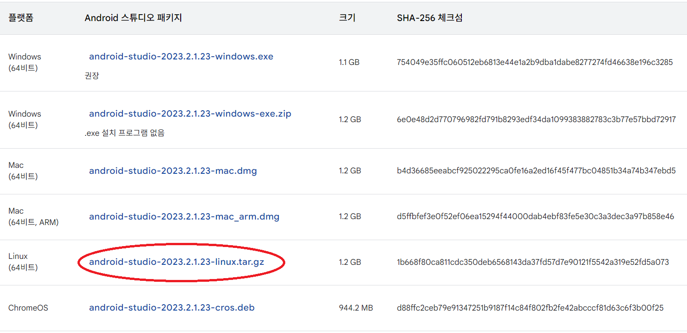
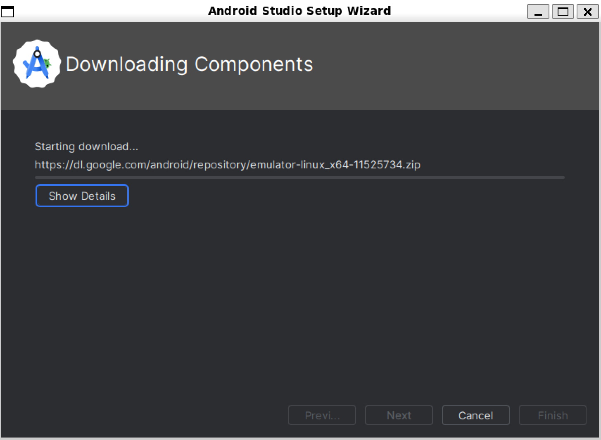

## 서론

필자는 Windows 컴퓨터를 사용하면서 개발 환경은 WSL2로 Ubuntu OS 위에서 동작하도록 구성해 놓은 상황이었는데 이번에 React Native를 사용하게 되면서 환경 구성했던 방법을 기록해보고자 한다.
Expo를 통해서 빠르게 개발 환경을 구성하는 방법도 있지만, 추후에 결국 eject해야 하는 일이 발생한다는 경험담이 있어서 React Native CLI로 시작해보기로 했다.

찾아보니 몇 가지 옵션이 있었다:

1. WSL2 위에서 React Native + Android Studio + JDK + 가상 ADB 를 모두 구동하기
2. Windows 위에서 React Native + Android Studio + JDK + 가상 ADB 를 모두 구동하기
3. WSL2 위에서 React Native를, Windows 위에서 Android Studio + JDK + 가상 ADB 를 구동하기
4. WSL2 위에서 React Native + Android Studio + JDK 를 구동하고, 실제 모바일 디바이스를 연결해서 구동하기

시도해보고 난 생각:

1. WSL2 위에서 가상 ADB를 돌리는 방식은 너무 느렸다. (가상환경 속의 가상환경..)
2. Windows 에서 모든 개발 환경을 세팅하자니, `zsh-autosuggestions` 같은 개발 편의성을 향상해주는 플러그인을 사용하지 못하는게 불편했다.
3. 시도해 보았으나 아직 방법을 찾지 못했다.
4. 시도한 방법중에 가장 괜찮았다. (가상 ADB를 구동하는 것보다 컴퓨터 자원을 덜 먹어서 좋았다.)

## React Native 준비하기

React Native 프로젝트를 구동하기 위해 필요한 내용은 [React Native 공식문서](https://reactnative.dev/docs/environment-setup#installing-dependencies)에서 살펴볼 수 있다.

### Node.js 설치

필자는 nvm을 통해 노드 버전 18을 설치해 둔 상태이다.

### JDK 설치

이 글을 포스팅 하는 시점을 기준으로 JDK 17 버전을 권장하고 있다.  
[How to Install Java 17 LTS on Ubuntu 20.04](https://www.rosehosting.com/blog/how-to-install-java-17-lts-on-ubuntu-20-04/)아티클을 참고하여 아래 커맨드로 JDK를 설치했다.

```sh
apt-get update
apt-get upgrade
apt install openjdk-17-jdk openjdk-17-jre
java -version # OpenJDK version "17.0.10" 과 같은 메시지가 출력된다면 설치가 완료된 것이다.
```

### Android Studio 설치

Linux 환경에 Android Studio를 설치하는 방법은 [Android Studio 설치 가이드](https://developer.android.com/studio/install#linux) 에서 살펴볼 수 있다.

#### 1. Android Studio 설치

[Android Studio 설치 페이지](https://developer.android.com/studio?hl=ko) 에서 Linux 전용 압축 파일을 다운로드 받는다.



#### 2. 압축 해제 및 설치


설치한 압축 파일을 `/usr/local` 디렉토리로 이동시키고, 압축을 풀어준다.  
만약 바로 옮겨지지 않는다면, 임시로 홈 디렉토리에 놓고 mv 커맨드로 압축 파일을 `/usr/local` 로 옮겨준다.

> (Windows 파일 탐색기로 수동으로 옮겼는데, 설치 자체를 리눅스에서 curl로 하는 방법도 있긴 할 것 같다.)

```sh
# 1. 압축 파일 이동
pwd # /home/aodem
sudo mv android-studio-2023.2.1.23-linux.tar.gz /usr/local/android-studio-2023.2.1.23-linux.tar.gz

# 2. 압축 해제
cd /usr/local/
sudo tar -zxvf android-studio-2023.2.1.23-linux.tar.gz

# 3. Android Studio 실행
cd /usr/local/android-studio/bin
sh studio.sh
```

이후 실행된 Android Studio를 통해 Android SDK 등 필요한 것들을 설치해준다.



#### 3. ANDROID_HOME 환경 변수 설정

bash 셸의 경우에는 `$HOME/.bashrc` 파일을 수정하면 된다고 하는데, 필자는 zsh를 사용중이므로 `~/.zshrc` 파일을 수정해준다.

```sh
sudo vi ~/.zshrc
```

```sh
# ~/.zshrc 파일에 아래 내용 추가
export ANDROID_HOME=$HOME/Android/Sdk
export PATH=$PATH:$ANDROID_HOME/emulator
export PATH=$PATH:$ANDROID_HOME/platform-tools
```

### Watchman 설치

Watchman은 facebook에서 개발한 도구로, 파일 변화를 감지하는 서비스라고 하는데 더 나은 성능과 호환성을 위해서 설치를 권장한다고 한다.  
[공식 문서](https://facebook.github.io/watchman/docs/install#linux)에 따르면 `brew` 를 통한 설치를 권장하는데, 만약 brew가 설치되어 있지 않다면 설치해준다.

#### 1. homebrew 설치

[Homebrew-on-Linux](https://docs.brew.sh/Homebrew-on-Linux) 문서를 따라서 설치해준다.

```sh
# 1. brew에서 필요한 패키지 설치
sudo apt-get install build-essential procps curl file git

# 2. brew 설치
/bin/bash -c "$(curl -fsSL https://raw.githubusercontent.com/Homebrew/install/HEAD/install.sh)"
test -d ~/.linuxbrew && eval "$(~/.linuxbrew/bin/brew shellenv)"
test -d /home/linuxbrew/.linuxbrew && eval "$(/home/linuxbrew/.linuxbrew/bin/brew shellenv)"
echo "eval \"\$($(brew --prefix)/bin/brew shellenv)\"" >> ~/.bashrc

# 3. brew가 설치 되었는지 확인
brew
```

#### 2. Watchman 설치

```sh
brew update
brew install watchman
```

## 모바일 디바이스 연결하기

개발 서버로 띄운 React Native 앱을 실제 모바일 디바이스에 실행하기 위해서는 추가 작업을 해줘야 한다.  
[React Native 공식 문서](https://reactnative.dev/docs/running-on-device#method-1-using-adb-reverse-recommended-2)에 따르면 크게 두 가지 방법으로, USB를 통한 연결을 하거나 Wi-Fi를 통한 연결을 하는 방법이 있다.

그런데 필자는 WSL2를 사용하고 있기 때문에 모바일 디바이스와 개발 서버를 바로 연결하는 것은 불가능하고, Windows 에서 추가적인 작업을 해줘야 한다.

```sh
모바일 디바이스 <-----> Windows <-----> WSL2
```

### 1. 모바일 디바이스에 개발자 모드 켜기

모바일 디바이스에서 개발자 모드를 켜고, USB 디버깅 모드를 ON 해준다.  
그런 다음 USB로 물리적인 연결을 해준다.

### 2. USB 디바이스 연결

[WSL 공식 문서](https://learn.microsoft.com/ko-kr/windows/wsl/connect-usb)에서 USB 디바이스 연결에 대한 내용을 확인할 수 있다.  
만약 usbipd를 설치하지 않았다면, [여기](https://github.com/dorssel/usbipd-win/releases)에서 먼저 설치해준다.

#### USB busid 확인

Windows PowerShell을 관리자 권한으로 실행한 뒤, 아래 명령어를 입력한다.

```sh
# Windows PowerShell
usbipd list
```


#### USB 디바이스 등록

확인한 busid를 통해 USB 디바이스를 등록해준다.  
(이 작업은 딱 한 번만 설정해두면 된다.)

```sh
# Windows PowerShell
usbipd bind --busid 2-1
```

#### USB 디바이스 연결

USB 디바이스를 WSL2에서 접근할 수 있도록 연결해준다.  
(이 작업은 USB 연결을 뺐다 꽃을 때마다 다시 해줘야 한다.)

```sh
# Windows PowerShell
usbipd attach --wsl --busid 2-1
```

#### ADB 확인

이제 WSL2에서 USB 디바이스가 잘 연결이 되었는지 확인한다.  
만약 연결이 되지 않았다면, Android Studio를 실행하고 시도해본다.

```sh
# Ubuntu
adb devices
adb -s <device name> reverse tcp:8081 tcp:8081
```


#### Permission Denied로 연결이 실패한다면?

[[Ubuntu] 권한 문제로 Android 기기가 연결이 안될 때](https://tech.ezphp.net/2) 글을 참고해서 해결했다.  
udev 파일을 생성해서 관련 규칙을 등록해줘야 한다는 것 같은데, 필자는 삼성의 휴대폰을 사용중이니 ATTR{idVendor} 값으로 `04e8` 를 적어줬다.

```sh
sudo vi /etc/udev/rules.d/51-android.rules
```

```sh
# /etc/udev/rules.d/51-android.rules
SUBSYSTEM=="usb", ATTR{idVendor}=="04e8", MODE="0666", GROUP="plugdev"
```

## React Native CLI로 프로젝트 초기화

```sh
npm uninstall -g react-native-cli @react-native-community/cli # 기존에 글로벌로 설치되어 있었다면, 예상치 못한 이슈 방지를 위해 제거한다.
npx react-native@latest init AwesomeProject # 패키지를 생성한다.
code AwesomeProject
npm start
a # 안드로이드 실행
```

> 🚨 빌드에 실패한다면?  
> `npx react-native doctor` 로 원인을 체크할 수 있다.

## 실행 결과


## 고민 거리

USB로 물리적인 연결까진 성공했는데, 편의상 Wi-Fi로 연결하는 방법도 추가적으로 알아보면 좋을 것 같다.  
이 부분도 WSL2 가상 환경을 사용하고 있어서 Windows 가 중간에서 프록시를 제대로 해줄 수 있도록 설정이 필요할 것으로 예상한다.
