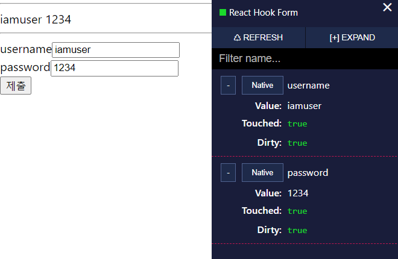

`react-hook-form` 은 폼 데이터를 한 눈에 조회하고 변화하는 과정을 쉽게 추적할 수 있도록 개발 도구를 지원한다. 이를 사용하기 위한 과정은 다음과 같다:

### 1. 설치
```sh
npm install -D @hookform/devtools
```

### 2. DevTool 가져오기
```ts
import { DevTool } from '@hookform/devtools';
```

### 3. 추적하려는 form 객체의 control 전달
```tsx
<DevTool control={control} />
```

### 예시 코드
```tsx
import { useForm, SubmitHandler } from 'react-hook-form';
import { DevTool } from '@hookform/devtools';

interface IForm {
  username: string;
  password: string;
}

function Example() {
  const {
    register,
    handleSubmit,
    control,
    formState: { errors },
  } = useForm<IForm>();

  const onSubmit: SubmitHandler<IForm> = data => console.log(data);

  return (
    <div>
      <form onSubmit={handleSubmit(onSubmit, onError)}>
        // ... input 요소 생략
      </form>

      <DevTool control={control} />
    </div>
  );
}

export default Example;
```