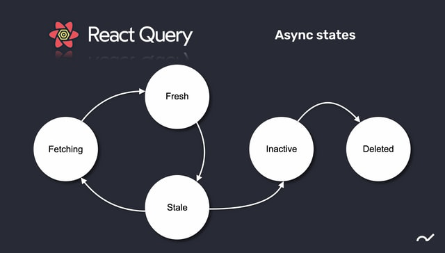

## 작성 계기
리액트로 개발을 하다보면 외부의 데이터를 가지고 있는 서버에게 비동기적으로 데이터를 요청하고, 그 데이터를 상태에 저장하는 일이 많이 생긴다.  
보통 이런 데이터는 `loading`, `error` 등 여러 플래그 변수도 같이 갖고 있어서 데이터를 요청하기 위해 작성해야 하는 공통적인 코드가 많아지는데,
이런 관리를 좀 편하게 해줄 방법은 없을지 알아보다가 Data Fetching에 관한 라이브러리로 `swr`, `react-query`, `RTK-query` 등이 있다는 걸 알게 되었다.  
처음 봤을 때 이 중에서 `react-query` 가 괜찮아보여서 한번 학습해 봤고 공부한 내용을 나중에 찾아볼 수 있게 기록하고자 글을 작성했다.

## react-query란?
[공식 페이지](https://tanstack.com/query/v4/?from=reactQueryV3&original=https://react-query-v3.tanstack.com/)에 따르면
<span style="color:red">**TS/JS를 위한 강력한 비동기 상태 관리 도구**</span>라고 한다.  
외부 서버로부터 가져오는 데이터는 클라이언트가 제어할 수 없기 때문에 특정 시점에 서버로부터 비동기적으로 가져오게 된다.
그렇기 때문에 시간이 지났을 때 실제로 서버가 가지고 있는 정보와 다를 가능성이 있어서 주기적으로 업데이트 해줘야 하고,
가져오는데 시간이 걸리거나 실패하는 등 조건에 따른 처리도 해줘야 하는데 이런 번거로운 작업을 손쉽게 하도록 해주는 라이브러리이다.

## 데이터 상태


### fresh
- 데이터를 최신의 것으로 간주하는 상태이다.
- 같은 쿼리 키의 데이터가 마운트되어도 서버에 데이터 fetching 요청을 하지 않는다.

### fetching
- 서버로부터 데이터를 가져오고 있는 상태이다.

### stale
- 데이터가 fresh 상태에서 staleTime 만큼의 시간이 지난 상황이다.
- 낡은 데이터일 가능성이 높은 데이터이다.

### inactive
- 데이터가 현재 보이는 화면에 사용되지 않고 있는 상태이다.
- 이 상태에 cacheTime 만큼의 시간이 지난다면 캐싱된 해당 데이터는 소멸하게 된다.  <br/><br/>


> `cacheTime`  
데이터가 inactive 상태일 때 얼마나 오랫동안 캐싱 데이터로 보관하고 있을지를 의미한다.  
inactive 상태로 일정시간 지난다면 더 이상 사용하지 않는 데이터로 간주하고 가비지 컬렉터로 버려지는 것이다.  
기본값은 5분이다.  

> `staleTime`  
데이터를 fresh 상태에서 얼만큼의 시간이 지나야 stale 상태로 변화시킬지를 의미한다.  
기본값은 0ms이다.

## useQuery
데이터를 조회하는 기능은 `useQuery` 를 사용한다.  
`useQuery(queryKey, queryFn, options)`  

<!-- `queryKey`: 내부적으로 데이터를 캐시할 때 사용된다. 쿼리키가 같으면 같은 종류의 데이터로 인식한다.
`queryFn`: 서버에 데이터를 요청하는 Promise이다.  
`options`: hook을 사용하는 데 있어서 설정할 수 있는 옵션을 객체 형태로 부여한다. -->

### queryKey
- 내부적으로 데이터를 캐시할 때 사용된다. 쿼리키가 같으면 같은 종류의 데이터로 인식한다.  
- 문자열 혹은 배열 형태로 값을 줄 수 있는데 배열 형태인 경우 안에 들어있는 값이 같아도 순서가 다르면 서로 다른 쿼리키로 인식한다.  

```ts
useQuery(['todos', status, page], ...)
useQuery(['todos', page, status], ...)
useQuery(['todos', undefined, page, status], ...)
```
> 예를 들어 위 키는 모두 다른 키이다.
```ts
useQuery(['todos', { status, page }], ...)
useQuery(['todos', { page, status }], ...)
useQuery(['todos', { page, status, other: undefined }], ...)
```
> 반면에 위처럼 배열에 객체 형태로 값이 들어있고, 그 객체가 단순히 내부 요소 순서만 다른 상황이라면 모두 같은 쿼리키로 인식한다.

### queryFn
- 서버에 데이터를 요청하는 Promise이다.

### options
- hook을 사용하는 데 있어서 설정할 수 있는 옵션을 객체 형태로 부여한다.  
- [공식 문서](https://tanstack.com/query/v4/docs/reference/useQuery?from=reactQueryV3&original=https://react-query-v3.tanstack.com/reference/useQuery) 에서 어떤 옵션이 있는지 확인할 수 있으며 몇가지 정리해보면 다음과 같다.  

> `staleTime: number`  
데이터를 fresh 상태에서 얼만큼의 시간이 지나야 stale 상태로 변화시킬지 ms 단위로 지정한다.  
기본값 0  

> `cacheTime: number`  
데이터가 inactive 상태일 때 얼마나 오랫동안 캐싱 데이터로 보관하고 있을지 ms 단위로 지정한다.  
기본값 300000  

> `refetchOnMount: boolean | 'always'`  
true: 데이터가 마운트 될 때 데이터가 stale 상태인 경우에만 새로 패칭함.  
always: 데이터가 마운트 될 때 항상 새로 패칭함.  
기본값 true  

> `refetchOnWindowFocus: boolean | 'always'`  
true: 브라우저 창이 포커싱 될 때 데이터가 stale 상태인 경우에만 새로 패칭함.  
always: 브라우저 창이 포커싱 될 때 항상 새로 패칭함.  
기본값 true  

> `refetchInterval: number`  
특정 시간마다 데이터를 새로 패칭함.  

> `refetchIntervalInBackground: boolean`  
화면을 보고있지 않은 백그라운드 상황에서도 refetchInterval 기능을 사용함.  

> `enabled: boolean`  
true: 데이터가 마운트되면 데이터를 패칭함.  
false: 데이터가 마운트되어도 데이터를 패칭하지 않게 설정함.  
기본값 true

> `onSuccess: (data) => {}`  
데이터 패칭에 성공했을 때 실행할 콜백 함수  

> `onError: (error) => {}`  
데이터 패칭에 실패했을 때 실행할 콜백 함수  

> `select: (data) => {}`  
패칭한 데이터를 useQuery hook의 data 객체에 넣기 전에 먼저 데이터를 가공할 수 있는 함수

## useMutation  
데이터 생성, 수정, 삭제 등 변화를 주는 기능은 `useMutation` 을 사용한다.  
`useMutation(queryFn, option)`

### queryFn
- 서버에 데이터의 변화를 요청하는 Promise이다.  

### option
- hook을 사용하는 데 있어서 설정할 수 있는 옵션을 객체 형태로 부여한다.  

### 예제  
> ↓ TestForm.tsx 
```ts
import React, { useState, useMemo, useCallback } from 'react';
import { useQueryClient, useMutation } from 'react-query';
import * as testApi from '@api/testApi';
import * as queryKey from '@util/queryKey';

function TestForm({}) {
  const initialForm = useMemo(() => ({
    author: '',
    content: ''
  }), []);
  const [form, setForm] = useState(initialForm);
  const queryClient = useQueryClient();

  // 데이터 추가 요청
  const postData = useMutation(testApi.postTestData, {
    onSuccess: (result) => {
      setForm(initialForm);
      queryClient.invalidateQueries(queryKey.testListKeys.all);
    },
    onError: (err: Error) => {
      console.error(err);
    }
  });

  // input 상태 값 변경
  const changeInput = useCallback((e: React.ChangeEvent<HTMLInputElement>) => {
    setForm({
      ...form,
      [e.target.name]: e.target.value
    });
  }, [form]);

  // 폼 전송 이벤트
  const onSubmit = useCallback((e: React.FormEvent) => {
    e.preventDefault();
    postData.mutate(form);
  }, [form, postData]);

  return (
    <form onSubmit={onSubmit}>
      <h1>작성 폼</h1>
      <span>작성자 </span>
      <input type="text" name="author" value={form.author} onChange={changeInput} />
      <br/>
      <span>내용 </span>
      <input type="text" name="content" value={form.content} onChange={changeInput} />
      <br/>
      <button type="submit">전송</button>
      {postData.isError && <div>{postData.error.message}</div>}
    </form>
  );
}
``` 

> ↓ @api/testApi.tsx 
```ts
import axios from "axios";
export const postTestData = (data: object) => axios({
  method: 'post',
  url: `http://localhost:5000/api/test/data`,
  data
});
```

> ↓ @util/queryKey.tsx
```ts
export const testListKeys = {
  all: ['todos'] as const,
  detail: (id: number) => [...testListKeys.all, id]
}
```