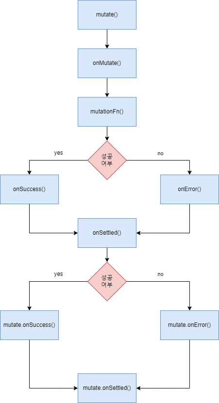

## useMutation
```ts
export function useMutation<
  TData = unknown,
  TError = unknown,
  TVariables = void,
  TContext = unknown,
>(
  options: UseMutationOptions<TData, TError, TVariables, TContext>,
): UseMutationResult<TData, TError, TVariables, TContext>
```

서버에 새로운 데이터를 **추가**하거나 기존의 데이터를 **수정**하거나 **삭제**하는 등의 조작을 하기 위해서는 `useMutation` 을 사용한다.

### 파라미터
#### mutationFn
```ts
mutationFn: (variables: TVariables) => Promise<TData>
```
`mutate` 가 동작하면 작동하는 함수이다. 보통은 서버에 비동기 API 요청을 하는 코드를 작성한다.
- `variables`: `mutate` 함수의 인자로 전달한 값

#### onMutate
```ts
onMutate: (variables: TVariables) => Promise<TContext | void> | TContext | void
```
`mutate` 가 동작할 때 작동하는 함수로, `mutationFn` 보다 빨리 실행된다. 

보통 **낙관적 업데이트**와 같이 서버에 보낸 요청의 결과를 미리 클라이언트의 데이터에 반영하는 경우에 사용되며, `onMutate` 가 반환한 값은 `onSettled` 와 `onError` 함수에 모두 전달된다. 따라서 `onMutate` 함수에서 데이터를 미리 반영해 놓고, 결과의 성공 여부에 따라서 `onSettled` 나 `onError` 함수에서 데이터를 그대로 유지하거나 아니면 롤백하는 로직을 작성할 수 있다.
- `variables`: `mutate` 함수의 인자로 전달한 값

#### onSuccess
```ts
onSuccess: (data: TData, variables: TVariables, context?: TContext) => Promise<unknown> | unknown
```
`mutationFn` 이 성공하면 작동하는 함수이다.
- `data`: `mutationFn` 함수가 반환한 값
- `variables`: `mutate` 함수의 인자로 전달한 값
- `context`: `onMutate` 함수가 반환한 값

#### onError
```ts
onError: (err: TError, variables: TVariables, context?: TContext) => Promise<unknown> | unknown
```
`mutationFn` 에서 오류가 발생하면 작동하는 함수이다.
- `err`: `mutationFn` 함수가 반환한 오류
- `variables`: `mutate` 함수의 인자로 전달한 값
- `context`: `onMutate` 함수가 반환한 값

#### onSettled
```ts
onSettled: (data: TData, error: TError, variables: TVariables, context?: TContext) => Promise<unknown> | unknown
```
`mutationFn` 이 성공하든 오류가 발생하든 상관없이 요청이 완료되면 작동하는 함수이다.
- `data`: `mutationFn` 함수가 반환한 값
- `error`: `mutationFn` 함수가 반환한 오류
- `variables`: `mutate` 함수의 인자로 전달한 값
- `context`: `onMutate` 함수가 반환한 값

### 반환 값
#### mutate
```ts
mutate: (variables: TVariables, { onSuccess, onSettled, onError }) => void
```
첫 번째 인자인 `variables` 를 파라미터로 해서 `Mutation` 을 작동시킨다. 여기서 입력한 `variables` 는 `onMutate`, `onSuccess`, `onError`, `onSettled` 의 콜백 함수에 그대로 전달된다.

#### data
`Mutation` 이 마지막으로 성공했을 때의 결과 데이터 값이다.

#### error
`Mutation` 에 오류가 발생했을 때의 오류 데이터 값이다.

### 콜백 함수 실행 순서


`useMutation()` 과 `mutate()` 에 모두 콜백 함수가 등록되어 있는 경우에는 위와 같이 `useMutation` 에 등록된 콜백 먼저 실행된다

### 업데이트 반영
`useMutation` 으로 서버의 데이터를 변형한 뒤에는 기존에 가지고 있던 데이터를 새로운 데이터로 업데이트 하는 과정이 필요하다. 이는 크게 두 가지 방법이 있다.

#### 쿼리 무효화
`queryClient.invalidateQueries()` 를 이용해서 쿼리를 무효화하는 방법이다. 특정 쿼리 키의 데이터를 무효화하면 그 데이터를 구독하는 옵저버는 새로운 최신의 데이터를 패칭하게 된다.
```ts
function Post() {
  const postMutation = useMutation<AxiosResponse<IPost>, AxiosError, IPost>({
    mutationFn: postPost,
    onSuccess: res => queryClient.invalidateQueries(['post']),
  });
}
```

#### 쿼리 데이터 직접 저장
`queryClient.setQueryData(queryKey, updater)` 를 이용해서 특정 쿼리 키의 데이터를 새로운 데이터로 바꿔주는 방법이다.
```ts
function Post() {
  const postMutation = useMutation<AxiosResponse<IPost>, AxiosError, IPost>({
    mutationFn: postPost,
    onSuccess: res => queryClient.setQueryData<IPost>(['post', res.data.id], res.data),
  });
}
```

### 예제 코드
```tsx
function Post() {
  const postMutation = useMutation<AxiosResponse<IPost>, AxiosError, IPost>({
    mutationFn: postPost,
    onSuccess: res => queryClient.setQueryData<IPost>(['post', res.data.id], res.data),
  });

  return (
    <div>
      <button onClick={() => handleMutate({ userId: 100, id: 101, title: '타이틀입니다', body: '하하호호' })}>
        mutate
      </button>
    </div>
  );
}
```

## 참고 자료
[Mutations](https://tanstack.com/query/latest/docs/react/guides/mutations)  
[useMutation](https://tanstack.com/query/v4/docs/react/reference/useMutation)  
