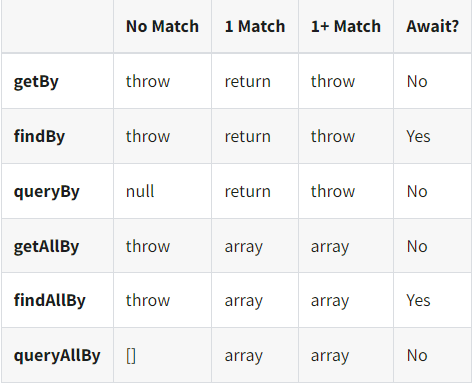

`DOM Testing Library` 가 가상 DOM에 그린 요소를 가져오기 위해서는 `screen` 전역 객체에 포함된 쿼리 메소드를 활용한다.

## 쿼리 메소드의 형태

쿼리 메소드의 형태는 `<Command>[All]By<Type>` 형태로 존재한다.  

예를 들어서 특정 텍스트 내용을 가진 단일 요소를 조회하려고 할 때는 `getByText` 메소드를 사용하고, 특정 역할을 가진 모든 요소를 조회하려고 할 때는 `getAllByRole` 메소드를 사용하는 형태이다.  

### 단일과 All  
- **단일**: 단일 요소를 조회한다. 하나 이상의 요소를 찾으면 예외를 발생한다.  
- **All**: 여러 요소를 조회한다. 배열 형태의 값을 반환한다.

### get, find, query
- **get**: DOM에 이미 존재하는 요소를 조회할 때 주로 사용하며, 요소를 찾지 못한경우 예외를 발생한다.  
- **query**: DOM에 없을 수도 있는 요소를 조회할 때 주로 사용하며, 요소를 찾지 못한 경우 null을 반환한다.  
- **find**: 요소가 비동기적인 작업 이후에 나타날 수 있는 경우에 주로 사용하며, `await` 키워드로 해당 요소가 정상적으로 반환될 때까지 기다리는 동작이 가능하다.

### Type
- **Role**: 요소의 역할을 가지고 조회한다.  
- **Text**: 요소에 들어간 내용을 가지고 조회한다.  
- **AltText**: 요소의 `alt` 속성의 내용을 가지고 조회한다.  

그 외에 추가적인 부분은 [공식 API 문서](https://testing-library.com/docs/react-testing-library/cheatsheet) 에서 참고할 수 있다.

## 참고 자료
[Jest 및 테스팅 라이브러리로 React 테스트하기](https://www.udemy.com/course/jest-testing-library)  
[Cheatsheet (Testing Library)](https://testing-library.com/docs/react-testing-library/cheatsheet)  