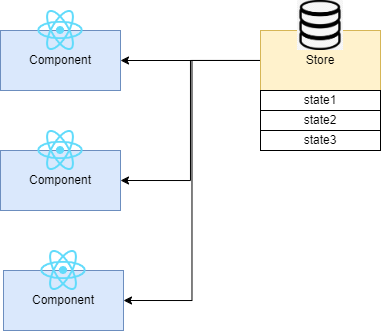
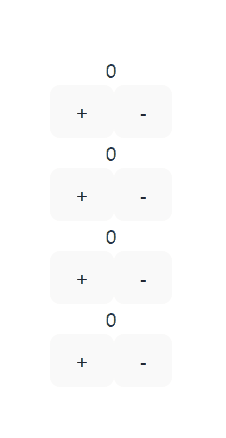
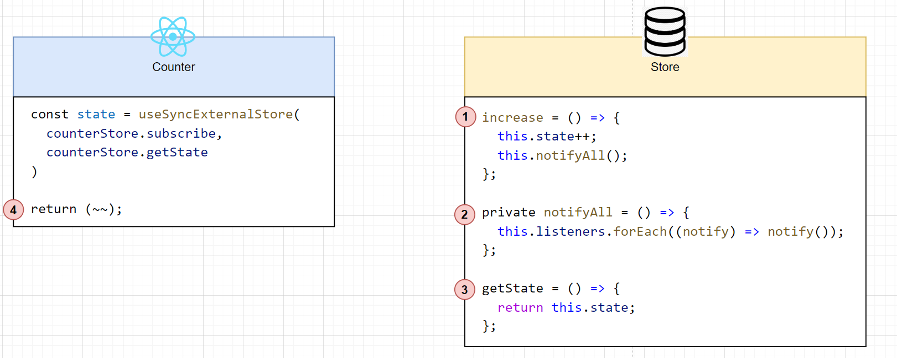
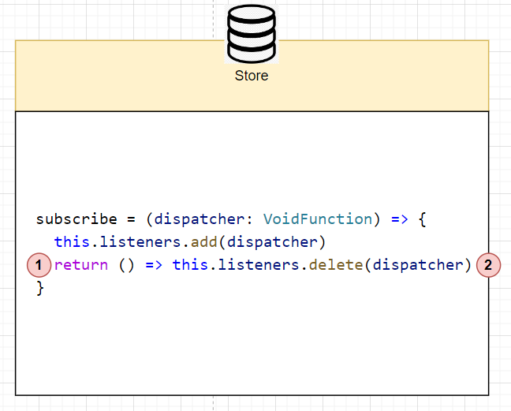
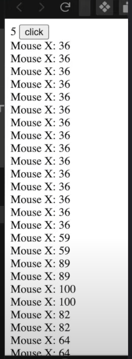

지금까지 개발해오면서 브라우저에서 전역적으로 관리해야 할 데이터는 외부 서버에 있는 데이터를 비동기적으로 가져와야 하는 경우가 대부분이라고 느꼈었다. 그래서 `TanStack Query` 를 사용하게 된 이후부터는 클라이언트에서 자체적으로 상태를 관리하는 일이 많이 줄었다고 생각해서 추가적인 상태 관리 라이브러리를 사용할 필요성을 느끼지 못하고 있었는데..

이번에 문득 `TanStack Query` 가 관리하는 상태의 변화를 어떻게 컴포넌트가 감지하고 화면을 다시 그릴 수 있는 것인지 궁금해서 탐구하는 과정에 상태 관리 라이브러리들이 어떻게 구현되었는지 학습해보게 되었다.

## 상태

상태(State)를 정의하는 데 있어서는 다양한 표현이 있겠지만 필자는 **실제 데이터의 변화에 맞춰 화면에 동기화되어 반영될 수 있도록 누군가(예를 들어 React)가 감지하는 값**이라고 생각한다.

클래스 컴포넌트에서는 인스턴스가 직접 갖고 있는 `state` 프로퍼티가 될 수도 있고, 함수 컴포넌트에서는 `useState` 나 `useReducer` 와 같은 훅의 사용으로 생성된 클로저의 변수가 될 수도 있다. 기본적으로 컴포넌트끼리 데이터를 공유하기 위해서는 부모 컴포넌트가 자식 컴포넌트에게 `props` 인자를 전달하는 방법도 있지만, 컴포넌트 트리의 깊이가 깊어질수록 상위 컴포넌트가 갖는 상태를 하위 컴포넌트로 전달하는 방법을 고민하게 된다.

리액트에서는 보통 `Context API` 혹은 서드파티 상태 관리 라이브러리를 이용할 수도 있는데 각 라이브러리들이 어떤 방식으로 구현되어 있는지 간단하게 살펴보고자 한다. 먼저 상태를 크게 두 가지로 분류해보자면 리액트가 기본적으로 제공하면서 상태의 변화를 직접 감지하는지 아닌지에 따라서 내부 상태와 외부 상태로 나눌 수 있다. [(React 18 for External Store Libraries)](https://youtu.be/oPfSC5bQPR8?si=XEPC5SkWkNuhg4Bs&t=231)

- **내부 상태**  
  리액트가 자체적으로 변화를 감지하는 값으로, `useState` 나 `useReducer` 로 만들어진 것을 의미한다.
- **외부 상태**  
  일반 자바스크립트 변수 등 리액트가 감지하지 못하는 값으로 만들어진 것으로, 컴포넌트가 변화를 감지할 수 있도록 `useEffect` 나 `useSyncExternalStore` 로 변화를 구독하는 과정이 필요하다.

## useSyncExternalStore

TanStack Query 의 `useBaseQuery` 부분을 살펴보다가 `useSyncExternalStore` 이라는 훅을 발견하게 되었다. [(GitHub)](https://github.com/TanStack/query/blob/main/packages/react-query/src/useBaseQuery.ts#L67)

```ts
React.useSyncExternalStore(
  React.useCallback(
    onStoreChange => {
      const unsubscribe = isRestoring
        ? () => undefined
        : observer.subscribe(notifyManager.batchCalls(onStoreChange))

      // Update result to make sure we did not miss any query updates
      // between creating the observer and subscribing to it.
      observer.updateResult()

      return unsubscribe
    },
    [observer, isRestoring]
  ),
  () => observer.getCurrentResult(),
  () => observer.getCurrentResult()
)
```

[React 공식 문서](https://ko.react.dev/reference/react/useSyncExternalStore)를 살펴보니 리액트의 **외부에 존재하는 store를 구독**하도록 만들어주는 훅이라고 하는데 React 18 버전부터 사용 가능하다고 한다.

이 훅은 세 가지의 인자를 받는 인터페이스로 되어있었다.

```tsx
export function useSyncExternalStore<Snapshot>(
  subscribe: (onStoreChange: () => void) => () => void,
  getSnapshot: () => Snapshot,
  getServerSnapshot?: () => Snapshot
): Snapshot
```

- **subscribe**: 컴포넌트를 스토어에 구독하는 함수. 반드시 구독 해제하는 함수를 반환해야 한다.
- **getSnapshot**: 스토어에 존재하는 데이터의 스냅샷을 반환하는 함수 (getState의 역할을 한다.)
- **getServerSnapshot?**: 서버 렌더링시 사용되는 인자로, 스토어에 존재하는 데이터의 스냅샷을 반환하는 함수

이 훅의 명세를 보면서 옵저버 패턴같다는 느낌이 들었는데, 마침 옵저버 패턴을 실제로 구현하는 방법에 대해 궁금했었기에 만들면서 학습해보자는 생각을 했다.

## 외부 스토어 실습해보기



리액트 컴포넌트가 외부 스토어를 구독하기 위한 과정에는 옵저버 패턴이 필요하다. 컴포넌트는 스토어를 구독하는 `subscriber` 가 되고, 스토어는 자신의 값에 변화가 생기면 모든 구독자에게 `notify` 하는 역할을 해야 한다.

이런 아이디어는 React 18 버전에서 도입된 `useSyncExternalStore` 훅을 이용하면 손쉽게 구현할 수 있다. 훅을 사용하기 전에 먼저 필요한 외부 스토어를 만들어보자.

### 스토어 만들기

```ts
class CounterStore {
  private state: number = 0
  private listeners = new Set<VoidFunction>()

  private notifyAll = () => this.listeners.forEach(notify => notify())

  subscribe = (dispatcher: VoidFunction) => {
    this.listeners.add(dispatcher)
    return () => this.listeners.delete(dispatcher)
  }

  getState = () => {
    return this.state
  }

  increase = () => {
    this.state++
    this.notifyAll()
  }

  decrease = () => {
    this.state--
    this.notifyAll()
  }
}

const counterStore = new CounterStore()
```

- **state**: 상태 변수
- **listeners**: 스토어를 구독하고 있는 함수들
- **notifyAll**: 이 스토어를 구독하는 모든 함수를 실행
- **subscribe**: 인자로 전달받은 함수를 `listeners` 에 추가
- **getState**: 스토어의 현재 상태의 값을 반환
- **increase**: 상태의 값을 증가하고 이 스토어를 구독하는 모든 함수를 실행
- **decrease**: 상태의 값을 감소하고 이 스토어를 구독하는 모든 함수를 실행

이제 이렇게 만든 스토어는 리액트 컴포넌트에서 `useSyncExternalStore` 를 통해 구독하고, 변경된 상태 값을 받아올 수 있다.

### 스토어 사용하기

```tsx
const Counter = () => {
  const state = useSyncExternalStore(
    counterStore.subscribe,
    counterStore.getState
  )

  return (
    <div>
      <div>{state}</div>
      <button onClick={counterStore.increase}>+</button>
      <button onClick={counterStore.decrease}>-</button>
    </div>
  )
}

function App() {
  return (
    <>
      <Counter />
      <Counter />
      <Counter />
      <Counter />
    </>
  )
}
```



인스턴스 내의 일반 자바스크립트 변수인 `state` 의 값의 변화에 따라서 `Counter` 컴포넌트가 새로운 값으로 리렌더링 되고 있으며 여러 컴포넌트끼리 공유하고 있다는 사실을 알 수 있다.

이 훅이 들어간 컴포넌트의 실행 흐름을 그려보자면 다음과 같다.

#### 컴포넌트가 마운트 되면


1. useSyncExternalStore 의 인자로 전달된 `counterStore.subscribe` 함수 실행.
   - 상태 업데이터 함수인 `dispatcher` 가 스토어의 `subscribe` 로 전달된다!
2. 스토어의 `this.listeners.add(dispatcher)` 실행. (구독 목록에 추가)

#### 상태가 변화하면



1. 버튼 클릭시 이벤트 핸들러로 인해 `increase` 함수 실행.
2. 스토어의 `notifyAll` 실행. (모든 구독자의 `dispatcher` 함수 실행.)
3. 스토어의 `getState` 실행.
4. 컴포넌트가 갖고 있는 `dispatcher` 함수를 실행한다는 것은 해당 컴포넌트를 리렌더링 한다는 것.

#### 컴포넌트가 언마운트 되면



1. `counterStore.subscribe` 의 반환 함수 실행.
2. `this.listeners.delete(dispatcher)` 실행. (구독 취소)

### 스토어 추상화하기

그런데 지금 만들었던 스토어는 `Counter` 라는 도메인을 포함하고 있기 때문에 상태 관리에 대한 부분만 뽑아서 추상화하는 것이 좋아보인다.  
스토어의 특징을 몇 가지 뽑아보자면..

> 1. 구독하는 기능이 있어야 한다.
> 2. 구독자들에게 변화를 알리는 기능이 있어야 한다.
> 3. 스토어 상태를 반환하는 기능이 있어야 한다.

```ts
class Observable<TState> {
  private listeners = new Set<VoidFunction>()

  constructor(protected state: TState) {
    this.state = state
  }

  protected notifyAll = () => this.listeners.forEach(notify => notify())

  subscribe = (listener: VoidFunction) => {
    this.listeners.add(listener)
    return () => this.listeners.delete(listener)
  }

  getState = () => this.state
}
```

세 가지 특징을 뽑아서 구독 가능함을 나타내는 `Observable` 추상 클래스를 만들었다.  
그럼 이제 이 클래스를 상속해서 원하는 스토어를 만들면 된다.

```ts
class CounterStore extends Observable<number> {
  constructor(initialState = 0) {
    super(initialState)
  }

  increase = () => {
    this.state++
    this.notifyAll()
  }

  decrease = () => {
    this.state--
    this.notifyAll()
  }
}
```

공통된 부분과 구체적인 부분의 분리가 잘 이뤄져서

## React 18 미만에서는?

그런데 React 18 미만 버전에서도 상태 관리 라이브러리들은 존재해왔는데, 외부 store를 구독하는 훅이 없던 상황에서 그 라이브러리들은 어떻게 구현되어 왔던걸까? 이런 고민을 하던 와중에 [React Conf 2021](https://youtu.be/oPfSC5bQPR8?si=-OavQE1rZ1lv_p25) 내용을 살펴보면 좋겠다는 조언을 받아 학습해보았다.

> 참고로 위 영상은 Jotai, Zustand 라이브러리를 만든 사람이 React 18 버전에 들어온 Concurrent Rendering으로 인해서 상태 관리 라이브러리에 사이드 이펙트가 발생한 것을 수정했다는 내용을 담고 있다.

```ts
const useStore = (store, selector) => {
  const [state, setState] = useState(() => selector(store.getState()))

  useEffect(() => {
    const callback = () => setState(selector(store.getState()))
    const unsubscribe = store.subscribe(callback)
    callback()
    return unsubscribe
  }, [store, selector])

  return state
}
```

위 코드는 영상의 [12:40](https://youtu.be/oPfSC5bQPR8?si=uXCakl55gJdUsvfy&t=760)에서 확인할 수 있는 코드인데, 이처럼 `useEffect` 를 통해서 외부 상태를 구독하고 있는 것을 알 수 있었다.

다만, 이런 방식은 React 18 버전에 들어서면서 등장한 `Concurrent Rendering` 를 활용하면 문제가 될 수 있다. 같은 스토어를 바라보고 있는 구독자일지라도 상황에 따라서 다른 값이 렌더링 될 가능성이 발생하는데 이런 현상을 **Tearing**이라고 한다.



그래서 현재 라이브러리에는 `useSyncExternalStore` 를 도입했다는 내용을 담고 있다. 다만, React 18 버전에서부터 사용 가능한 훅이기 때문에 이전 버전에서의 호환성 문제는 괜찮을지 의문이었는데 리액트 패키지로부터 훅을 직접 가져와서 사용하는 게 아니라, 일부 훅만 따로 가져와서 사용하는 `shim` 을 사용한다고 한다.

> 예를 들어, zustand에서는 `use-sync-external-store/shim/with-selector` 패키지를 사용한다.

## 상태관리 라이브러리 비교

그렇다면 현재 상태관리 라이브러리들은 어떤 방식으로 구현되어 있을까? 궁금해서 간단하게 살펴보았다.

### zustand

zustand는 `useSyncExternalStore` 의 `shim` 을 사용하고 있었고, 직접 구현해봤던 스토어와 유사한 느낌의 옵저버 패턴으로 구현되어 있다는 사실을 알 수 있었다.

> [react.ts](https://github.com/pmndrs/zustand/blob/main/src/react.ts#L65C28-L65C28)

```ts
import useSyncExternalStoreExports from "use-sync-external-store/shim/with-selector"

const { useSyncExternalStoreWithSelector } = useSyncExternalStoreExports

export function useStore<TState, StateSlice>(
  api: WithReact<StoreApi<TState>>,
  selector: (state: TState) => StateSlice = api.getState as any,
  equalityFn?: (a: StateSlice, b: StateSlice) => boolean
) {
  // ↑ 생략
  const slice = useSyncExternalStoreWithSelector(
    api.subscribe,
    api.getState,
    api.getServerState || api.getState,
    selector,
    equalityFn
  )
  useDebugValue(slice)
  return slice
}
```

> [vanilla.ts](https://github.com/pmndrs/zustand/blob/main/src/vanilla.ts#L60)

```ts
const createStoreImpl: CreateStoreImpl = createState => {
  type TState = ReturnType<typeof createState>
  type Listener = (state: TState, prevState: TState) => void
  let state: TState
  const listeners: Set<Listener> = new Set()

  const setState: StoreApi<TState>["setState"] = (partial, replace) => {
      // ↑ 생략
      listeners.forEach(listener => listener(state, previousState))
    }
  }

  const getState: StoreApi<TState>["getState"] = () => state

  const subscribe: StoreApi<TState>["subscribe"] = listener => {
    listeners.add(listener)
    return () => listeners.delete(listener)
  }

  const destroy: StoreApi<TState>["destroy"] = () => {
    listeners.clear()
  }

  const api = { setState, getState, subscribe, destroy }
  state = createState(setState, getState, api)
  return api as any
}
```

### Jotai

Jotai는 Context API 기반으로 작성되어 있다는 점을 알 수 있었다. 단, `Provider` 를 개발자가 직접 주입할 필요가 없는게 라이브러리 차원에서 컴포넌트를 알아서 감싸주기 때문이었다.

> [Provider.ts](https://github.com/pmndrs/jotai/blob/main/src/react/Provider.ts#L14)

```tsx
export const useStore = (options?: Options): Store => {
  const store = useContext(StoreContext)
  return options?.store || store || getDefaultStore()
}

export const Provider = ({
  children,
  store,
}: {
  children?: ReactNode
  store?: Store
}): FunctionComponentElement<{ value: Store | undefined }> => {
  const storeRef = useRef<Store>()
  if (!store && !storeRef.current) {
    storeRef.current = createStore()
  }
  return createElement(
    StoreContext.Provider,
    {
      value: store || storeRef.current,
    },
    children
  )
}
```

### TanStack Query

TanStack Query는 리액트 라이브러리에 존재하는 `useSyncExternalStore` 를 사용하고 있었다. 또한 마찬가지로 옵저버 패턴으로 구현되었다.

> [useBaseQuery.ts](https://github.com/TanStack/query/blob/main/packages/react-query/src/useBaseQuery.ts#L67)

```ts
React.useSyncExternalStore(
  React.useCallback(
    onStoreChange => {
      const unsubscribe = isRestoring
        ? () => undefined
        : observer.subscribe(notifyManager.batchCalls(onStoreChange))

      // Update result to make sure we did not miss any query updates
      // between creating the observer and subscribing to it.
      observer.updateResult()

      return unsubscribe
    },
    [observer, isRestoring]
  ),
  () => observer.getCurrentResult(),
  () => observer.getCurrentResult()
)
```

> [subscribable.ts](https://github.com/TanStack/query/blob/main/packages/query-core/src/subscribable.ts)

```ts
export class Subscribable<TListener extends Function = Listener> {
  protected listeners: Set<TListener>

  constructor() {
    this.listeners = new Set()
    this.subscribe = this.subscribe.bind(this)
  }

  subscribe(listener: TListener): () => void {
    this.listeners.add(listener)

    this.onSubscribe()

    return () => {
      this.listeners.delete(listener)
      this.onUnsubscribe()
    }
  }

  hasListeners(): boolean {
    return this.listeners.size > 0
  }

  protected onSubscribe(): void {
    // Do nothing
  }

  protected onUnsubscribe(): void {
    // Do nothing
  }
}
```

## 학습 후기

아직 상태 관리 라이브러리를 체계적으로 사용해봤던 경험이 없었는데, 이번 기회에 상태 관리 라이브러리가 어떤 방식으로 동작하는 것인지 어렴풋이라도 알게되어서 뿌듯하고 오픈소스 분석이 꽤 흥미로운 공부라고 느꼈다. 그리고 옵저버 패턴만 잘 활용한다면 자신만의 상태 관리 스토어를 만드는 것도 생각보다는 크게 어렵지는 않아보였다. 간단하게 `npm` 패키지 배포하는 공부도 해볼 겸 만들어 보는 것도 재밌을 것 같다.

또한 `Context API` 를 사용할 때 Provider로 감싸진 모든 하위 컴포넌트가 재렌더링 되는 현상이 상태 관리 라이브러리에서는 왜 나타나지 않는 것인지도 궁금했는데, 리액트 외부의 스토어에 상태를 만들고 필요한 컴포넌트에서만 구독하는 방식으로 구현되었다는 사실도 재밌었다.

스토어 안의 특정 값만 뽑아서 해당 값이 변경될 때에만 리렌더링 하는 방법을 위해 `selector` 에 대한 부분도 이어서 학습해보면 좋겠다.

## 참고 자료

[React 18 for External Store Libraries](https://youtu.be/oPfSC5bQPR8?si=Z_F35Zizs4LSfpd_)  
[useSyncExternalStore를 활용한 동시성 처리 로직](https://joong-sunny.github.io/react/react6/)
