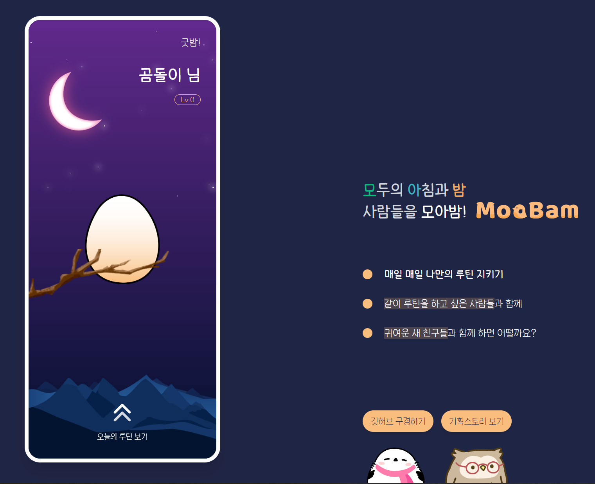
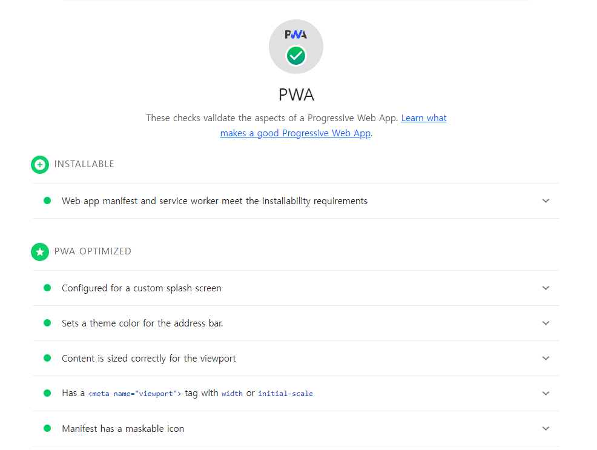

약 2개월동안 진행했던 모아밤 프로젝트가 끝났다.  
기획, 설계, 개발, QA까지 정말 재미있게 진행한 프로젝트였는데 이번에 경험했던 것들에 대해서 정리해보고자 한다.

이번 프로젝트를 하면서 중점적으로 신경쓰고 싶었던 부분이 몇 가지 있었다.

- **모바일을 고려하기**
  - 최근에 모바일로 사용할 것을 기준으로 생각한 서비스가 많은데, 리액트로 만든 웹 앱을 어떻게 설치할 수 있도록 만드는 것인지 궁금했다.
- **공통 컴포넌트 관리**
  - 이전 프로젝트에서는 페이지 단위로 작업을 분배한 뒤 페이지에서 사용되는 컴포넌트를 각자 만들다보니 중복된 코드를 작성하고 있다는 느낌도 들었다.  
    그래서 이번에는 공통 컴포넌트를 먼저 만드는 방식으로 해보고 싶었다.
- **UI 인터랙션과 트랜지션 효과 고민해보기**
  - 사용자의 동작에 따라서 UI가 자연스럽게 변화하는 요소를 만들고 싶었다.

## Service Worker

리액트로 만들어진 웹 앱을 모바일로 다운받아볼 수 있도록 하는 방법은 크게 2가지 방법이 있다:

1. 네이티브 앱의 **WebView**에 리액트 앱을 띄워서 보여주기
2. 리액트 앱에 **PWA**를 도입하기

우리는 여기서 2번을 선택했는데 그렇다보니 자연스럽게 서비스 워커를 알게 되었다.

PWA를 선택한 이유는 일정 기한이 제한되어 있기 때문에 Android와 iOS에서 동작하는 각각의 네이티브 앱을 띄우기 위한 학습을 하는 것 보다 **비교적 쉽게 적용할 수 있는 PWA를 도입하자**는 이유도 있었고 네이티브 앱에 비해서 **PWA가 어떤 한계점을 갖고 있을지**도 알아보고 싶었다. 그리고 무엇보다 **서비스 워커를 경험**하고 이해하고 싶었다.

### Progressive Web App

PWA를 적용하기 위해서는 앱에 반드시 서비스 워커가 등록되어 있어야 한다. 이 외에도 몇 가지 조건이 있는데:

1. Web Manifest 파일의 필수 내용 입력
2. HTTPS or localhost 환경에서 동작
3. 앱을 표시할 아이콘 이미지
4. 백그라운드 및 오프라인에서 동작하기 위한 Service Worker

이 부분들의 셋업은 각각의 파일을 작성한 뒤에 적용을 해도 크게 어렵진 않지만, Vite 빌드 도구를 사용한다면 제공되는 몇 가지 플러그인으로 더욱 손쉽게 작업할 수 있었다.

- [@vite-pwa/assets-generator](https://vite-pwa-org.netlify.app/assets-generator/): 여러 크기의 아이콘 이미지를 만들어 주는 플러그인
- [vite-plugin-pwa](https://vite-pwa-org.netlify.app/guide/): Manifest, Service Worker를 등록하는 데 도와주는 플러그인

```ts
import { defineConfig } from "vite"
import { VitePWA } from "vite-plugin-pwa"
import react from "@vitejs/plugin-react"
import path from "path"

export default defineConfig({
  plugins: [
    react(),
    VitePWA({
      registerType: "autoUpdate",
      injectRegister: null,
      strategies: "injectManifest",
      filename: "firebase-messaging-sw.js",
      manifest: {
        name: "Moabam: 당신의 루틴을 지켜요!",
        short_name: "Moabam",
        description: "성취감과 의무감을 더하는 루틴 관리 웹 앱",
        theme_color: "#f8f8f8",
        icons: [여러 크기의 아이콘들...],
      },
    }),
  ],
})
```

두 패키지를 설치하고, 애셋도 적당히 만들어 놓았으면 `vite.config.ts` 파일에 위와 같이 원하는 설정을 부여하면 된다.

기본 설정으로는 서비스 워커와 매니페스트를 자동으로 등록해주지만, 이번 프로젝트에서는 수동으로 처리해야 할 부분이 있어서 몇 가지 추가 설정을 했다.

- **injectRegister**: 기본적으로는 서비스 워커를 알아서 등록해주지만, 현재 프로젝트에서는 동일한 스코프에서 실행 환경에 따라서 다른 서비스 워커를 등록해야만 했기에 수동으로 등록하도록 `null` 로 설정했다.
- **strategies**: 기본적으로는 서비스 워커와 매니페스트를 자동으로 등록해주지만, 우리가 만든 서비스 워커를 수동으로 등록하기 위해서 매니페스트만 자동으로 등록해주도록 설정했다.
- **filename**: `FCM` 수신을 위해서는 반드시 서비스 워커 파일의 이름이 `firebase-messaging-sw.js` 이어야 했기에 파일 이름을 지정해줬다.



PWA에 최적화 된 설정이 올바르게 되었는지는 Lighthouse로 체크해볼 수 있었다.

### Firebase Cloud Messaging


FCM을 활용해서 사용자가 앱을 이용중이지 않은 상태에도 알림을 통해 재참여를 유도할 수 있었다.

이를 위해서는 3가지의 작업이 필요했는데:

1. Firebase 앱 등록
2. 디바이스의 FCM 토큰 발급 후 백엔드 서버로 전송
3. 웹 푸쉬를 수신하는 서비스 워커 작성

#### 구현 1: 디바운싱 처리

로그인을 하거나 알림 권한이 변경되었을 때 백엔드 서버에 FCM 토큰을 보내야 했다.

`navigator.permissions.query` 메소드를 이용하면 알림 권한이 변경되는 것을 감지할 수 있었는데, FCM 토큰을 발급하고 백엔드 서버에 보내는 로직을 이벤트 핸들러로 등록했다.

그런데 사용자가 고의로 알림 권한 변경 버튼에 마우스 매크로를 동작할 때 무수히 많은 FCM 토큰이 발급되는 현상을 우려해서 여기에 디바운싱 처리를 했다.

#### 구현 2: 페이지 이동


이러한 Notification을 클릭하면 연관된 페이지로 이동하는 로직이 필요했다. 만약 이미 모아밤에 접속중인 브라우저가 있다면 그 창을 이용하고, 그렇지 않다면 새로운 창을 띄워야 하는데 여기에서 몇 가지의 문제가 있었다.

1. 푸쉬 알림이 어떤 페이지로 이어지는 것인지에 대한 정보 필요.
2. `client.navigate()` 가 작동하지 않음.

1번 문제같은 경우에는 백엔드 팀원과의 논의로 방 ID를 알림 내용에 포함되도록 해서 해결했고, 2번 문제는 서비스 워커가 메인 스레드에게 이동해야 할 `url` 을 메세지로 보내는 방식으로 해결했다.

```js
self.addEventListener("notificationclick", function (e) {
  e.waitUntil(
    clients.matchAll({ includeUncontrolled: true }).then(windowClients => {
      if (windowClients.length > 0) {
        const client = windowClients[0]

        client.focus()
        client.postMessage(url)
      } else {
        clients.openWindow(url)
      }
    })
  )
})
```

#### 헤맸던 점: messaging/unsupported-browser

[공식 문서](https://firebase.google.com/docs/cloud-messaging/js/client?hl=ko)를 보면서 헤맸던 부분은 Firebase 앱 등록 로직을 서비스 워커 파일에서 해야하는지, 아니면 일반 모듈 파일에서 해도 되는지였다.

처음에는 서비스 워커에서 앱을 등록하려고 시도하다가 지원하지 않는 브라우저라는 오류로 토큰을 발급하지 못하는 문제가 있었는데, 추후에 토큰 발급 로직은 모두 일반 파일로 빼고 서비스 워커에서는 웹 푸쉬와 관련한 로직만 넣었더니 정상적으로 작동했다.

### Mock Service Worker

프론트엔드와 백엔드가 동시에 개발하다보니 아무래도 개발 단계에서 아직 API를 실제로 활용하지 못하는 상황이 발생할 것이라고 생각했다.  
그래서 `fetch` 이벤트를 중간에서 가로채는 `MSW` 를 도입했다.

```ts
http.post(baseURL("/members/login/kakao/oauth"), async () => {
  await delay(1000)

  const status: number = 201
  let response = {}
  const headers = new Headers()

  switch (status) {
    case 200:
      response = { isSignUp: false, id: 5 }
      headers.set("Set-Cookie", "accessToken=MockedToken;")
      headers.append("Set-Cookie", "refreshToken=MockedToken;")
      break
    case 201:
      response = { isSignUp: true, id: 5 }
      headers.set("Set-Cookie", "accessToken=MockedToken;")
      headers.append("Set-Cookie", "refreshToken=MockedToken;")
      break
    case 404:
      response = { message: "존재하지 않는 유저입니다." }
      break
  }

  return HttpResponse.json(response, {
    status,
    headers,
  })
})
```

처음에는 병렬 개발을 위해서 도입했었는데, 로딩이나 에러 상황을 시뮬레이션하고 의도하는 화면이 나왔는지를 체크하는 데에도 유용하게 활용됐다.

`delay` 로 원하는 만큼의 지연 시간도 걸어보고, `status` 값에 따라 보여줄 여러 내용을 분기처리해서 에러 화면도 잘 나오는지 체크할 수 있었다.

### Service Worker 등록

동일한 스코프에서는 하나의 서비스 워커만 존재할 수 있는데, 우리는 MSW와 FCM을 위한 서비스 워커를 각각 사용하고 있었다.

처음에는 전체 스코프에 대해서 두 서비스 워커를 동시에 등록하다보니 간혹 의도하지 않는 서비스 워커가 작동해서 API 모킹이 이뤄지지 않는다거나 하는 문제점이 발생했다.

그래서 우리는 동작하길 원하는 서비스 워커만 등록할 수 있도록 분기 로직을 작성했다.

```ts
const setupSW = async () => {
  if (import.meta.env.VITE_MSW === "true") {
    await setupMockServiceWorker()
  } else {
    await setupFCMServiceWorker()
  }
}
```

`setupSW` 함수를 호출하면 원하는 서비스 워커를 등록하는데, 여기서는 실행할 때 `MSW` 를 사용할 것인지에 대한 환경 변수에 따라서 분기 처리를 했다.

```json
{
  "scripts": {
    "dev": "vite",
    "dev:msw": "cross-env VITE_MSW=true vite"
  }
}
```

그리고 실행 명령어에 따라서 API 모킹을 위한 서비스 워커를 실행할 것인지, 아니면 FCM 알림을 위한 서비스 워커를 실행할 것인지를 선택할 수 있도록 했다.

## 공통 컴포넌트 및 훅

각자가 맡은 페이지를 구현하기 전에 공통 컴포넌트를 만드는 단계를 거쳤는데 어떤 것을 컴포넌트나 훅으로 묶어낼 것인지가 고민이 되었다.

특히 **하나의 요소에 간단히 스타일을 입히는데 컴포넌트를 사용**한다거나 **간단히 다른 훅을 래핑하고 반환하는데에 또 다른 커스텀 훅**을 만드는 것이 좋은 방법일지에 대해서 의문이 있었는데 이번에는 묶어내야 할 부분만 묶고, 그 외의 부분은 외부에서 재활용할 수 있게 구현해보았다.

### Button에 사용되는 스타일


버튼에서 가장 우선적으로 공통화되어야 하는 부분은 색상, 패딩, 라운딩, 그림자 효과같은 스타일에 대한 부분이라고 생각한다. 그런데 이 부분을 리액트 컴포넌트로 만들기엔 공통화를 너무 큰 범위로 하는 것이 아닐까? 싶은 고민을 했었다.

예를 들어, 버튼 컴포넌트를 `button`, `a`, `Link` 등의 다양한 태그로 활용하고 싶다거나 버튼 내부에 아이콘을 추가해서 사용하고 싶다면..? 그에 맞는 컴포넌트를 새로 만들거나 `prop`을 많이 받아서 분기 처리를 하는것도 애매할 것이다.

그래서 버튼에서 가장 관심있는 부분인 스타일만 따로 묶어서 최대한 외부에서 재활용하기 좋은 인터페이스를 만들자는 생각을 하게 됐다.

```css
.btn {
  @apply rounded-3xl px-4 py-2 shadow-md duration-100 ease-in-out focus:outline-none;
}

.btn-success {
  @apply text-white bg-success hover:bg-success-hover focus:ring-success-ring;
}

.btn-warning {
  @apply text-white bg-warning hover:bg-warning-hover focus:ring-warning-ring;
}
```

이번에는 `tailwind-css` 의 `@apply` 속성을 활용해봤는데, `import` 하지 않아도 된다는 장점은 있지만 사실 객체를 만들어서 활용하도록 하는 것이 더 명시적인 방법일 것 같다.

프로젝트 막바지에 [cva](https://cva.style/docs/getting-started/variants#creating-variants) 라이브러리를 알게 됐는데, 이후에 활용해본다면 내가 고민했던 아이디어를 실현하기에 유용할 것 같다.

### queryOptions

`TanStack Query` 를 활용할 때 쿼리 키나 쿼리 함수에 생기는 변화에 유연하게 대응하기 위해 커스텀 훅으로 공통 레이어를 만들어 놓는 경우가 많았다.

```ts
const usePostDetailQuery = (id: string, options?: QueryOptions<Post>) => {
  return useQuery<Post>({
    queryKey: ["post", "detail", id],
    queryFn: () => getPostDetail(id),
    ...options,
  })
}
```

그런데 만약 이 훅을 사용하는 특정 컴포넌트마다 옵션을 조금씩 다르게 줘야 한다면 외부에서 입력받을 수 있도록 매개변수로 받아줘야 하는데.. 이러한 API가 많아질수록 점점 반복적인 일이 되고 훅의 이름도 어떻게 지어야 명시적이면서 짧은 이름을 지을 수 있을지 고민하게 된다.

그래서 이 부분도 큰 범위의 훅으로 공통 로직을 묶는 것이 아니라, 작은 범위의 옵션으로만 묶어보면 어떨까? 하는 생각을 적용해봤다.  
(`TanStack Query`의 버전이 V5가 되면서 새롭게 등장한 인터페이스이다!)

```ts
const roomOptions = {
  detail: (roomId: string) =>
    queryOptions({
      queryKey: ["rooms", "detail", roomId] as const,
      queryFn: () => roomAPI.getRoomDetail(roomId),
    }),
  myJoin: () =>
    queryOptions({
      queryKey: ["rooms", "myJoin"] as const,
      queryFn: () => roomAPI.getMyJoinRoom(),
    }),
  joinHistory: () =>
    queryOptions({
      queryKey: ["rooms", "joinHistory"] as const,
      queryFn: () => roomAPI.roomJoinHistory(),
    }),
}
```

```tsx
const { data: room } = useSuspenseQuery({
  ...roomOptions.detail(roomId),
  staleTime: Infinity,
})
```

이렇게 옵션으로만 묶어서 사용했더니.. 몇 가지의 장점이 있었다.

1. 커스텀 훅의 이름을 고민하지 않아도 된다.
2. 옵션을 매개변수로 받기 위해서 제네릭을 부여하는 번거로운 과정이 사라진다.
3. 사용하는 측에서 TanStack Query에서 제공하는 `useSuspenseQuery` 훅을 선언하기 때문에 밖에서 봐도 훅의 동작의 예측이 수월해진다.

### Storybook


공통 컴포넌트는 모든 팀원이 자주 사용하는 컴포넌트인 만큼 화면에서 어떻게 그려지고 어떤 인터페이스를 갖고 있는지를 쉽게 확인할 수 있으면 좋겠다는 생각을 했다.
그래서 이번에 `Storybook` 을 도입해보았는데, 컴포넌트를 사용하는 사람이 의도하는 대로 동작하지 않으면 스토리북을 다시 확인하면서 잘못 사용한 부분을 빠르게 체크할 수 있었다.

이번에 `Netlify` 를 통해서 배포했는데, 간단하게 등록만 하면 통합 브랜치에 PR이 올라올 때마다 preview 배포 내용도 볼 수 있다는 점이 좋았는데.. 무료 빌드 300분을 생각보다 금방 소진했다는 문제점도 있었다. `Chromatic` 을 이용하면 UI 테스팅까지 적용할 수 있다고 하던데, 이번에는 적용해보지 못해서 아쉽고 추후에 공부해보면 재밌을 것 같다.

#### Storybook에 MSW 적용


방에 혼자만 남아있는 경우에만 삭제 버튼을 보여줘야 하는 조건부 렌더링이 있었는데, 스토리북에 MSW를 적용해서 조건에 따라서 잘 나오는지를 체크할 수 있도록 했다.

이 부분에는 렌더링 테스트 코드를 작성하는 방법도 있겠지만 테스트 코드같은 경우에는 UI에 대한 요구사항이 변화하면 쉽게 깨지기 쉬울 것 같아서 적용하기에 망설여지고.. 우선 스토리북에 MSW를 적용해서 조건에 따라 정상적인 화면이 보여지는지만 사람이 체크할 수 있도록 해봤다.

`Chromatic` 을 이용했다면 더 좋은 방법이 있었을지.. 고민이 된다.

## 마무리

몇 가지 시도해보고 싶었던 것도 해봤고 재밌게 프로젝트를 진행한 것 같아서 뿌듯하다.

다만 FCM과 관련해서 최근에는 iOS도 FCM을 지원한다고는 하는데 직접 사용해보니 FCM 토큰 발급이 되지 않는 문제도 있었어서 그 부분은 아쉽다.
찾아보니 ACNs를 사용해야 한다는 의견도 있는데, 이를 이용하기 위해서는 연간 13만원의 애플 개발자 등록을 해야 한다는 어려움이 있었다.
