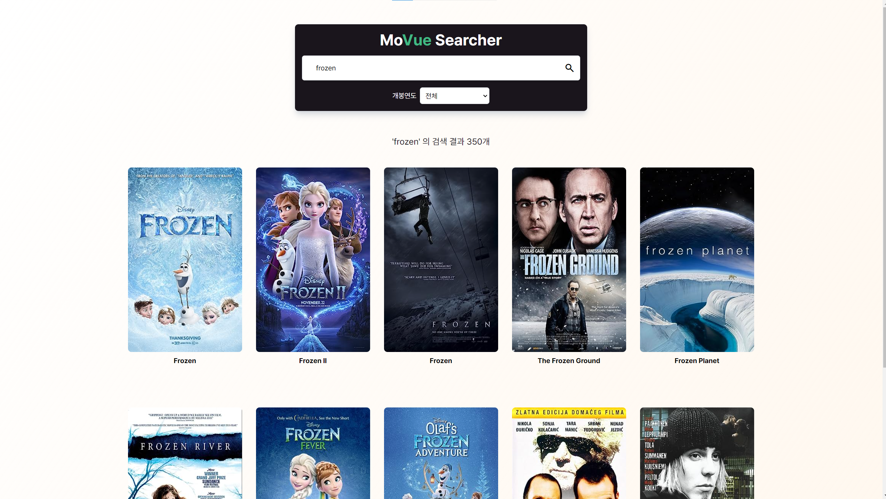
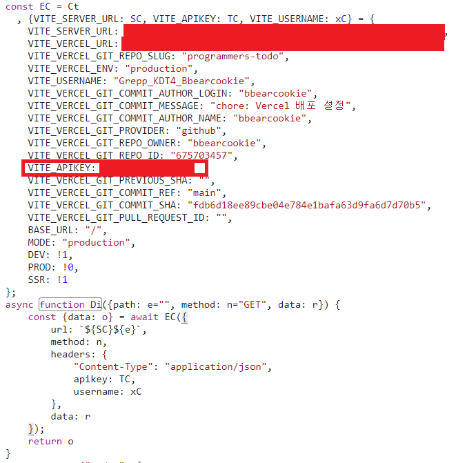
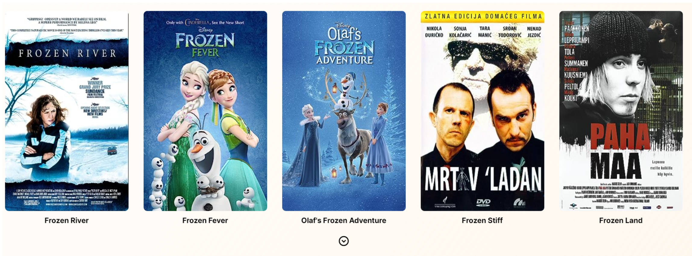

## Vue 첫 사용기
데브코스 과정을 진행하면서 `Vue` 프레임워크를 처음 사용해보게 되었다.  
React를 주로 사용해왔던 나에게는 생소한 부분도 있고 리액트와 유사하다고 느낀 부분도 있었는데  
이번에 영화 검색 사이트를 구현해보면서 Vue 만의 장점과 매력도 나름 느끼게 되었다.  

### React와 유사한 점
React로 구성한 프로젝트에서 모달을 구현할 때 현재 컴포넌트가 그려지는 DOM 위치가 아니라 외부의 위치에 그리고 싶어서 `createPortal` 을 사용한 적이 있었는데, Vue에서도 유사한 기능을 `Teleport` 빌트인 컴포넌트로 제공하고 있었다.  

### React와 다른 점
React에서의 `ref` 는 값이 변경되어도 재렌더링이 발생하지 않기에 DOM 객체를 가리키는 포인터나, 화면에 상관없이 컴포넌트에서 보관해야 할 변수를 관리할 때 사용했었는데

Vue에서의 `ref` 는 반대로 변화를 감지하고 화면을 재렌더링할 수 있게 하는, 마치 React에서의 상태처럼 사용되는 부분이 약간 혼란스럽기도 했다.  

### Vue의 좋은 점
- **input 데이터 양방향 바인딩**  
React에서 데이터의 흐름은 단방향으로만 진행할 수 있다. 따라서 View단에서는 실제 Model의 데이터를 전달받고 단순하게 화면에 그려주는 역할만 수행할 수 있기 때문에, input 의 값을 상태에 보관하기 위해서는 간단한 기능일지라도 직접 핸들러를 등록하고 View에서 해당 데이터를 받아서 그려줘야 했었다. 하지만 `Vue` 에서는 **`v-model` 이라는 디렉티브를 통해 양방향으로 바인딩할 수 있다**는 점이 상황에 따라서 편리하게 사용될 수 있겠다는 생각을 했다.  
- **편리한 이벤트 핸들링**  
React에서는 이벤트의 기본 동작을 막기 위해서 이벤트 핸들러의 내부에 반드시 `e.stopPropagation()`, `e.preventDefault()` 등의 메소드를 직접 호출해야 했지만 Vue에서는 `.stop`, `.prevent` 등의 이벤트 수식어를 사용할 수 있다는 점이 이벤트를 다루는데 유용하다고 느꼈다.  
특히 키보드 이벤트와 관련해서는 발생한 이벤트가 정확히 어떤 키인지까지도 검사할 수 있는 부분이 편리했다.  
- **유용한 빌트인 컴포넌트**  
Vue에서는 여러 빌트인 컴포넌트를 제공하는데 특히 `Transition` 컴포넌트는 무척 유용해보였다.  
React에서 조건부에 따라서 컴포넌트를 렌더링하는 부분에 대해 애니메이션 효과를 구현하기 위해서는 번거로웠던 과정이 있었는데, Vue에서는 `Transition` 컴포넌트를 사용하면 애니메이션을 재생할 때 까지 기다렸다가 그 후에 요소를 없애주기 때문에 편리했다.  

## 영화 검색 사이트
  
[배포 주소](https://movue-searcher.vercel.app/)  

`OMDb API` 에서 영화 데이터를 받고 사용자에게 정보를 제공하는 검색 사이트를 구현했다.  
상태 관리로 `pinia` 라이브러리를, 페이지 라우팅으로 `Vue Router` 라이브러리를 사용했다. 

### 서버리스 함수


`OMDb API` 서버에 데이터를 요청할 때엔 API KEY가 필요하다.  
그런데 이 정보를 `.env` 파일에 숨겨서 깃헙 레포지토리에서는 확인할 수 없다고 하더라도 브라우저에서 `OMDb API` 요청을 직접 하게된다면 결국 API KEY는 브라우저에서 조회할 수 있는 형태가 되기 때문에 키가 노출되어 버리는 현상이 발생한다.  

그래서 클라이언트가 원하는 요청을 본인이 `OMDb API` 에 대신 요청해주는 일종의 프록시 서버가 필요하다.  
이런 프록시 서버는 직접 백엔드 서버를 구성하는 방법도 있지만, 지금 하려는건 요청을 대신 처리하고 응답해주는 간단한 API를 만드려는 것이기 때문에 `vercel` 에서 제공하는 서버리스 함수 기능을 사용하는 것도 비용 부담 없이 편리한 방법이었다.  

`vite` 로 구성한 환경에서 `vercel` 서버리스 함수를 설정하는 순서는 다음과 같다:

#### 1. vercel 패키지 설치
```sh
npm i vercel
```

#### 2. package.json 설정
```json
{
  "scripts": {
    "vercel": "vercel dev --listen 2999",
  },
  "overrides": {
    "@vercel/node": {
      "typescript": "5.1.6"
    }
  }
}
```
환경설정 당시에 `typescript` 패키지 버전과 `vercel` 에서의 `typescript` 패키지 버전이 달라서 호환이 잘 되지 않는 문제가 있었는데, 이 것을 `overrides` 옵션으로 해결했다.  

#### 3. vercel 로컬서버 실행
```sh
npm run vercel
```

위 커맨드를 입력하면 간단한 설정을 마치고 `vercel` 로컬서버를 실행하게 된다.  
루트 디렉토리의 `/api/*` 경로에 서버리스 함수를 작성하고 브라우저에서 해당 경로에 맞는 `path` 를 입력하면 자동으로 프록시가 동작해 서버리스 함수가 실행된다.

#### 4. tsconfig.json 수정
```sh
error: TS6046: Argument for '--moduleResolution' option must be: 'node', 'classic', 'node16', 'nodenext'.
error: TS5023: Unknown compiler option 'allowImportingTsExtensions'.
```

서버리스 함수가 정상적으로 동작은 하는데, 동작할 때마다 터미널에 위와 같은 에러 메시지가 등장했었다.  
이는 `tsconfig.json` 파일을 수정해서 해결할 수 있었다.  

```json
{
  "moduleResolution": "Node",
  //"allowImportingTsExtensions": true <<< 이 옵션은 그냥 지워준다.
}
```

### 무한 스크롤

라이브러리를 사용하지 않고 `Insersection API` 만 사용해서 무한 스크롤 기능을 구현했다. 

영화 목록의 마지막 부분에 도달하면 다음 목록을 자동으로 가져오는 기능을 구현했는데, `isLoading` 상태가 아닌 경우에는 더보기 아이콘을 보여줌으로써 혹시 무한 스크롤이 잘 작동하지 않는 경우에는 사용자가 직접 불러올 수 있도록 했다.  


### 서버상태 관리
서버로부터 가져오는 정보는 `pinia` 라이브러리를 통한 스토어에 저장했다.  

`isSuccess`, `isLoading`, `isError` 등의 플래그를 직접 구현해서 사용하기도 하고 캐싱이나 프리패칭에 대한 부분도 간단하게 구현해보았는데, 네트워크 요청의 예외 처리를 하거나 status가 꼬이지 않고 잘 작동하기 위해서는 신경쓸게 많다고 느껴졌다. 

확실히 `tanstack-query` 가 서버상태를 관리하는데 있어서 얼마나 강력한 라이브러리였는지를 새삼 느끼게 되었다.  

## 프로젝트 후기
처음 사용해보는 `Vue` 였기 때문에 생소한 부분도 많았는데, 이번에 프로젝트를 구현해보면서 학습하다보니 감을 많이 잡은 것 같다.  

`Tailwind CSS` 도 처음 사용해봤는데 Vue의 `Transition` 컴포넌트와 관련한 기능이나, 기타 복잡한 선택자 관계를 표현하기 위해서는 결국 `scss` 도 함께 사용해야 된다고 느껴져서 사실 매력을 잘 못느꼈다.  

`Tailwind` 의 장점이라고 한다면 요소의 클래스만 보고도 어떤 화면이 나올지 예측이 가능하다는 점이 있고, 클래스 네이밍을 고민하는데 많은 시간을 보내지 않아도 되는 점이겠지만, 개인적으로는 `HTML` 트리 구조만 보고 전체적인 구조를 파악하기에는 클래스 이름이 너무 길어지는 느낌이 있어서 시맨틱 태그나 CSS 네이밍 방법론을 잘 정리해서 사용하는 것이 유지보수에 더 좋지 않을까 싶은 생각이 들었다.  

사실 나는 `Vue` 보다는 `React` 에 더 관심이 있기 때문에 `Vue` 에 대해서 더 깊은 학습을 하는 것에는 중점을 두진 않을 것 같긴 하지만, 한 번쯤 써보고 싶기도 했고 `Vue` 만의 장점도 느낀 나름 새로운 경험을 하게 되어서 뿌듯하다.  

아마 나중에 `Vue` 를 사용해야 할 일이 생기거나, 혹은 다른 기술이 등장해서 새롭게 학습해야 하는 경우가 생기면 현재 프로젝트에서의 경험이 도움이 될 것 같다.  
