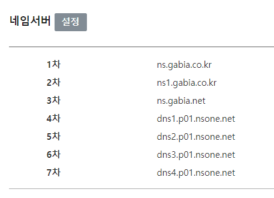
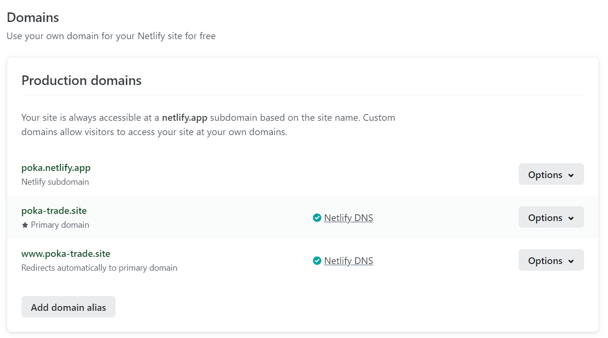
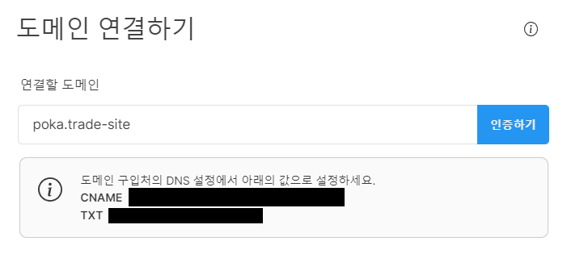

우선 배포해야 할 프로젝트를 `React` 기반의 프론트엔드 프로그램과, `Node.js` 기반의 백엔드 프로그램 두 가지로 생각했다.  

배포하기 위한 여러 방법을 알아보니 `EC2` 나 `GCP` 같이 인프라 자원을 가상화해서 제공하는 `IaaS` 를 이용하는 방법과, `Heroku` 나 `Netlify` 같이 서비스가 배포를 쉽게 할 수 있게 지원하는 `PaaS` 를 이용하는 방법이 있었다.  

왠만해서는 비용이 들지 않는 방법으로 하고 싶었는데, 프론트엔드 프로그램은 `Netlify` 로 배포하고, 데이터베이스와 백엔드 프로그램은 `CloudType` 으로 배포하는 것이 비용이 들지 않았다.

## Netlify
`React` 기반의 프론트엔드 프로그램은 `Netlify` 를 통해서 배포했는데 한달에 빌드 시간 `300분` 과 네트워크 사용량 `100GB` 를 무료로 지원하기 때문에 유용하다고 생각했다.

`Github` 에 올린 사이드 프로젝트의 레포지토리를 선택해서 사이트를 배포하면, 해당 레포지토리에 새로운 내용이 푸쉬될 때 마다 자동으로 빌드와 배포를 다시 해주기에 블로그도 `Netlify` 로 배포하고 있기도 하다.

이번에 배포 하는 과정에서는 빌드 오류와 라우팅 오류 등의 이슈를 만났었다.

### 빌드 오류
로컬에서는 빌드가 잘 되지만, `Netlify` 에서는 빌드가 되지 않았다. 해결책은 빌드 커맨드를 `npm run build` 에서 `CI=false npm run build` 로 바꾸는 것 이었다.

### 라우팅 오류
`Netlify` 주소에 접속해서 `URL` 의 `path` 가 달라질 때 `Page Not Found` 가 발생했다.  
싱글 페이지 애플리케이션이 처리하는 라우팅을 `Netlify` 가 알 수 없어서 발생하는 문제였는데, 프로젝트에서 `public` 디렉토리 안에 `_redirect` 파일을 작성해 주면 해결할 수 있었다.

#### public/_redirect
```
/* /index.html 200
```

## CloudType
백엔드 프로그램은 `CloudType` 으로 배포했다.

무료 플랜으로 메모리 용량 `1GB` 와 디스크 용량 `2GB` 를 지원하며 서비스를 제공하는 업체가 한국 회사이기 때문에 [가이드](https://help.cloudtype.io/guide)도 한글로 잘 되어 있다.

백엔드 프로그램을 배포하는 환경에서는 로컬의 환경과 다르다보니 몇 가지의 의문이 있었다.

### 데이터베이스
`Node.js` 애플리케이션이 가동되는 서버에서 데이터베이스에 어떻게 접근해야 하는지가 의문이었다. 그런데 간단하게 데이터베이스와 `Node.js` 애플리케이션을 따로 배포하고, `Node.js` 에서는 데이터베이스 접속 주소와 포트만 지정해 주면 되는 거였다.

### 이미지 등 파일 데이터
로컬에서는 포토카드 이미지나 사용자 프로필 이미지 같은 정보를 프로젝트의 `public` 디렉토리에 넣고 사용했었다. 그런데 `CloudType` 으로 배포할 때에는 코드 변경을 적용하기 위해서 재배포할 때마다 프로젝트를 클론하고, 패키지 설치하고, 빌드하는 과정이 새로 진행되다 보니 파일 데이터가 모두 삭제되는 것 이었다. 그래서 파일 데이터를 어떻게 보관해야 하는지가 의문이었는데 이는 `Amazon S3` 스토리지를 사용하면 해결할 수 있었다.

## Amazon S3
이미지 파일 데이터는 `Amazon S3` 에 배포했다.  

클라이언트가 `Node.js` 애플리케이션 서버에 파일 정보를 전송하면 `Node.js` 서버는 임시로 파일을 가지고 있다가 필요에 따라서 `Amazon S3` 스토리지에 업로드 하도록 했다.

## 도메인
비용을 들이지 않기 위해서 도메인 사용은 지양하려고 했으나 `Netlify` 에서 제공하는 주소와 `Cloudtype` 에서 제공하는 주소가 다르다보니 `Same-Site` 쿠키 정책을 위반해서 로그인 토큰을 백엔드 프로그램에서 프론트엔드 프로그램으로 정상적으로 보내주지 않는 문제점을 발견했다.

`Same-Site` 쿠키 정책을 `none` 으로 사용할 수도 있겠지만 `CSRF` 공격에 취약해지는 등 보안에 문제가 생기는 방법이기도 하고, 생각해보니 같은 서비스이면 같은 사이트로 인식하게끔 도메인을 사용하는게 맞다는 생각을 하게 되었다.

그래서 가비아에서 최초 1년간 2000원으로 이용 가능한 도메인을 구매해서 사용하기로 했다.

### Netlify


`Netlify` 로 배포한 프론트엔드 프로그램에 도메인을 연결하기 위해서는 우선 `Netlify`의 네임 서버를 가비아에 등록해야 했는데, 가비아에도 기본적으로 네임 서버가 입력되어 있기 때문에 `Netlify` 네임 서버를 추가적으로 입력해줬다.



그 이후에 가비아에서 구매한 도메인 주소를 입력하고 잠시 기다리면 `Netlify DNS` 로 적용된 것을 확인할 수 있었다.

### Cloudtype


`Cloudtype` 으로 배포한 백엔드 프로그램에 도메인을 연결하는 방법은 간단했다. 대시보드에서 도메인 추가 버튼을 누르면 나오는 `CNAME` 과 `TXT` 레코드와 값을 가비아의 DNS 설정 화면에서 입력해주면 됐다.

### DNS 레코드
> **A**: IPv4 주소와 도메인 네임을 매핑한다.  
> **AAAA**: IPv6 주소와 도메인 네임을 매핑한다.  
> **CNAME**: 도메인 네임을 다른 도메인 네임으로 매핑한다.  
> **TXT**: 해당 도메인 네임에 대한 추가적인 문자열 정보를 입력한다.   

## 참고 자료
[CNAME 레코드](https://ko.wikipedia.org/wiki/CNAME_%EB%A0%88%EC%BD%94%EB%93%9C)  
[Page Not Found Error](https://soso-cod3v.tistory.com/142)  