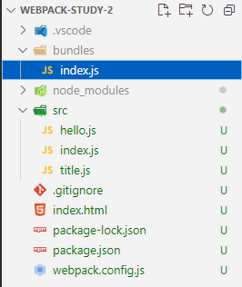
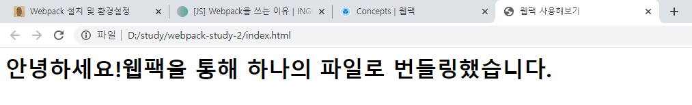

이번 글에서는 `Webpack` 을 설치하고 여러 `js` 파일로 나눠져서 개발된 모듈을 하나의 파일로 번들링하는 과정을 진행해보고자 한다.  

## 1. 노드 패키지 설정
`webpack` 은 일종의 외부 모듈이기 때문에 웹팩을 설치하기 위해서는 먼저 우리의 프로젝트가 패키지 관리자에 의해서 관리되도록 해야한다.  

```sh
npm init
```

## 2. webpack 패키지 설치
`webpack` 과 `webpack-cli` 패키지를 설치한다.  
웹팩으로 번들링하는 과정은 직접적인 애플리케이션의 동작과는 관계없이 개발 과정에서만 필요하기 때문에 `-D` 옵션을 준다.

> `webpack`: 웹팩 모듈  
> `webpack-cli`: 웹팩을 쉽게 사용할 수 있도록 여러 커맨드를 제공하는 모듈

```sh
npm install -D webpack webpack-cli
```

## 3. index.html 작성
웹 페이지의 시작 포인트가 될 `index.html` 을 루트 디렉토리에 생성한다.  

```html
<!-- index.html -->
<html>
  <head>
    <title>웹팩 사용해보기</title>
    <script defer src="bundles/index.js"></script>
  </head>
  <body>
    <div id="app"></div>
  </body>
</html>
```

## 4. 웹팩 설정 파일 작성
웹팩은 루트 디렉토리에 존재하는 `webpack.config.js` 를 웹팩과 관련된 설정 파일로 사용한다. 지금은 간단하게 번들링을 시작하는 지점인 `entry` 와, 번들 결과물에 대한 `output` 에 관한 설정만 작성해본다.  

```js
// webpack.config.js
const path = require('path');

module.exports = {
  mode: 'none',
  entry: path.resolve(__dirname, 'src/index.js'),
  output: {
    filename: 'index.js',
    path: path.resolve(__dirname, 'bundles'),
  },
};
```

> 엔트리 파일인 `/src/index.js` 에서 사용하는 모든 모듈이 번들링되고,  
하나의 파일 `/bundles/index.js` 가 생성된다.  

## 5. 소스코드 작성
인사말이 존재하는 `hello.js` 모듈과, 타이틀 텍스트가 존재하는 `title.js` 모듈을 작성하고,  
엔트리 포인트에서 모듈들을 `import` 해서 사용한다.  

```js
// src/hello.js
export const helloText = '안녕하세요!';
```

```js
// src/title.js
export const titleText = '웹팩을 통해 하나의 파일로 번들링했습니다.';
```

```js
import { titleText } from './title.js';
import { helloText } from './hello.js';

const $title = document.createElement('h1');
$title.innerText = helloText + titleText;

document.getElementById('app').appendChild($title);
```

## 6. 번들링
웹팩이 파일을 번들링 하도록 커맨드를 입력한다.  

```sh
npx webpack
```

## 7. 결과
`src/index.js` 에서 사용하는 모든 모듈이 하나의 결과물 `bundles/index.js` 로 합쳐진 것을 확인할 수 있다!  

이제 아까 작성했던 `index.html` 파일을 실행해보면 `h1` 태그에 텍스트가 의도한 대로 나오고 있는 것을 확인할 수 있다.  

  



## 참고 자료
[[JS] Webpack을 쓰는 이유 (INGG)](https://ingg.dev/webpack/)  