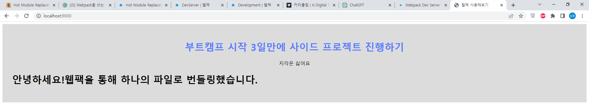
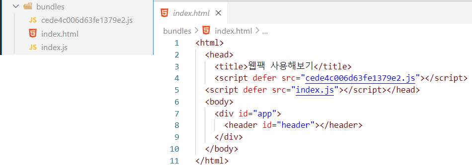

## Hot Module Replacement(HMR)
개발하는 과정에는 소스 코드를 수정하고 실행 결과를 즉각적으로 확인해야 하는 경우가 많다. 그런데 이럴 때마다 웹팩으로 번들링하고 다시 실행하는 과정을 거친다면 굉장히 번거로울 것이다.  

그렇기에 *Hot Module Replacement(HMR)* 를 적용한다면 **소스코드의 변화를 감지하고 자동으로 브라우저의 내용을 업데이트**하는 기능을 사용할 수 있다.  

HMR을 구성하는 방법은 많이 있지만 대부분의 경우엔 `webpack-dev-server` 를 통해서 적용하는 방법이 적합하다.  

## webpack-dev-server
`webpack-dev-server` 는 개발 환경에서 편리한 디버깅 및 개발 경험을 제공하기 위해 많은 기능을 포함하고 있는 개발 서버이다.  
라우팅을 위한 API 프록시 설정, HTTPS 지원, 라이브 리로딩, 모듈 번들링 결과를 메모리에 유지 등 다양한 기능을 제공한다.  

### 설치
```sh
npm install -D webpack-dev-server
```

### 웹팩 설정
```js{22-28}
const path = require('path');

module.exports = {
  mode: 'none',
  entry: './src/index.js',
  output: {
    filename: 'index.js',
    path: path.resolve(__dirname, 'bundles'),
  },
  module: {
    rules: [
      {
        test: /\.css$/i,
        use: ['style-loader', 'css-loader'],
      },
      {
        test: /\.html$/i,
        loader: 'html-loader',
      },
    ],
  },
  devServer: {
    static: {
      directory: path.join(__dirname),
    },
    compress: true,
    port: 9000,
  },
};
```

### 개발 서버 실행
```sh
npx webpack serve
```

### 개발 서버 접속
  

브라우저로 `http://localhost:9000/` 에 접속하면 `index.html` 파일의 내용이 잘 보이는 것을 확인할 수 있다.  
그러나 파일의 내용을 수정해도 아직 화면에 즉각 반영되지 않고 있는데, 추가적인 설정이 필요하기 때문이다.  

## html-webpack-plugin
  

`html-webpack-plugin` 는 웹팩 번들을 제공하는 HTML 파일 생성을 단순화하는 플러그인이다.  

개발 서버가 파일의 수정을 감지하고 자동으로 컴파일하면, 번들링 된 파일의 이름은 해시가 포함된 랜덤 문자열로 생성된다. 그런데 `index.html` 파일에서는 웹팩이 번들링한 `js` 파일의 이름을 알지 못하기 때문에 `script` 태그로 가져올 수 있도록 적절하게 처리해주는 플러그인이 필요하다.  

### 설치
```sh
npm install -D html-webpack-plugin
```

## 추가적인 웹팩 설정
- <b style="color: green;">**엔트리**</b>  
  - 엔트리는 `key-value` 를 가진 객체 형태로 여러 엔트리를 입력할 수 있다.  
  아웃풋에서 엔트리의 이름을 파일 이름으로 설정해줬기 때문에, `./src/index.js` 파일의 이름을 `index` 로 지정해줬다.  
- <b style="color: red;">**아웃풋**</b>  
  - **filename**  
  `html-webpack-plugin` 플러그인을 사용함으로 인해서 번들링시에 기존의 `index.js` 외에 다른 `js` 파일이 생성되는데, 번들링 결과 파일이 겹치지 않도록 엔트리의 `key` 에 해당하는 값을 파일 이름으로 사용하도록 `[name]` 값을 입력했다.  
  - **clean**  
  이전 빌드 결과를 완전히 삭제하는 옵션이다.  
  소스코드에 변화를 감지한 개발 서버가 새롭게 컴파일을 진행할 때 이전 결과에 겹쳐서 오작동 하는 현상을 방지한다.  
- <b style="color: blue;">**플러그인**</b>  
  - **html-webpack-plugin**  
  웹팩이 새롭게 생성하는 `html` 의 기본 형태를 `index.html` 파일로 지정했다.  
  - **HotModuleReplacementPlugin**  
  `Hot Module Replacement` 기능을 활성화한다.  

```js{7-14, 27-32}
const path = require('path');
const HtmlWebpackPlugin = require('html-webpack-plugin');
const webpack = require('webpack');

module.exports = {
  mode: 'none',
  entry: {
    index: './src/index.js',
  },
  output: {
    filename: '[name].js',
    path: path.resolve(__dirname, 'bundles'),
    clean: true,
  },
  module: {
    rules: [
      {
        test: /\.css$/i,
        use: ['style-loader', 'css-loader'],
      },
      {
        test: /\.html$/i,
        loader: 'html-loader',
      },
    ],
  },
  plugins: [
    new HtmlWebpackPlugin({
      template: 'index.html',
    }),
    new webpack.HotModuleReplacementPlugin(),
  ],
  devServer: {
    static: {
      directory: path.join(__dirname),
    },
    compress: true,
    port: 9000,
  },
};
```

## 문제점
`bundles/index.html` 이 존재하지 않는 최초 번들링 시 다음과 같은 에러가 발생한다:

```sh
ERROR in   Error: Child compilation failed:
  Module not found: Error: Can't resolve './bundles/index.js' in 'D:\study\webpack-study-2'
  ModuleNotFoundError: Module not found: Error: Can't resolve './bundles/index.js' in 'D:\study\webpack-study-2'
      at D:\study\webpack-study-2\node_modules\webpack\lib\Compilation.js:2022:28
      at D:\study\webpack-study-2\node_modules\webpack\lib\NormalModuleFactory.js:817:13
      at eval (eval at create (D:\study\webpack-study-2\node_modules\tapable\lib\HookCodeFactory.js:33:10), <anonymous>:10:1)
      at D:\study\webpack-study-2\node_modules\webpack\lib\NormalModuleFactory.js:275:22
      at eval (eval at create (D:\study\webpack-study-2\node_modules\tapable\lib\HookCodeFactory.js:33:10), <anonymous>:9:1)
      at D:\study\webpack-study-2\node_modules\webpack\lib\NormalModuleFactory.js:448:22
      at D:\study\webpack-study-2\node_modules\webpack\lib\NormalModuleFactory.js:118:11
      at D:\study\webpack-study-2\node_modules\webpack\lib\NormalModuleFactory.js:689:25
      at D:\study\webpack-study-2\node_modules\webpack\lib\NormalModuleFactory.js:893:8
      at D:\study\webpack-study-2\node_modules\webpack\lib\NormalModuleFactory.js:1013:5
```

`HtmlWebpackPlugin` 플러그인을 적용하는 과정에 발생하는 문제인데, 아직 해결방법을 찾지 못했다.  
이런 경우 다시 `npx webpack` 으로 번들링하면 정상적으로 성공한다.  

## 참고자료
[Dev Server (공식문서)](https://webpack.kr/configuration/dev-server/)  
[Hot Module Replacement (공식문서)](https://webpack.kr/concepts/hot-module-replacement/)  
[웹팩 데브 서버 (웹팩 핸드북)](https://joshua1988.github.io/webpack-guide/tutorials/webpack-dev-server.html#%EC%8B%A4%EC%8A%B5-%EC%A0%88%EC%B0%A8)  
[빌드 결과 자동 주입 (Webpack 러닝 가이드)](https://yamoo9.gitbook.io/webpack/webpack/webpack-plugins/automatic-injection-to-html-document)  
[웹팩 빌드시 이전 결과물을 삭제하는 옵션 (김정환블로그)](https://jeonghwan-kim.github.io/2022/08/21/webpack-output-clean)  