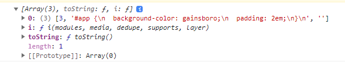
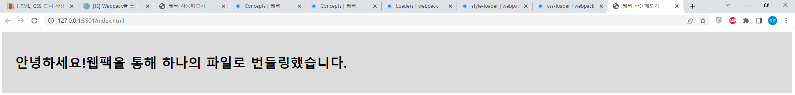
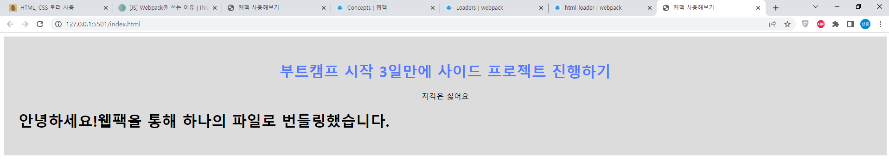

## 로더란?
웹팩은 기본적으로 `js` 와 `json` 파일만 이해할 수 있기에 `css`, `html`, `jpg` 등의 다른 유형의 데이터를 사용하기 위해서는 약간의 전처리가 필요하다.  

전처리 과정에는 **로더(Loader)** 를 이용할 수 있다.  
로더는 `TypeScript` 코드를 `JavaScript` 코드로 변환하거나 인라인 이미지를 데이터 URL로 변환하는 등, 모듈을 가져오거나 로드할 때 적절한 전처리 작업을 수행해준다.  

다양한 로더는 [여기](https://webpack.js.org/loaders/)에서 자세하게 확인할 수 있다.

### 설정 방법
웹팩에 로더를 설정하는 방법은 두 가지가 있는데 설정 파일에 지정하는 방법을 권장한다.  

1. 설정 파일 `webpack.config.js` 에 내용을 작성하는 방법  
2. 각 `import` 구문에서 명확하게 지정하는 방법

## css-loader  
[css-loader](https://webpack.js.org/loaders/css-loader/)는 `CSS` 파일의 내용을 읽어서 `JS` 모듈에서 사용할 수 있는 형태로 값을 반환하는 로더이다.  

### 설치
```sh
npm install --D css-loader
```

### 웹팩 설정
`.css` 로 끝나는 모든 파일에 대해서 `css-loader` 로더를 적용하도록 `webpack.config.js` 파일을 수정한다.

```js{10-17}
// webpack.config.js
const path = require('path');

module.exports = {
  mode: 'none',
  entry: './src/index.js',
  output: {
    filename: 'index.js',
    path: path.resolve(__dirname, 'bundles'),
  },
  module: {
    rules: [
      {
        test: /\.css$/i,
        use: ['css-loader'],
      },
    ],
  },
};
```

### 소스코드 추가
```css
/* src/index.css */
#app {
  background-color: gainsboro;
  padding: 2em;
}
```

```js{4,5}
// src/index.js
import { titleText } from './title.js';
import { helloText } from './hello.js';
import css from './index.css';
console.log(css);

const $title = document.createElement('h1');
$title.innerText = helloText + titleText;

document.getElementById('app').appendChild($title);
```

### 번들링 후 실행
`npx webpack` 커맨드 실행 후에 `index.html` 파일을 열고 콘솔을 확인하면 `css` 파일의 내용이 잘 읽어진 것을 확인할 수 있다.  



## style-loader
`css-loader` 로더는 단순히 `css` 파일의 내용을 읽을 뿐이고 실제로 화면에 반영해주지는 않는다.  

그래서 `DOM` 객체에 실제로 스타일을 적용해주는 [style-loader](https://webpack.js.org/loaders/style-loader/)를 함께 적용해야 한다.

### 설치
```sh
npm install --D style-loader
```

### 웹팩 설정
`css-loader` 로더가 읽은 내용을 `style-loader` 가 DOM 객체에 반영하도록 `webpack.config.js` 파일을 수정한다.  
```js{14}
const path = require('path');

module.exports = {
  mode: 'none',
  entry: './src/index.js',
  output: {
    filename: 'index.js',
    path: path.resolve(__dirname, 'bundles'),
  },
  module: {
    rules: [
      {
        test: /\.css$/i,
        use: ['style-loader', 'css-loader'],
      },
    ],
  },
};
```

> **로더 적용 순위**  
로더를 여러 개를 적용할 때는 `use` 를 배열 형태로 작성하면 되는데, 가장 마지막 요소로 존재하는 로더부터 시작한다.  
따라서 위 설정 파일의 내용으로는 `css-loader` -> `style-loader` 순으로 동작한다.

### 소스코드 수정
```js{4}
// src/index.js
import { titleText } from './title.js';
import { helloText } from './hello.js';
import './index.css';

const $title = document.createElement('h1');
$title.innerText = helloText + titleText;

document.getElementById('app').appendChild($title);
```

### 번들링 후 실행
스타일이 잘 적용되었음을 확인할 수 있다.  



## html-loader
[html-loader](https://webpack.js.org/loaders/html-loader/)는 `html` 파일의 내용을 읽어서 문자열 형태로 변환해주는 로더이다.  
모듈에서 사용하는 `DOM` 요소를 `html` 파일의 형태로 작성하고 가져오는데 유용하다.  

### 설치
```sh
npm install -D html-loader
```

### 웹팩 설정
`.html` 로 끝나는 모든 파일에 대해서 `html-loader` 로더를 적용하도록 `webpack.config.js` 파일을 수정한다.  

```js{16-19}
const path = require('path');

module.exports = {
  mode: 'none',
  entry: './src/index.js',
  output: {
    filename: 'index.js',
    path: path.resolve(__dirname, 'bundles'),
  },
  module: {
    rules: [
      {
        test: /\.css$/i,
        use: ['style-loader', 'css-loader'],
      },
      {
        test: /\.html$/i,
        loader: 'html-loader',
      },
    ],
  },
};
```

### 소스코드 작성
개발하려는 `Header` 컴포넌트를 `html`, `css`, `js` 파일로 분할해서 작성하고, 이걸 `index` 에서 가져와서 사용하는 상황이라고 가정했다.  

#### 헤더 컴포넌트
```html
<!-- components/header/header.html -->
<h1>부트캠프 시작 3일만에 사이드 프로젝트 진행하기</h1>
<p>지각은 싫어요</p>
```

```css
/* components/header/header.css */
#header {
  text-align: center;
}

#header h1 {
  color: #557AFE;
}
```

```js
// components/header/header.js
import html from './header.html';
import './header.css';

function Header() {
  const $element = document.querySelector('#header');
  $element.innerHTML = html;
}

export default Header;
```

#### index
```html
<!-- index.html -->
<html>
  <head>
    <title>웹팩 사용해보기</title>
    <script defer src="bundles/index.js"></script>
  </head>
  <body>
    <div id="app">
      <header id="header"></header>
    </div>
  </body>
</html>
```

```js
// src/index.js
import { titleText } from './title.js';
import { helloText } from './hello.js';
import Header from './components/header/header.js';
import './index.css';

Header();

const $title = document.createElement('h1');
$title.innerText = helloText + titleText;

document.getElementById('app').appendChild($title);
```

### 번들링 후 실행
`Header` 컴포넌트에 대한 스타일과 DOM 요소가 잘 적용되어 있는 걸 확인할 수 있다.




## 참고 자료
[Loaders (Webpack 공식문서)](https://webpack.kr/concepts/loaders/)  
[[JS] Webpack을 쓰는 이유 (INGG)](https://ingg.dev/webpack/)  