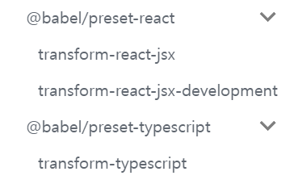
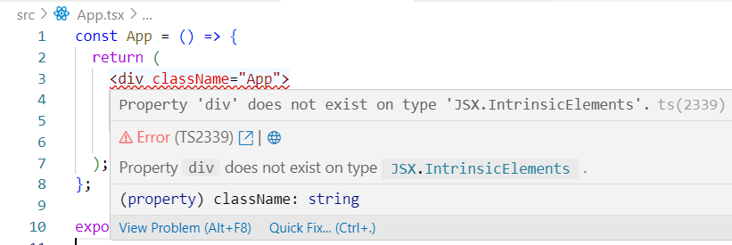

## 개요

내가 리액트를 처음 공부할 때 CRA를 활용해서 빠르게 초기 환경을 구성하는 편이었다.  
그러다 작년 7월 쯤 알게 된 빌드 도구인 `Vite` 를 알게 된 이후로는 주로 Vite를 활용해서 개발 초기 환경을 구성해 왔었는데 문득 이런 의문이 들었다.



> ❓ Babel에는 JSX나 TS를 변환해주는 프리셋이 존재한다.  
> 그런데, 타입스크립트를 사용하면 TS 컴파일러가 TS나 JSX 문법을 원하는 버전의 JS로 트랜스파일링 해주는데.. 그렇다면 Babel은 왜 존재하는 것이지?

> ❓ Webpack이나 Rollup의 번들러에도 Babel과 관련한 로더나 플러그인이 존재하는데.. 이런 것들이 Babel이랑은 무슨 관계가 있지?

이 궁금점을 해결하기 위해서는.. 여러 아티클을 단순히 읽어보는 것만으로는 빠르게 이해하기가 어렵겠다는 판단을 했고, 그래서 직접 Webpack 기반의 환경을 구성해보면서 부딪혀보기로 했다.

왜 `Webpack` 으로 구성했는지 묻는다면.. 물론 `Vite`는 Webpack 기반이 아니라 개발 환경 및 프로덕션 환경에 따라서 esbuild와 Rollup을 번들러로 사용하지만, 번들러와 트랜스파일러에 대해 전반적인 이해를 하는데 있어서는 Webpack 기반으로 구성해보는 것이 나쁘지 않겠다는 생각이었다.

아무런 환경도 갖추지 않은채 TypeScript 부터 시작해서 필요에 따라 번들러나 트랜스파일러를 추가하게 되었는데, 그랬더니 각각의 필요성이 더 잘 와닿게 되었다. 이번 포스트에서는 타입스크립트 컴파일러만 가지고 리액트 프로젝트를 한번 구성해보고자 한다.

## 타입스크립트 설치

```ts
npm i -D typescript
```

### tsconfig.json

```json
{
  "compilerOptions": {
    "strict": true, // 모든 엄격한 타입 검사 옵션 활성화
    "outDir": "./dist" // 컴파일된 파일이 저장될 디렉터리
  },
  "include": ["src"]
}
```

### src/hello.ts

```ts
const sum = (a: number, b: number) => a + b
console.log(sum(1, 3))
```

### 디렉토리 구조

```
📂 src
  📄 hello.ts
📄 tsconfig.json
```

### 빌드 결과

`npx tsc` 를 입력해서 타입스크립트를 컴파일하면 아래와 같은 결과를 확인할 수 있다.

```js
var sum = function (a, b) {
  return a + b
}
console.log(sum(1, 3))
```

그런데 const 키워드나 화살표 함수가 왠지 신경쓰인다. 이 부분은 타입스크립트 컴파일러에 설정을 입력할 수 있다.  
(구버전 브라우저의 호환성을 위해서는 다음 시리즈에 바벨로 처리할 것이다.)

### tsconfig.json

```json
{
  "compilerOptions": {
    "strict": true, // 모든 엄격한 타입 검사 옵션 활성화
    "outDir": "./dist", // 컴파일된 파일이 저장될 디렉터리
    "target": "ESNext" // 빌드 결과물의 JS 버전을 설정. (일단 최신 버전의 JS로 변환하고 Babel에게 트랜스파일링을 맡길 것이다.)
  },
  "include": ["src"]
}
```

## 리액트 설치

작성한 타입스크립트가 정상적으로 JS로 변환이 되는 것을 확인했으니, 이번에는 리액트 패키지를 설치해보자.

```ts
npm i react react-dom
npm i -D @types/react @types/react-dom
```

### src/App.tsx

```tsx
const App = () => {
  return (
    <div className="App">
      <h1>환영합니다!</h1>
      <p>React 입니다!</p>
    </div>
  )
}

export default App
```

### src/main.tsx

```tsx
import React from "react"
import ReactDOM from "react-dom/client"
import App from "./App"

ReactDOM.createRoot(document.getElementById("root")!).render(<App />)
```

### 디렉토리 구조

```
📂 src
  📄 hello.ts
  📄 App.tsx
  📄 main.tsx
📄 tsconfig.json
```

이런 형태로 `App.tsx` 와 `main.tsx` 를 작성해줬다.  
그런데 아직 각각의 파일에 들어가면 오류가 나는 것을 확인할 수 있는데.. 천천히 해결해보자.

### JSX 문법과 import 구문 에러

#### src/App.tsx


`App.tsx` 컴포넌트를 보면 JSX를 사용할 수 없다는 에러를 확인할 수 있다.  
이는 TS 컴파일러가 JSX를 변환하는 방법을 지정해주지 않았기 때문이다.

#### src/main.tsx


`main.tsx` 에서는 import 구문에서의 에러를 확인할 수 있다.  
이는 타입스크립트는 CommonJS 방식으로 동작하는데, 라이브러리가 웹 방식으로 `import/export` 하기 때문이라고 한다.  
CommonJS와 웹 방식의 상호 호환성을 위해서 옵션을 추가 설정해줘야 한다.

#### tsconfig.json

```json
{
  "compilerOptions": {
    // ...생략
    "esModuleInterop": true, // import React from 'react' 방식으로 임포트할 수 있도록 설정 (이거 안하면 import * as React from 'react' 방식으로 임포트해야 함)
    "jsx": "react-jsx" // jsx 변환 방식을 React 17 버전부터 사용하는 방식으로 설정
  }
  // ...생략
}
```

위 두 가지의 오류를 해결하기 위해서 타입스크립트 컴파일러 옵션의 내용을 추가해준다.

> 여기서 jsx 옵션의 값에 따라 리액트 17 이전의 방식으로 변환할 것인지, 이후의 방식으로 변환할 것인지를 설정할 수 있다. [참고](https://www.typescriptlang.org/tsconfig#jsx)

- react: JSX로 작성된 요소를 변환할 때 `createElement()` 가 사용된다.
- react-jsx: JSX로 작성된 요소를 변환할 때 `_jsx()` 가 사용된다.

### src/App.tsx



그런데 아직 div 요소를 찾을 수 없다는 문제가 더 남아있다.  
이 문제를 해결하기 위해서는 `moduleResolution` 옵션을 추가해줘야 한다. (아직 이 부분은 정확하게 이해하진 못했다..)

#### tsconfig.json

```json
{
  "compilerOptions": {
    "moduleResolution": "Node" // [🚨] 모듈을 해석하는 방식을 설정한다는데.. 잘 이해 못했음. 다만, module에 ESM 방식을 사용하면 이거 설정 바꿔줘야 JSX가 컴파일됨..
  }
}
```

#### 빌드 결과물

```js
import { jsx as _jsx, jsxs as _jsxs } from "react/jsx-runtime"
const App = () => {
  return _jsxs("div", {
    className: "App",
    children: [
      _jsx("h1", { children: "\uD658\uC601\uD569\uB2C8\uB2E4!" }),
      _jsx("p", { children: "React \uC785\uB2C8\uB2E4!" }),
    ],
  })
}
export default App
```

이제 TS 컴파일러를 돌리면 리액트 컴포넌트가 JS로 변환이 된 것을 확인할 수 있다!  
그런데 빌드된 결과물을 보면 하나의 파일로 합쳐지지도 않았으며, 아직 JS 파일을 브라우저에서 실행할 방법도 없는 상황이다.  
이 부분은 **모듈 번들러**를 사용하면 해결이 되는데, 다음 포스트에서는 Webpack으로 관련 설정을 이어서 진행해보겠다.

## 완성

### 디렉토리 구조

```
📂 src
  📄 hello.ts
  📄 App.tsx
  📄 main.tsx
📄 tsconfig.json
```

### tsconfig.json

```json
{
  "compilerOptions": {
    "strict": true, // 모든 엄격한 타입 검사 옵션 활성화
    "outDir": "./dist", // 컴파일된 파일이 저장될 디렉터리
    "target": "ESNext", // 빌드 결과물의 JS 버전을 설정. (일단 최신 버전의 JS로 변환하고 Babel에게 트랜스파일링을 맡길 것이다.)
    "module": "ESNext", // 어느 모듈 시스템을 사용하는 환경에서 동작하도록 JS 파일을 컴파일할 것인지 설정 (CJS, ES6, ES2020, ESNext 등)
    "moduleResolution": "Node", // [🚨] 모듈을 해석하는 방식을 설정한다는데.. 잘 이해 못했음. 다만, module에 ESM 방식을 사용하면 이거 설정 바꿔줘야 JSX가 컴파일됨..

    "esModuleInterop": true, // import React from 'react' 방식으로 임포트할 수 있도록 설정 (이거 안하면 import * as React from 'react' 방식으로 임포트해야 함)
    "jsx": "react-jsx" // jsx 변환 방식을 React 17 버전부터 사용하는 방식으로 설정
  },
  "include": ["src"]
}
```

## 참고 자료

[📘 타입스크립트 컴파일 설정 - tsconfig 옵션 총정리 (Inpa Dev)](https://inpa.tistory.com/entry/TS-%F0%9F%93%98-%ED%83%80%EC%9E%85%EC%8A%A4%ED%81%AC%EB%A6%BD%ED%8A%B8-tsconfigjson-%EC%84%A4%EC%A0%95%ED%95%98%EA%B8%B0-%EC%B4%9D%EC%A0%95%EB%A6%AC)
