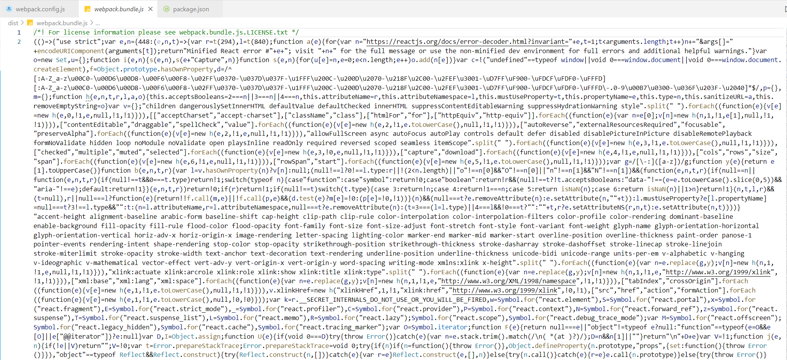
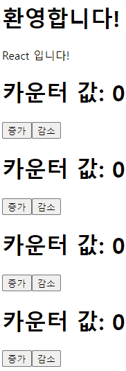

## 개요

저번 시간에 TS 컴파일러로 리액트 컴포넌트를 JS로 변환하는 과정까지 했었는데, 이번에는 모듈 번들러 Webpack을 통해서 하나의 파일로 번들링하고 실행할 수 있는 환경을 구성해보자.

## Webpack 설치

```sh
npm i -D webpack webpack-cli
```

### package.json

```json
{
  "type": "module",
  "scripts": {
    "build": "NODE_ENV=production webpack",
    "dev": "NODE_ENV=development webpack serve"
  }
}
```

package.json 을 수정해준다.  
모든 js 파일을 기본적으로 ESM 방식으로 인식하도록 했고, 빌드와 개발 서버 실행 커맨드를 추가했다.  
실행에 앞서서.. `NODE_ENV` 의 값을 빌드할 때엔 production으로, 개발 서버를 킬 땐 development로 했는데 이 것을 기반으로 웹팩 설정에서 분기 처리를 할 것이다.

### webpack.config.js

```js
import path from "path"

const isDevelopment = process.env.NODE_ENV !== "production"
const __dirname = path.resolve()

/**
 * @type {import("webpack").Configuration}
 */
export default {
  mode: isDevelopment ? "development" : "production",
  entry: "./src/main.tsx",
  output: {
    path: path.resolve(__dirname, "dist"),
    filename: "main.js",
    clean: true,
  },
}
```

웹팩 설정 파일을 작성하고.. `npm run build` 커맨드를 시도해본다.

### 빌드 에러

```sh
Module parse failed: Unexpected token (5:51)
You may need an appropriate loader to handle this file type, currently no loaders are configured to process this file. See https://webpack.js.org/concepts#loaders
| import App from './App';
|
> ReactDOM.createRoot(document.getElementById('root')!).render(<App />);
|
```

빌드 에러가 나는 것을 확인할 수 있는데, 이건 Webpack이 타입스크립트를 다루는 데 있어서 필요한 로더를 추가하지 않았기 때문이다!  
[ts-loader](https://webpack.kr/guides/typescript/#loader) 를 설치하고 적용해야 한다.

### ts-loader 설치

```sh
npm i -D ts-loader
```

### webpack.config.js

```js
export default {
  resolve: {
    extensions: [".tsx", ".ts", ".js"],
  },

  module: {
    rules: [
      {
        test: /\.(tsx|ts)?$/,
        exclude: /node_modules/,
        use: "ts-loader",
      },
    ],
  },
}
```

로더를 추가한 부분은 `module.rules` 쪽을 보면 된다.  
`node_modules` 디렉토리가 아닌 곳에 존재하는 모든 `tsx | ts` 파일에 대해 `ts-loader` 를 적용한다는 의미이다.

### 빌드 확인



하나의 파일로 빌드되었음을 확인할 수 있다!  
그런데.. 결과물이 압축 되어 있다 보니 확인하는데 불편하다.  
이 경우에는 `optimization.minimize` 옵션을 `false` 로 주면 된다.

### webpack.config.js

```js
export default {
  optimization: {
    minimize: false, // 빌드 결과물을 확인하기 위한 임시 설정
  },
}
```

## 빌드 결과 실행하기

웹팩이 여러 JS 파일에서 엮여있는 의존성 관계를 정리하여 하나의 파일로 번들링해주었으니, 이제 간단하게 `html` 파일에서 가져와서 사용할 수 있게 되었다.  
따라서 실행을 위해 `index.html` 을 작성해준다.

### index.html

```html
<!DOCTYPE html>
<html lang="ko">
  <head>
    <meta charset="UTF-8" />
    <meta name="viewport" content="width=device-width, initial-scale=1.0" />
    <title>Simple React</title>
    <script defer src="dist/main.js"></script>
  </head>
  <body>
    <div id="root"></div>
  </body>
</html>
```

### Live Server로 실행


화면이 잘 렌더링되었다.

## Counter 컴포넌트

아직 리액트의 훅을 사용해보지 않았기에 `useState` 를 간단하게 사용해보면서 정상적으로 동작하는지 확인해보자.

### src/components/Counter.tsx

```tsx
import { useState } from "react"

const Counter = () => {
  const [counter, setCounter] = useState(0)

  return (
    <div>
      <h1>카운터 값: {counter}</h1>
      <button onClick={() => setCounter(counter + 1)}>증가</button>
      <button onClick={() => setCounter(counter - 1)}>감소</button>
    </div>
  )
}

export default Counter
```

### src/App.tsx

```tsx
import Counter from "./components/Counter"

const App = () => {
  return (
    <div className="App">
      <h1>환영합니다!</h1>
      <p>React 입니다!</p>
      <Counter />
      <Counter />
      <Counter />
      <Counter />
    </div>
  )
}

export default App
```

### 실행 결과



`useState` 도 정상적으로 동작한다.

## 개발 서버 설정

지금까지의 설정으로는 문제점이 있는데, 개발하면서 변경 사항을 확인하려고 할 때마다 빌드하고 새로고침하는 과정이 굉장히 번거로울 것으로 예상이 된다.  
그래서 코드에 수정 사항이 발생하면 새로고침 없이 변경된 부분만 화면에 즉시 반영하는 `HMR` 을 적용할 수 있는데.. 웹팩에서는 `webpack-dev-server` 를 통해서 쉽게 적용할 수 있다.

여기서 중요한 점은 개발 서버는 코드에 수정사항이 발생하면 임의로 번들링해서 새로운 JS 파일을 만들어내는데, 이 파일을 html 파일에서도 가져올 필요가 있다는 점이다.  
이 부분은 가져와야 할 JS 파일을 임의로 `html` 파일에 하드 코딩하는 방식으로는 어렵기 때문에, 웹팩이 HTML 파일을 생성할 수 있도록 하는 `HtmlWebpackPlugin` 플러그인도 추가적으로 적용해야 한다.

### webpack-dev-server 설치

```sh
npm i -D webpack-dev-server html-webpack-plugin
```

### webpack.config.js

```js
import HtmlWebpackPlugin from "html-webpack-plugin"

export default {
  devServer: {
    port: 3000,
    hot: true, // HMR 적용
  },

  plugins: [
    new HtmlWebpackPlugin({
      template: path.resolve(__dirname, "index.html"),
    }),
  ],
}
```

`devServer` 옵션으로 HMR을 적용하고, `plugins` 옵션으로 플러그인을 추가해줬다.  
이제 아까 추가했던 실행 스크립트 `npm run dev` 로 개발 서버를 실행할 수 있다.

### 실행 결과


소스코드를 수정하고 저장하면 변경된 사항이 자동으로 화면에 반영되고 있음을 확인할 수 있다. 그런데 화면이 순간적으로 깜빡이는 현상이 있고 **모든 컴포넌트가 갖고 있던 기존의 상태도 함께 날아가버리는 문제점**이 있다.

원인은 웹팩은 HMR을 적용해주지만, 화면을 그리는 건 리액트이기에 `main.tsx` 가 다시 실행되면서 모든 화면을 다시 렌더링하기 때문이다.

그렇다면 CRA로 구성한 프로젝트는 왜 컴포넌트가 상태를 잃지 않는 것일까? 이건 eject를 해서 확인해보니 `react-refresh` 라는 것을 사용하고 있었다.  
웹팩과 함께 사용하기 위해서는 `react-refresh-webpack-plugin` 를 사용하면 편한데, 이 라이브러리는 [Babel을 통한 설정](https://github.com/pmmmwh/react-refresh-webpack-plugin?tab=readme-ov-file#usage)을 권장한다고 한다.

다음 포스트에서는 프로젝트에 바벨과 `react-refresh` 를 적용하는 과정을 이어서 진행해보겠다.

## 읽어 보면 좋은 자료

[HMR 이해하기](https://gseok.github.io/tech-talk-2022/2022-01-24-what-is-HMR/)  
[Vite 프로젝트에서 리액트 컴포넌트는 어떻게 HMR될까? (소스코드 뜯어보기)](https://velog.io/@woohm402/vite-react-hmr)
