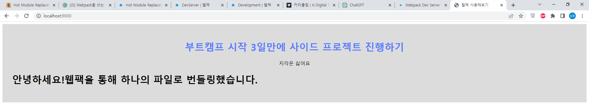
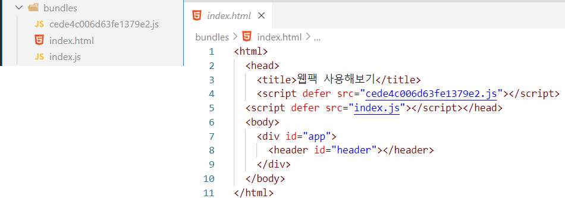

## Hot Module Replacement(HMR)
개발하는 과정에는 소스 코드를 수정하고 실행 결과를 즉각적으로 확인해야 하는 경우가 많다. 그런데 이럴 때마다 웹팩으로 번들링하고 다시 실행하는 과정을 거친다면 굉장히 번거로울 것이다.  

그렇기에 *Hot Module Replacement(HMR)* 를 적용한다면 **소스코드의 변화를 감지하고 자동으로 브라우저의 내용을 업데이트**하는 기능을 사용할 수 있다.  

HMR을 구성하는 방법은 많이 있지만 대부분의 경우엔 `webpack-dev-server` 를 통해서 적용하는 방법이 적합하다.  

## webpack-dev-server
`webpack-dev-server` 는 개발 환경에서 편리한 디버깅 및 개발 경험을 제공하기 위해 많은 기능을 포함하고 있는 개발 서버이다.  
라우팅을 위한 API 프록시 설정, HTTPS 지원, 라이브 리로딩, 모듈 번들링 결과를 메모리에 유지 등 다양한 기능을 제공한다.  

소스코드에 변화가 발생하면 `webpack-dev-server` 는 새롭게 모듈을 번들링하여 메모리 상에 기억하고, 브라우저에 변화된 내용을 보여준다.  

### 설치
```sh
npm install -D webpack-dev-server
```

### 웹팩 설정
```js{22-29}
const path = require('path');

module.exports = {
  mode: 'none',
  entry: './src/index.js',
  output: {
    filename: 'index.js',
    path: path.resolve(__dirname, 'bundles'),
  },
  module: {
    rules: [
      {
        test: /\.css$/i,
        use: ['style-loader', 'css-loader'],
      },
      {
        test: /\.html$/i,
        loader: 'html-loader',
      },
    ],
  },
  devServer: {
    static: {
      directory: path.join(__dirname, 'bundles'),
    },
    port: 9000,
    open: true,
    compress: true,
  },
};
```

### 개발 서버 실행
```sh
npx webpack serve
```

### 개발 서버 접속
  

브라우저로 `http://localhost:9000/` 에 접속하면 `index.html` 파일의 내용이 잘 보이는 것을 확인할 수 있다.  
그러나 파일의 내용을 수정해도 아직 화면에 즉각 반영되지 않고 있는데, 추가적인 설정이 필요하기 때문이다.  

## html-webpack-plugin
  

`html-webpack-plugin` 는 웹팩이 `HTML` 파일을 생성할 수 있도록 해주는 플러그인이다.  

개발 서버가 소스코드의 변화를 감지하고 메모리 상에서 새로운 `JS` 파일을 번들링할 때, `HTML` 파일에서도 그 스크립트를 가져와야 한다.  

그러나 지금까지 번들링된 JS 파일을 하드코딩해서 가져온 `HTML` 로는 새롭게 번들링 된 스크립트를 가져올 수 없기 때문에, 플러그인이 자체적으로 `HTML` 을 생성할 수 있게끔 설정해줘야 한다.  

### 설치
```sh
npm install -D html-webpack-plugin
```

### 웹팩 설정
번들링시 생성되는 html 파일은 `src/index.html` 의 내용을 기반으로 작성하도록 설정한다.  
그리고 번들링 결과 파일의 이름을 `index.html` 로 설정한다.  

```js{2, 6-11}
const path = require('path');
const HtmlWebpackPlugin = require('html-webpack-plugin');

module.exports = {
  // ... 생략
  plugins: [
    new HtmlWebpackPlugin({
      filename: 'index.html',
      template: path.resolve(__dirname, 'src/index.html')
    }),
  ],
};
```

### index.html 수정 및 이동
이제부터는 `index.html` 파일을 직접 사용하지 않고, 웹팩이 번들링시에 만든 `bundle/index.html` 를 사용할 것이다.  

웹팩이 번들링하면서 생긴 `js` 파일을 자동으로 `html` 파일에서 가져올 것이니, `script` 태그 부분을 지워준다.  

그리고 `index.html` 파일의 위치를 `src/index.html` 로 이동한다.  

```html
<!-- src/index.html -->
<html>
  <head>
    <title>웹팩 사용해보기</title>
  </head>
  <body>
    <div id="app">
      <header id="header"></header>
      <main id="main"></main>
    </div>
  </body>
</html>
```

## 최종 웹팩 설정
```js
const path = require('path');
const HtmlWebpackPlugin = require('html-webpack-plugin');

module.exports = {
  mode: 'none',
  entry: {
    index: path.resolve(__dirname, 'src/index.js'),
  },
  output: {
    path: path.resolve(__dirname, 'bundles'),
    filename: '[name].js',
    clean: true,
  },
  module: {
    rules: [
      {
        test: /\.css$/i,
        use: ['style-loader', 'css-loader'],
      },
      {
        test: /\.html$/i,
        loader: 'html-loader',
      },
    ],
  },
  plugins: [
    new HtmlWebpackPlugin({
      filename: 'index.html',
      template: path.resolve(__dirname, 'src/index.html')
    }),
  ],
  devServer: {
    static: {
      directory: path.join(__dirname, 'bundles'),
    },
    port: 9000,
    open: true,
    compress: true,
  },
};
```

- <b style="color: green;">**엔트리**</b>  
  - 엔트리는 `key-value` 를 가진 객체 형태로 여러 엔트리를 입력할 수 있다.  
  번들 결과로 생성되는 파일 이름을 엔트리의 이름으로 설정해줬기 때문에, `/src/index.js` 파일의 이름을 `index` 로 지정해줬다.  
- <b style="color: red;">**아웃풋**</b>  
  - **filename**  
  번들 결과로 생성되는 파일이 여러 가지일 경우를 대비해서, 파일 이름이 겹치지 않도록 엔트리의 `key` 에 해당하는 값을 사용하게끔 `[name]` 값을 입력했다.  
  - **clean**  
  이전 빌드 결과를 완전히 삭제하는 옵션이다.  
- <b style="color: blue;">**플러그인**</b>  
  - **html-webpack-plugin**  
  웹팩이 새롭게 생성하는 `html` 의 기본 형태를 `/src/index.html` 파일로 지정했다.  

## 개발 서버 실행
`npx webpack serve` 로 개발 서버를 실행하고, 내부의 소스코드를 바꿔보면 브라우저에 새로운 내용이 반영되는 것을 확인할 수 있다.

> **웹팩 명령어**  
**npx webpack**: 엔트리 파일에서 사용하는 모든 소스코드를 번들링한다.  
**npx webpack serve**: 개발 서버를 실행한다.  

## 참고자료
[Dev Server (공식문서)](https://webpack.kr/configuration/dev-server/)  
[Hot Module Replacement (공식문서)](https://webpack.kr/concepts/hot-module-replacement/)  
[웹팩 데브 서버 (웹팩 핸드북)](https://joshua1988.github.io/webpack-guide/tutorials/webpack-dev-server.html#%EC%8B%A4%EC%8A%B5-%EC%A0%88%EC%B0%A8)  
[빌드 결과 자동 주입 (Webpack 러닝 가이드)](https://yamoo9.gitbook.io/webpack/webpack/webpack-plugins/automatic-injection-to-html-document)  
[웹팩 빌드시 이전 결과물을 삭제하는 옵션 (김정환블로그)](https://jeonghwan-kim.github.io/2022/08/21/webpack-output-clean)  
[Webpack 5 Crash Course | Frontend Development Setup](https://www.youtube.com/watch?v=IZGNcSuwBZs&t)  